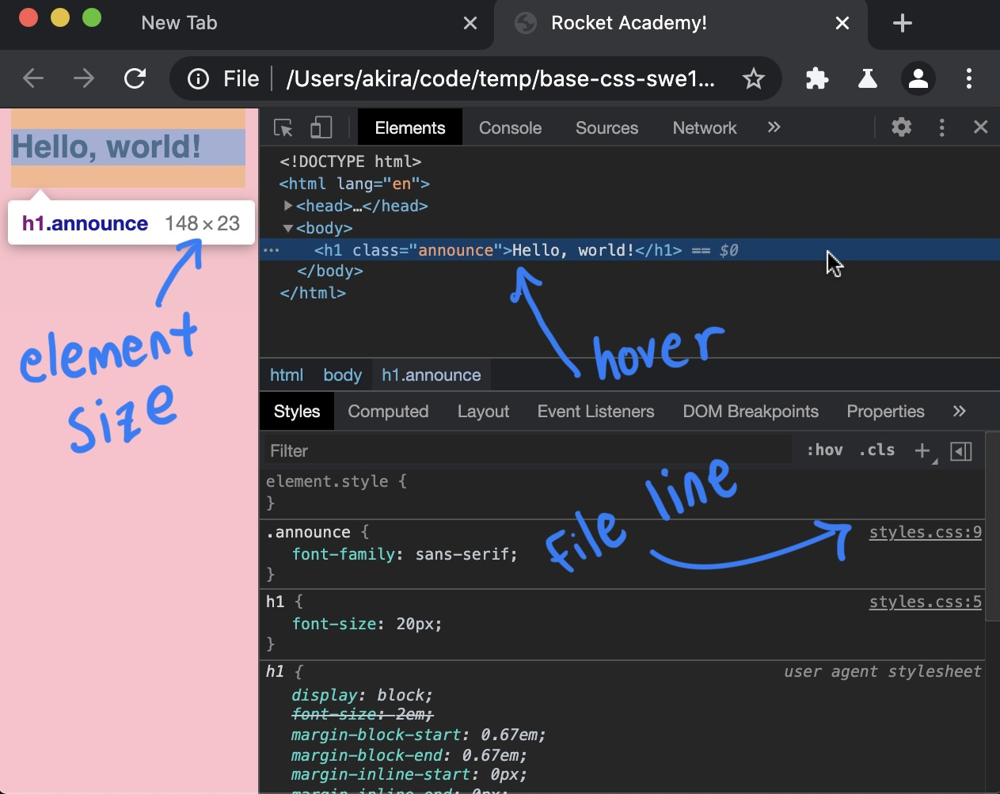

# 1.1.2: Basic CSS

## 1.1.2: Basic CSS

We'll be using CSS to create the layout of web pages that we are going to create. Before we can learn about layout, which is a complex CSS topic, we need to cover the basics of CSS, applying styles to an element or set of elements to do basic things like change colours and constrain sizes.

## What is CSS

Built on top of HTML in order to add more visual control and complexity, CSS specifies _styles_ on an HTML element or set of elements. The CSS code specifies visual properties that not related to the _semantic_ content of an HTML page- that is, CSS will not be used to change anything about the content or meaning of the content.

In practice there are 3 uses for CSS: Logic, Element Styling, and Layout.

### **Logic**

CSS can induce behaviours that represent some logic inside the application, such as hiding or showing cards, flipping elements 90 degrees, etc. We can use JavaScript to manipulate CSS as part of the logic of an app.

### **Element Styling**

Basic CSS is used to change the visual properties of an element, such and changing a font, setting a background image, or giving a button rounded corners.

### **Layout**

When you see a website that has content that is divided up into different visual sections, this is specified by CSS. Creating this behaviour is where most of the developer's effort is focused when writing CSS, and is the most tricky. The fundamental reason is because CSS was not originally intended to be used to structure website layout design, and some aspects of CSS behaviour can work against this goal. The focus of the CSS content in this course will be about being able to create these website layouts.

## Dev Tools

The Chrome Dev Tools are the place where CSS work actually happens. When attempting any CSS task the elements tab is the main tool to debug and fine-tune the CSS code.

### Styles Pane


We already saw how to inspect an element in the last section. When you select an element the CSS styles applied to that element appear in the _styles_ pane.

### Element / Style Inspection



Hovering over the element gives you CSS information like the pixel dimensions of the element. The style pane gives information like the CSS precedence of styles being applied to an element. It also gives the line in the CSS file the style was written.

In this example, the default browser styles at the bottom, the `h1` style from the CSS file and the styles for the `announce` class.

### Toggle Style


For each style listed in the style pane you can mouse over to see a checkbox. This toggles the style on and off.

### Edit CSS


## Exercise Tips / Cheatsheet

### Don't copy or write paragraphs of text yourself. \(Do copy header text for context\).

Install the Lorem Ipsum plugin for VSCode: [https://marketplace.visualstudio.com/items?itemName=Tyriar.lorem-ipsum](https://marketplace.visualstudio.com/items?itemName=Tyriar.lorem-ipsum)

### Get placeholder images for your CSS.

Use Lorem Picsum to get placeholder images: [https://picsum.photos/](https://picsum.photos/)

### Get icons for use within the page.

Fontawesome makes it easy to put icons on the page using HTML elements and CSS.

CSS styles link:

```css
<link rel="stylesheet" href="https://stackpath.bootstrapcdn.com/font-awesome/4.7.0/css/font-awesome.min.css" crossorigin="anonymous">
```

Usage:

```css
<i class="fa fa-camera"></i>
```

Read full Fontawesome documentation [here](https://fontawesome.com/how-to-use/on-the-web/referencing-icons/basic-use).

### Use Google Fonts where appropriate.

Refer back to this exercise on Google Fonts: [https://www.freecodecamp.org/learn/responsive-web-design/basic-css/import-a-google-font](https://www.freecodecamp.org/learn/responsive-web-design/basic-css/import-a-google-font). Select a Google font here: [https://fonts.google.com/](https://fonts.google.com/)

## Exercises

We will complete the 44 exercises in [Free Code Camp's Basic CSS module](https://www.freecodecamp.org/learn/responsive-web-design/basic-css/).

### Part 1 \(Exercises 1-22\)

Complete Free Code Camp's Basic CSS Exercises 1-22. Start from [Change the Color of Text](https://www.freecodecamp.org/learn/responsive-web-design/basic-css/change-the-color-of-text) and end at [Use Clockwise Notation to Specify the Margin of an Element](https://www.freecodecamp.org/learn/responsive-web-design/basic-css/use-clockwise-notation-to-specify-the-margin-of-an-element).

### Part 2 \(Exercises 23-36, Skip Last 8 Exercises\)

Complete Free Code Camp's Basic CSS Exercises 23-36. Start from [Use Attribute Selectors to Style Elements](https://www.freecodecamp.org/learn/responsive-web-design/basic-css/use-attribute-selectors-to-style-elements) and end at [Use RGB to Mix Colors](https://www.freecodecamp.org/learn/responsive-web-design/basic-css/use-rgb-to-mix-colors). Skip last 8 exercises \(i.e. 37-44\) because they are not particularly relevant.

### HTML/CSS Exercise 1: Tribute Page

Complete the [Tribute Page exercise from 1.1: HTML & CSS](./#html-css-exercise-tribute-page).

