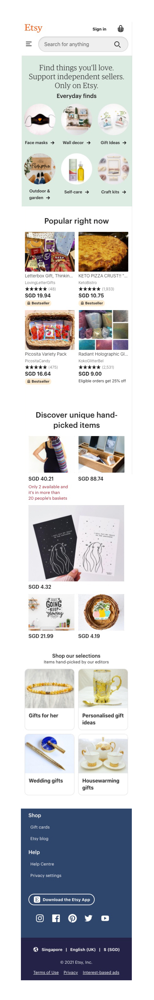

# 1.ICE.5: Etsy CSS

Recreate the website screenshot above. Note that this is not the real version of this page.

Given the limited time for this exercise, begin by coding the top and bottom of the page before adding each middle section.

Refer to the [cheatsheet](../1.1-html-and-css/1.1.2-basic-css.md#exercise-tips-cheatsheet) to make the page easier to code.

This exercise is only for the mobile view of this page. To make this page look good on a laptop/desktop, put the contents of the site inside a container element. Set the `max-width` CSS style on this element and center the element using `margin: 0 auto;`.

