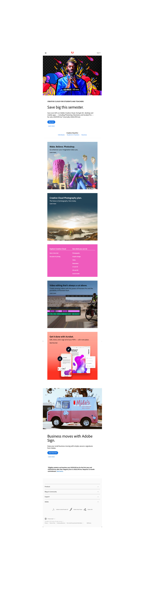
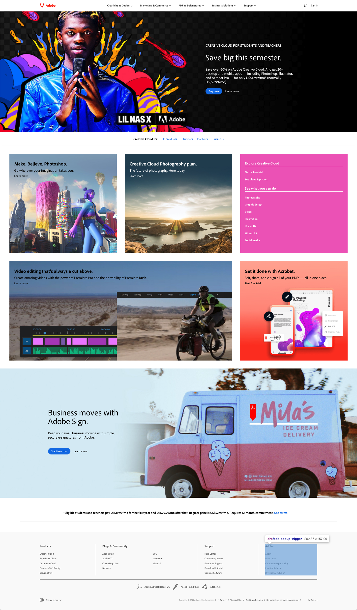

# 1.POCE.10: Bootstrap Adobe

Begin with the basic Bootstrap starter code: [https://github.com/rocketacademy/basic-bootstrap-swe1.git](https://github.com/rocketacademy/basic-bootstrap-swe1.git)

Refer to the Bootstrap documentation website [here](https://getbootstrap.com/docs/4.6/getting-started/introduction/). \(Note we are using Bootstrap version 4\).

We will be recreating a version of the adobe home page.

There are only two responsive layouts, a mobile layout and a desktop. Begin with the mobile layout first and build the desktop layout second. As you are building the mobile layout, keep in mind the layout needed for the desktop.

Don't worry about the heading text with background image. If you want you can put this text in a solid background color box and position this box against the background div.

#### Mobile Layout

#### Desktop Layout

