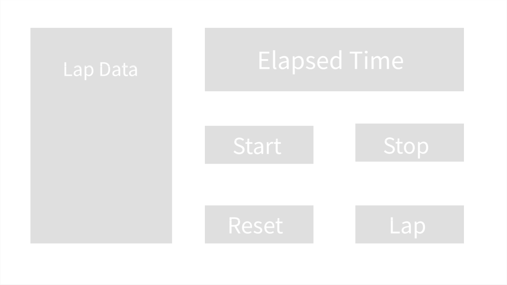

# 1.POCE.4: Timer

Begin by **forking** this starter code repo: [https://github.com/rocketacademy/timer-swe1](https://github.com/rocketacademy/timer-swe1)

## Base

### Match Game Timer

Add a countdown timer to the Match game. End the game if the time runs out.

### Timer

Work on the timer in stages. Full features are in parts below.

#### Timer Start, Stop

**1\)** A timer that counts up seconds, minutes and hours.

**2\)** A timer that can be stopped

## Comfortable

### Match Game Timer Reset

When the timer runs out, turn all the cards back over and reset the game. Message the user they've lost.

### Timer Reset

A timer that can be reset.

## More Comfortable

## Laps & Splits



**Timer Lap & Split**

**1\)** A timer that records lap times.

\(Hint: what sort of data structure would you be able to use to record this lap data?\)

**2\)** A timer that shows splits at each lap

