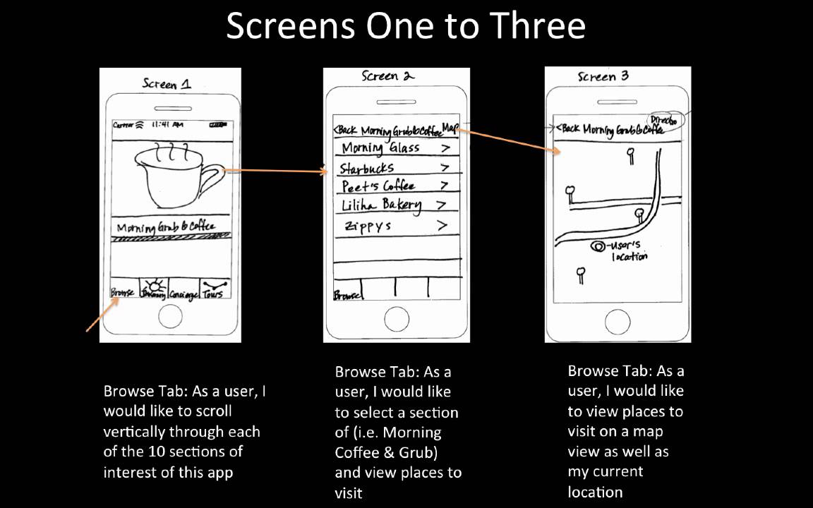

# 1.1.0: Wireframes

## Introduction

In this course we will use a visual design concept called "wireframing". A wireframe is a blueprint-type drawing/graphic that represents a user interface layout without worrying about details such as specific text or images. Most teams that build user-facing apps use wireframes to discuss what needs to be built before creating more detailed visual designs.

## User Stories

Wireframes are typically part of a concept called "user stories". A user story is a description of the product's target user and their "job to be done". What are they coming to our app to do, and how will they accomplish that with our app? To ensure our apps address the user story in the most effective way, we use wireframes to map a user's journey through our app for each user story.

## Wireframes in RA's Bootcamp

During Bootcamp we'll use user stories and wireframes to specify layouts for frontend exercises and our projects. Read more about wireframes [here](https://www.experienceux.co.uk/faqs/what-is-wireframing/) and [here](https://en.wikipedia.org/wiki/Website_wireframe).

