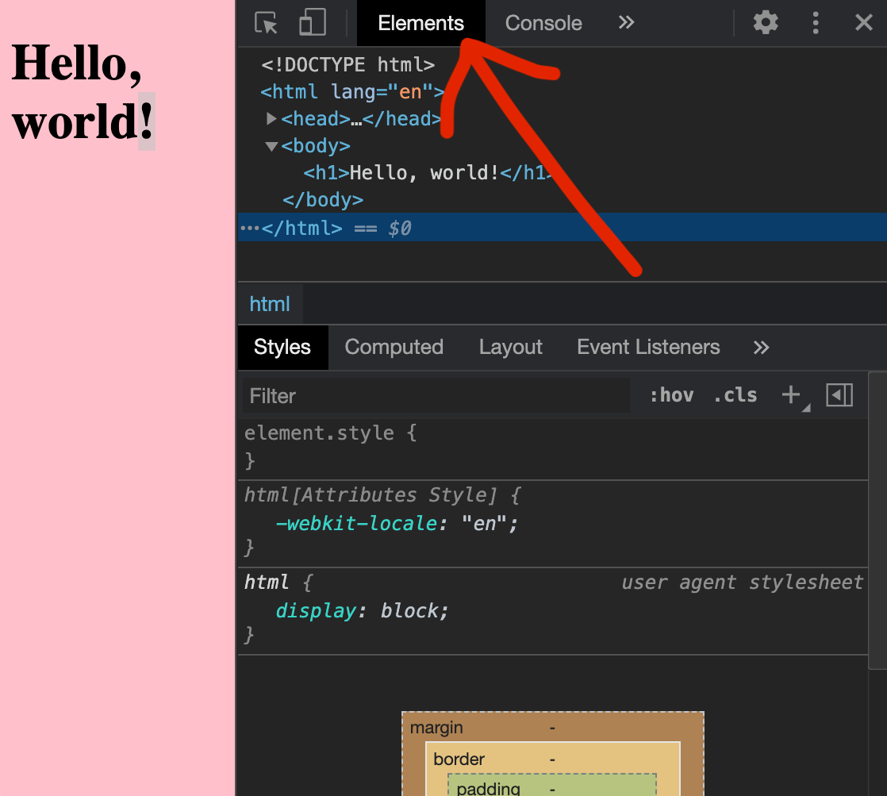
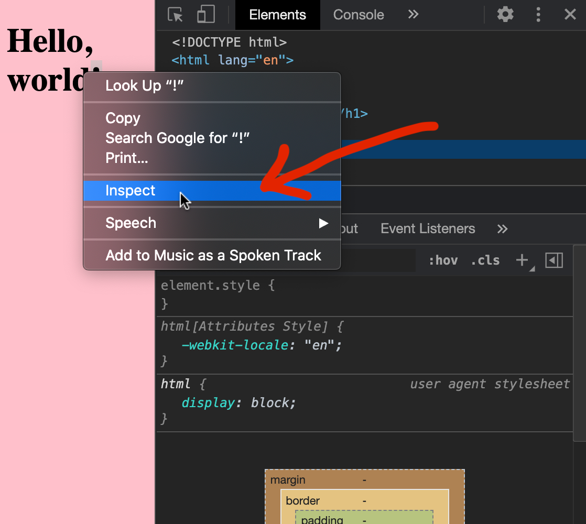
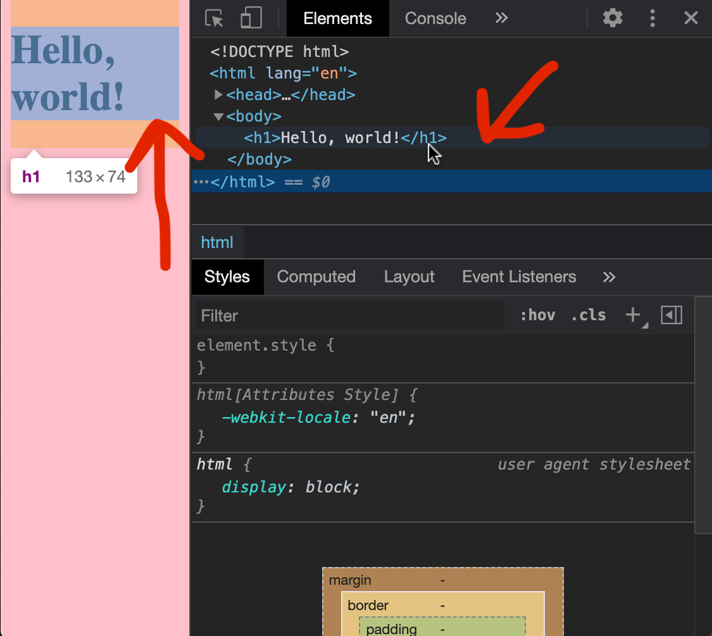
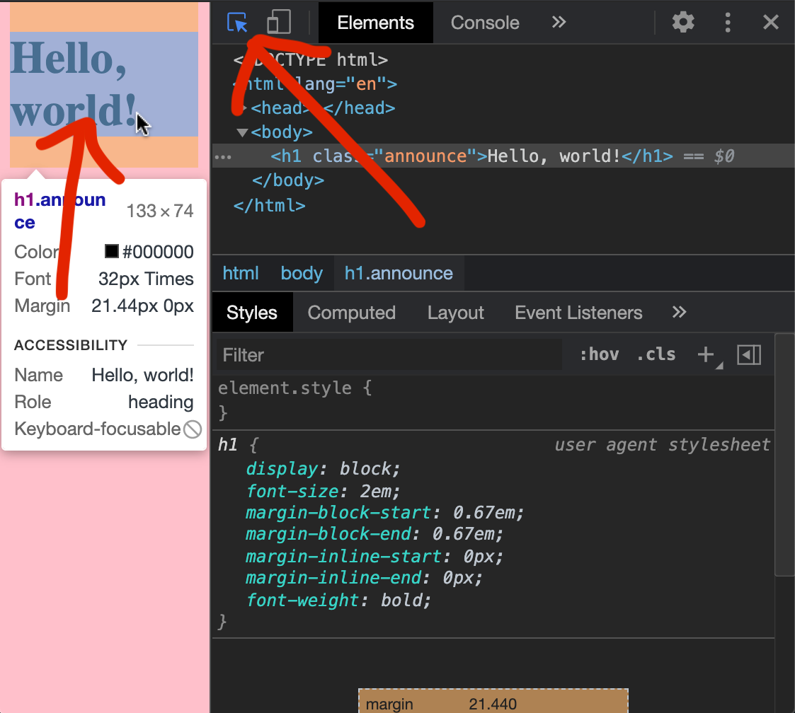

# 1.1.1: Basic HTML

## Why HTML

HTML pages and the software that transfers them are the foundation of the browser-based internet. A browser's fundamental task is to display HTML documents and handle built-in HTML behaviours.

## What is HTML

HTML originated as a way to specify the format and data of a document. Today HTML is used as a building block in creating complex applications we use in the browser. HTML is not a programming language in the same sense that JavaScript is a programming language because it does not have any syntax for logical control flow, such as functions, loops or conditionals.

## Browser Tools for HTML

Chrome DevTools \(most browsers have an equivalent\) helps us reconcile content displayed in Chrome with HTML code that renders that content. We can view the HTML Chrome is rendering in the "**Elements"** tab.









## HTML Errors

HTML does not run like other programming languages in the sense that even if HTML is written improperly, or there is an error in the syntax, the browser \(all browsers\) attempt to render the document as a "best effort" based on the HTML file. For this reason there will never be any error warning text when coding HTML incorrectly.

## Semantic HTML

A major feature of HTML is that the same document will contain both structure and content of a page. Page structure can be organised by tags, each of which defines a different component on the page. HTML tags can also help communicate content priority. When we use the `h1` tag, regardless of the words inside, that tag implies the content inside it is "more important" than content inside any `h2` tag elsewhere on the page.

Using HTML tags to communicate content priority is what we call Semantic HTML, because tags have meaning beyond separating components on screen. This property is used by search engines like Google to determine what pages are about. A website search engine is an application that digests web pages on the internet, and when a user does a search, tries to find the relevant, previously-digested page. Google and others know the `h1` tag is more likely to contain a page title, and weighs that text more heavily than text inside `h2` or "lower-priority" tags.

```markup
<h1>Important Text</h1>
<h2>Less Important Text<h2/>
```

We'll see when we write CSS that the visual differentiation between `h1` and `h2` \(or between any 2 elements\) can be overridden with CSS. In this sense, the selection of the "correct" HTML tag has less to do with how it looks, but what part of the document it represents.

## Exercise

### Free Code Camp Intro to HTML

[https://www.freecodecamp.org/learn/responsive-web-design/basic-html-and-html5](https://www.freecodecamp.org/learn/responsive-web-design/basic-html-and-html5)

This exercise introduces the most common HTML elements we'll use during Coding Bootcamp. The exercise also covers `<form>` and various form input tags, which we won't be using until Module 3.
