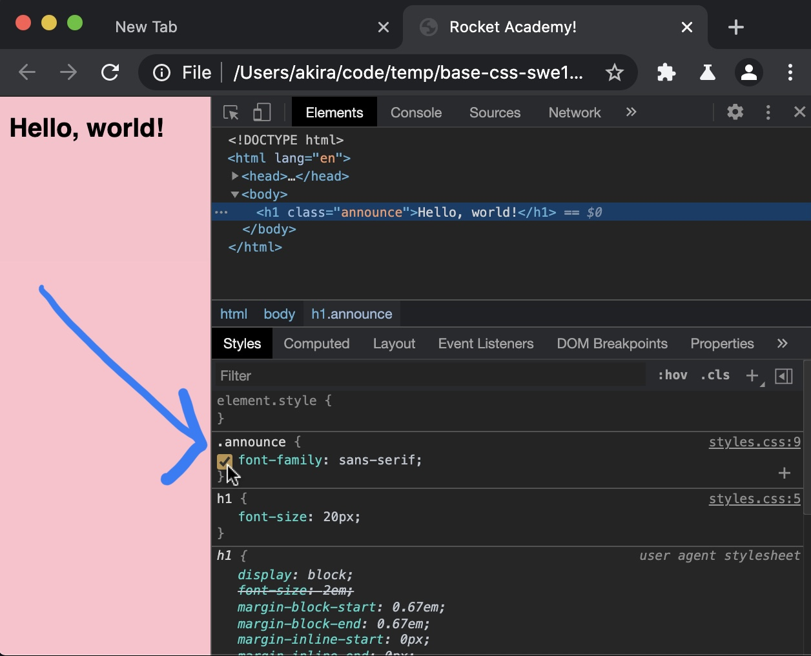

# 1.1.2: Basic CSS

## Introduction

We use CSS to style web pages. We will first learn how to apply styles to to HTML elements for basic formatting such as changing colours and sizes. We will later learn about CSS for layout.

## What is CSS

Built on top of HTML to add more visual control and complexity, CSS specifies _styles_ on an HTML element or set of elements. The CSS code specifies visual properties unrelated to the written content on an HTML page. In practice there are 2 uses for CSS: element styling and layout.

### **Element Styling**

CSS helps us change visual properties of HTML elements, such as fonts, background images, or rounded corners on buttons. Together with JS DOM manipulation, we can use CSS to implement visual logic within an application, such as hiding or showing cards and flipping elements 90 degrees.

### **Layout**

CSS can help us divide our UI into visual sections. This is one of the most tricky aspects of CSS, because CSS was not originally intended for layout design. CSS content in RA's Bootcamp will focus on implementing UI layouts.

## DevTools

A significant amount of CSS development happens in Chrome's DevTools. The Elements tab in DevTools is our primary tool to fine-tune and debug CSS.

### Styles Pane in Elements Tab


We already saw how to inspect an element in the last section. When you select an element the CSS styles applied to that element appear in the _styles_ pane.

### Element / Style Inspection


Hovering over the element gives you CSS information like the pixel dimensions of the element. The style pane gives information like the CSS precedence of styles being applied to an element. It also gives the line in the CSS file the style was written.

In this example, the default browser styles at the bottom, the `h1` style from the CSS file and the styles for the `announce` class.

### Toggle Style



For each style listed in the style pane you can mouse over to see a checkbox. This toggles the style on and off.

### Edit CSS


## Exercise Tips / Cheatsheet

### Don't Write Placeholder Text

Install the Lorem Ipsum plugin for VSCode: [https://marketplace.visualstudio.com/items?itemName=Tyriar.lorem-ipsum](https://marketplace.visualstudio.com/items?itemName=Tyriar.lorem-ipsum)

### Get Placeholder Images for CSS

Use Lorem Picsum to get placeholder images: [https://picsum.photos/](https://picsum.photos/)

### Use Readily-Available Icons

Fontawesome makes it easy to put icons on the page using HTML elements and CSS.

CSS styles link:

```css
<link rel="stylesheet" href="https://stackpath.bootstrapcdn.com/font-awesome/4.7.0/css/font-awesome.min.css" crossorigin="anonymous">
```

Usage:

```css
<i class="fa fa-camera"></i>
```

Read full Fontawesome documentation [here](https://fontawesome.com/how-to-use/on-the-web/referencing-icons/basic-use).

Note that the Fontawesome docs may give examples where the icon base classes must change- `fas` might need to be changed to `fa` if the icon doesn't appear.

### Use Google Fonts Where Appropriate

Refer back to this exercise on Google Fonts: [https://www.freecodecamp.org/learn/responsive-web-design/basic-css/import-a-google-font](https://www.freecodecamp.org/learn/responsive-web-design/basic-css/import-a-google-font). Select a Google font here: [https://fonts.google.com/](https://fonts.google.com/)

### Use Viewport Tag for Mobile Views

For mobile first layouts we need to add the scaling tag in the `head` tag. This is to develop for mobile on desktop without squinting. Chrome DevTools assumes we have this scaling tag when debugging mobile layouts. Read more about the `viewport` tag [here.](https://developer.mozilla.org/en-US/docs/Web/HTML/Viewport_meta_tag)

```markup
<meta name="viewport" content="width=device-width, initial-scale=1, shrink-to-fit=no">
```

## Exercises

We will complete the 44 exercises in [Free Code Camp's Basic CSS module](https://www.freecodecamp.org/learn/responsive-web-design/basic-css/).

### Part 1 \(Exercises 1-22\)

Complete Free Code Camp's Basic CSS Exercises 1-22. Start from [Change the Color of Text](https://www.freecodecamp.org/learn/responsive-web-design/basic-css/change-the-color-of-text) and end at [Use Clockwise Notation to Specify the Margin of an Element](https://www.freecodecamp.org/learn/responsive-web-design/basic-css/use-clockwise-notation-to-specify-the-margin-of-an-element).

### Part 2 \(Exercises 23-36, Skip Last 8 Exercises\)

Complete Free Code Camp's Basic CSS Exercises 23-36. Start from [Use Attribute Selectors to Style Elements](https://www.freecodecamp.org/learn/responsive-web-design/basic-css/use-attribute-selectors-to-style-elements) and end at [Use RGB to Mix Colors](https://www.freecodecamp.org/learn/responsive-web-design/basic-css/use-rgb-to-mix-colors). Skip last 8 exercises \(i.e. 37-44\) because they are not particularly relevant.

### Tribute Page

Complete the [Tribute Page exercise from 1.1: HTML & CSS](./#tribute-page).

