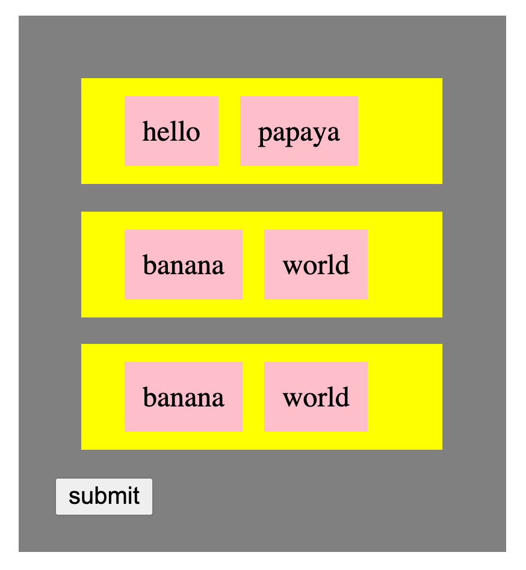

# 1.4.2: Events

## Defining an Input



An input to our JavaScript program is called an **event**. All this means is that we can set the browser in such a way that when the user makes an action, the browser calls our function - and this is exactly how our `main` function works. Except that we aren't just limited to clicking on the submit button or getting the value the user typed from an input.

The function for an event is referred to as a _**callback**_ function.

```javascript
const myNewMain = (event) => {
  console.log('hey wow my new function');
};

wowParagraph.addEventListener('click', myNewMain);
```

## Exercises

### Setup

Start with this repo: [https://github.com/rocketacademy/basics-next-steps-dom](https://github.com/rocketacademy/basics-next-steps-dom)

Every time you finish a section of the exercise, make a commit and start over in the same repo.

We'll be reusing some code from the previous DOM creation exercise.


### Click to Create

Create a button in JavaScript and attach a listener callback function to it. When the user clicks the button, build the elements above.

### Other Events

Instead of the click event, attach other events to the button:`dblclick`, `mouseenter`, `mouseleave.`

Use this page to find out more about these events: [https://developer.mozilla.org/en-US/docs/Web/Events](https://developer.mozilla.org/en-US/docs/Web/Events)

### Click to Create Button

Begin with the same button.

When the user clicks the button, build the elements above.

Inside the grey box create a button and attach a click event listener callback function.

When the grey boxes' button gets clicked, create another yellow box set of elements \(a yellow box with 2 pink boxes inside\). These can also say "hello" and "banana", or you can come up with your own text.



This user has clicked the submit button three times. Not shown are any other grey boxes. \(There could be many\).

### **Click and Input**

Create a button in JavaScript and attach a listener callback function to it.

When the user clicks the button, build the elements above, but also create an input and a button inside the grey box.

When the user clicks the button in the grey box, the app creates another yellow square with a single pink square inside. Inside the pink square is the text the user typed in the input box.


Example: This user has typed "_hello_" and clicked submit, and also typed "_world_" and clicked submit. Not shown are any other sets of grey boxes. \(There could be many\).
