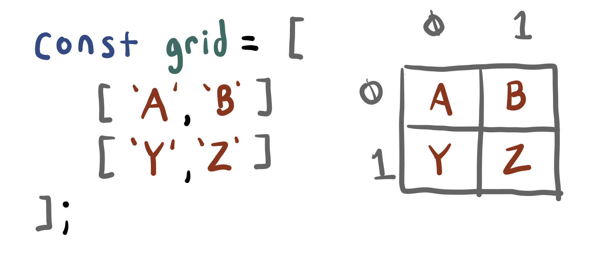

# 1.6: Match Game

## Introduction

Create a card-matching game called Match Game. In this game the user turns cards over one at a time to find matching pairs of cards.

## Nested Array Coordinates

In this Match Game implementation we'll use an array of arrays data structure to represent the board and store card positions. We could implement Match Game with a different data structure, but since our layout will be grid-like an array of arrays is appropriate.

We can use the properties of an array nested inside another array to represent a coordinate grid.



```javascript
const grid = [
  ['A', 'B'],
  ['Y', 'Z'],
];

const upperLeftPosition = grid[0][0]; // 'A'
const upperRightPosition = grid[0][1]; // 'B'
const lowerLeftPosition = grid[1][0]; // 'Y'
const lowerRightPosition = grid[1][1]; // 'Z'
```

## CSS

Paste this css into the `style.css` file.

```css
.square {
  padding: 10px;
  margin: 10px;
  background-color: white;
  display: inline-block;
  height: 10px;
  width: 10px;
  vertical-align: top;
}
```

## Global Variables

```javascript
// boardSize has to be an even number
const boardSize = 4;
const board = [];
let firstCard = null;
let firstCardElement;
let deck;
```

## Gameplay Logic

```javascript
const squareClick = (cardElement, row, column) => {

    console.log(cardElement);
    
    console.log('FIRST CARD DOM ELEMENT', firstCard);
    
    console.log('BOARD CLICKED CARD', board[row][column]);
    
    const clickedCard = board[row][column]; 

    // the user already clicked on this square
    if( cardElement.innerText !== '' ){
        return;
    }

    // first turn
    if (firstCard === null) {
      console.log('first turn');
      firstCard = clickedCard;
      // turn this card over
      cardElement.innerText = firstCard.name;
  
      // hold onto this for later when it may not match
      firstCardElement = cardElement;

    // second turn
    } else {
    
      console.log('second turn');
      if (
        clickedCard.name === firstCard.name &&
        clickedCard.suit === firstCard.suit
      ) {
        console.log('match');
    
        // turn this card over
        cardElement.innerText = clickedCard.name;
      } else {
        console.log('NOT a match');
    
        // turn this card back over
        firstCardElement.innerText = '';
      }

      // reset the first card
      firstCard = null;
    }
};
```

## Game Initialisation Logic

```javascript
// create all the board elements that will go on the screen
// return the built board
const buildBoardElements = (board) => {
  // create the element that everything will go inside of
  const boardElement = document.createElement('div');

  // give it a class for CSS purposes
  boardElement.classList.add('board');

  // use the board data structure we passed in to create the correct size board
  for (let i = 0; i < board.length; i += 1) {
    // make a var for just this row of cards
    const row = board[i];

    // make an element for this row of cards
    const rowElement = document.createElement('div');
    rowElement.classList.add('row');

    // make all the squares for this row
    for (let j = 0; j < row.length; j += 1) {
      // create the square element
      const square = document.createElement('div');

      // set a class for CSS purposes
      square.classList.add('square');

      // set the click event
      // eslint-disable-next-line
      square.addEventListener('click', (event) => {
        // we will want to pass in the card element so
        // that we can change how it looks on screen, i.e.,
        // "turn the card over"
        squareClick(event.currentTarget, i, j);
      });

      rowElement.appendChild(square);
    }
    boardElement.appendChild(rowElement);
  }

  return boardElement;
};

const initGame = () => {
  // create this special deck by getting the doubled cards and
  // making a smaller array that is ( boardSize squared ) number of cards
  let doubleDeck = makeDeck();
  let deckSubset = doubleDeck.slice(0, boardSize * boardSize);
  deck = shuffleCards(deckSubset);

  // deal the cards out to the board data structure
  for (let i = 0; i < boardSize; i += 1) {
    board.push([]);
    for (let j = 0; j < boardSize; j += 1) {
      board[i].push(deck.pop());
    }
  }

  const boardEl = buildBoardElements(board);

  document.body.appendChild(boardEl);
};
```

## New Make Deck

Add line 39 to `makeDeck` so that it outputs doubles of each card.

```javascript
const makeDeck = (cardAmount) => {
  // create the empty deck at the beginning
  const newDeck = [];
  const suits = ['hearts', 'diamonds', 'clubs', 'spades'];

  for (let suitIndex = 0; suitIndex < suits.length; suitIndex += 1) {
    // make a variable of the current suit
    const currentSuit = suits[suitIndex];
    console.log(`current suit: ${currentSuit}`);

    // loop to create all cards in this suit
    // rank 1-13
    for (let rankCounter = 1; rankCounter <= 13; rankCounter += 1) {
      // Convert rankCounter to string
      let cardName = `${rankCounter}`;

      // 1, 11, 12 ,13
      if (cardName === '1') {
        cardName = 'ace';
      } else if (cardName === '11') {
        cardName = 'jack';
      } else if (cardName === '12') {
        cardName = 'queen';
      } else if (cardName === '13') {
        cardName = 'king';
      }

      // make a single card object variable
      const card = {
        name: cardName,
        suit: currentSuit,
        rank: rankCounter,
      };

      console.log(`rank: ${rankCounter}`);

      // add the card to the deck
      newDeck.push(card); // add double the cards to the deck
      newDeck.push(card);
    }
  }

  return newDeck;
};
```

## Exercise

Fork and clone the [Coding Bootcamp Match Game repo](https://github.com/rocketacademy/match-game-bootcamp). Use code from the above implementation to build a working Match Game.

Don't forget to [run npm install in the starter code directory.](../course-logistics/required-hardware-and-software.md#eslint-npm-configuration-libraries)
