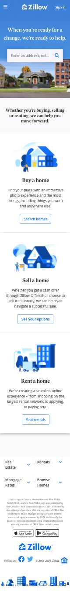
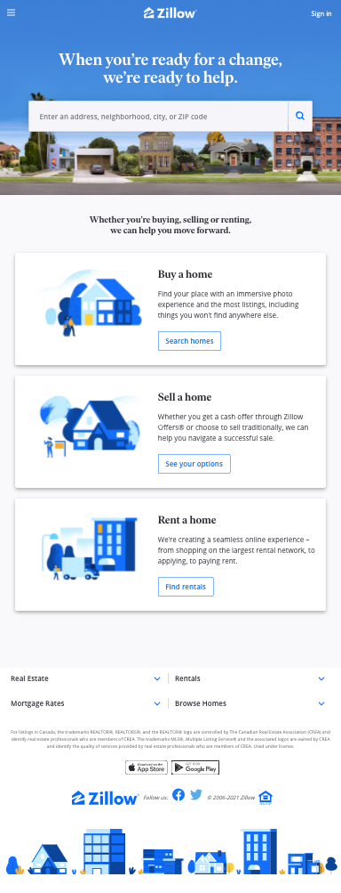
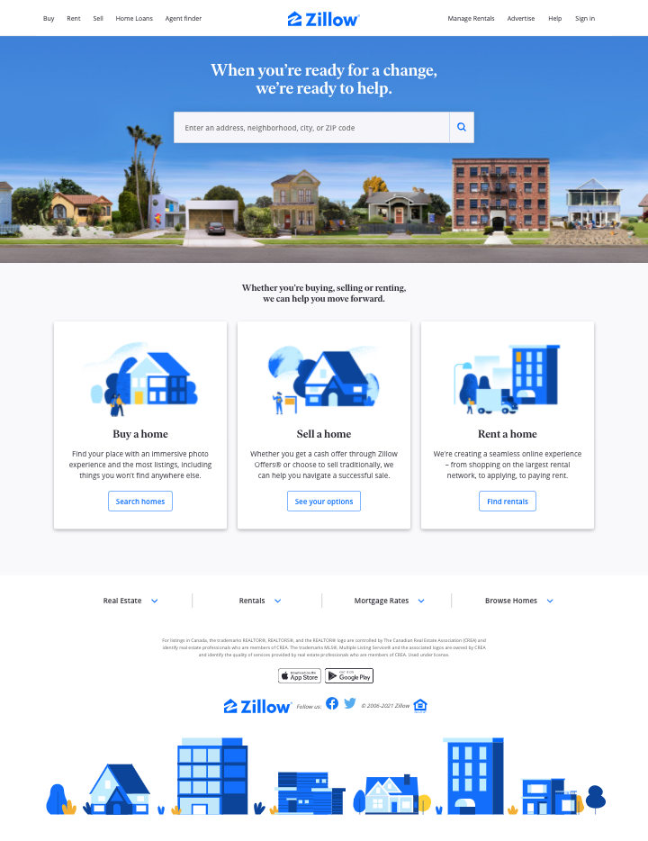

# 3.ICE.16: CSS Practice 4

Recreate the real estate website Zillow.

Clone the [base Bootstrap repo](https://github.com/rocketacademy/basic-bootstrap-bootcamp).

Refer to the [cheatsheet](../1.1-html-and-css/1.1.2-basic-css.md#exercise-tips-cheatsheet) to make the page easier to code.

