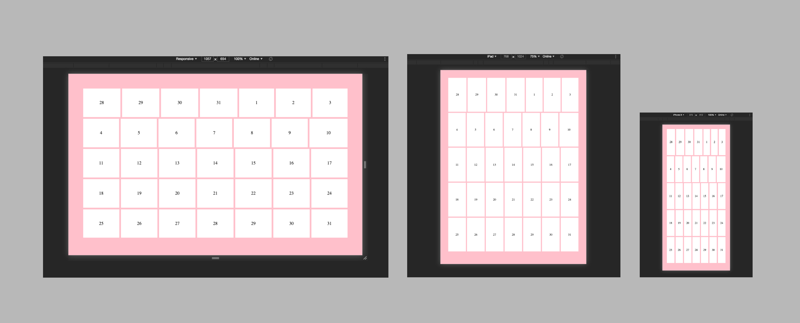

# 1.POCE.7: Flexbox Calendar

## Setup

Begin with the starter code repo [here](https://github.com/rocketacademy/base-css-bootcamp).

## Base

1. Create a calendar for Jan 2021 using Flexbox.
2. Use the Starter HTML at the bottom of this page.
3. Without altering the HTML create a responsive calendar that looks like the following screenshots.




To extend the page container to cover the whole screen height, use `height: 100%`:

```css
html,
body {
  height: 100%;
}
```


## Comfortable

1. Add days of the week to the calendar
2. Add the month name and year to the calendar

## Starter HTML

```markup
<div class="calendar">
  <div class="week">
    <div class="day">28</div>
    <div class="day">29</div>
    <div class="day">30</div>
    <div class="day">31</div>
    <div class="day">1</div>
    <div class="day">2</div>
    <div class="day">3</div>
  </div>
  <div class="week">
    <div class="day">4</div>
    <div class="day">5</div>
    <div class="day">6</div>
    <div class="day">7</div>
    <div class="day">8</div>
    <div class="day">9</div>
    <div class="day">10</div>
  </div>
  <div class="week">
    <div class="day">11</div>
    <div class="day">12</div>
    <div class="day">13</div>
    <div class="day">14</div>
    <div class="day">15</div>
    <div class="day">16</div>
    <div class="day">17</div>
  </div>
  <div class="week">
    <div class="day">18</div>
    <div class="day">19</div>
    <div class="day">20</div>
    <div class="day">21</div>
    <div class="day">22</div>
    <div class="day">23</div>
    <div class="day">24</div>
  </div>
  <div class="week">
    <div class="day">25</div>
    <div class="day">26</div>
    <div class="day">27</div>
    <div class="day">28</div>
    <div class="day">29</div>
    <div class="day">30</div>
    <div class="day">31</div>
  </div>
</div>
```

