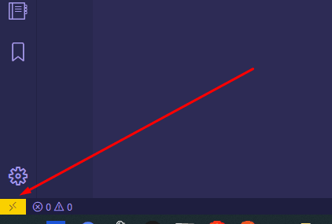
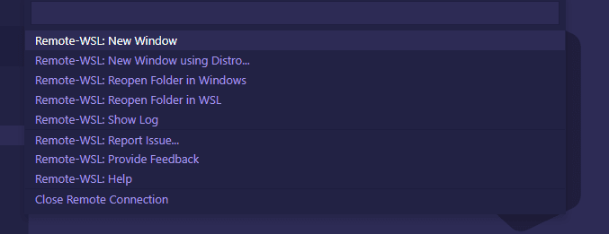

# 2.0: Module 2 Overview

## **Backend Fundamentals**

The focus of SWE1 is building applications that interact with the internet.

Before we can create those applications we need to understand the environment in which the applications operate and a few underlying mechanisms of the internet.

## Install Node.js

### Mac

```text
brew install node
```

### Windows

Make sure you've followed the instructions for installation of WSL in [SWE1 Required Hardware and Software](../course-logistics/required-hardware-and-software.md#windows-subsystem-for-linux-wsl).

Some WSL Linux distributions are lacking libraries that are required by the VS Code server to start up. You can add additional libraries into your Linux distribution by using its package manager.

For example, to update Debian or Ubuntu, use:

```text
sudo apt update
sudo apt upgrade
sudo apt install build-essential
```

To add ca-certificates \(to allow SSL-based applications to check for the authenticity of SSL connections\), enter:

```text
sudo apt-get install ca-certificates
```

Install the [Remote Development extension](https://marketplace.visualstudio.com/items?itemName=ms-vscode-remote.vscode-remote-extensionpack) for VSCode.

Once you install the extension, you will see a Remote Development extension icon at the bottom left corner of the VS Code editor.



Click on the icon, you will get a pop up with a list of options. Click on the first option "**Remote-WSL: New Window**" for the default distro or select the "**Remote-WSL: New Window using Distro**" for a specific distro.



You will see a notification "Starting VS Code in WSL...".

[](https://res.cloudinary.com/practicaldev/image/fetch/s--hQNq4fVk--/c_limit%2Cf_auto%2Cfl_progressive%2Cq_auto%2Cw_880/https://dev-to-uploads.s3.amazonaws.com/i/3667py1lgpqwwl1ijafz.png)

This means VS Code is setting up a server inside WSL for the first time. Once installed, the VS Code of your Windows machine/desktop will communicate with VS Code server on the Linux side.

#### 

## New Online Accounts

### AWS

Sign up for an [AWS account](https://aws.amazon.com) if you don't have one already. We will use this to set up servers in the cloud to which we will deploy our code.

### Namecheap

Sign up for a [Namecheap account](https://namecheap.com) to buy a domain name.

