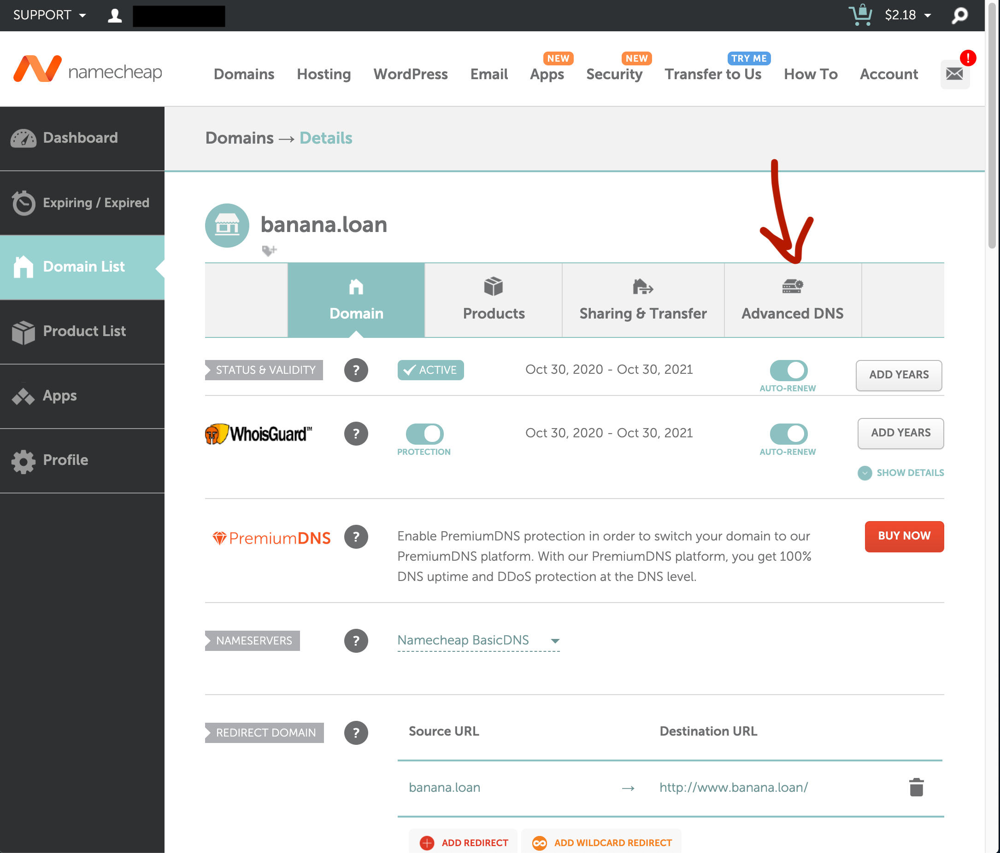
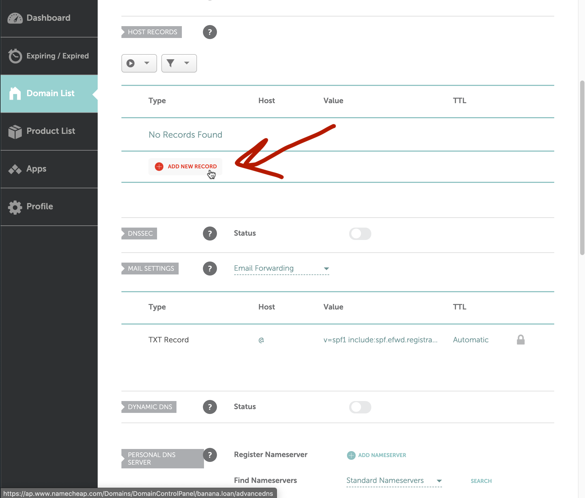
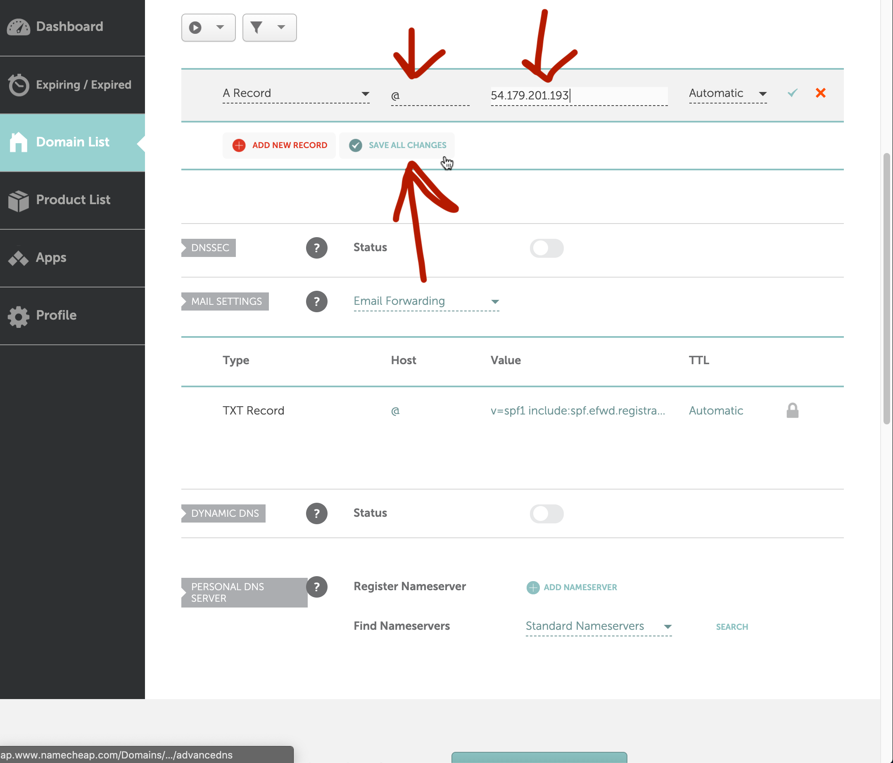

# 2.14 Domain Names

You can buy a domain name on namecheap.com and associate it with your AWS instance.

Note that if you ever stop your instance your domain name will stop working. If you want to keep your domain name tied to AWS even if you stop your instance you need to use an [AWS Elastic IP](https://docs.aws.amazon.com/AWSEC2/latest/UserGuide/elastic-ip-addresses-eip.html).

## Buy a Domain

Create an account on namecheap.com. Buy a domain name.

## Configure DNS

Go to the domain management console.

Delete the default DNS records.

Create a new A record.

Set the host to `@` and the IP to your EC2 instance IP. 

You should now be able to visit your server address with the same place, but with the domain in place of the IP, something like http://banana.loan/index.html

