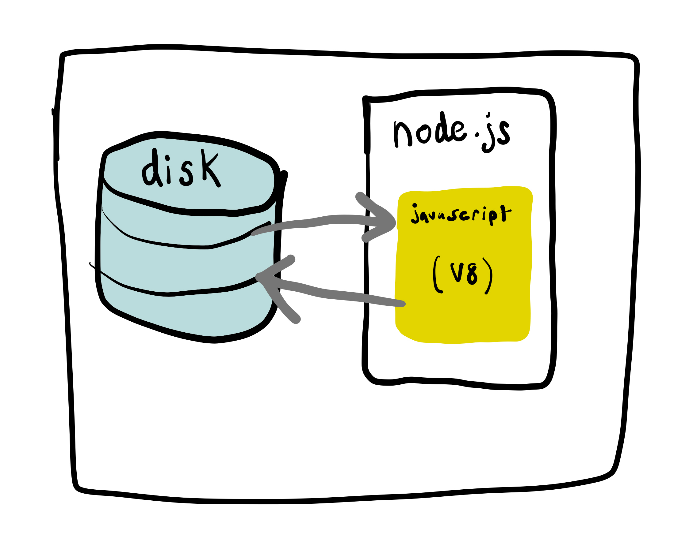

# 2.5: Disk Writing



Save javascript data permanently to your hard drive.

```javascript
import { writeFile } from 'fs';

const content = 'Some content!';

const whenFileIsDoneReading (err) => {
  if (err) {
    console.log(err);
  } else {
    console.log('success!');
    // file written successfully
  }
};

writeFile('test.txt', content, whenFileIsDoneReading);
```

## Newlines

You can create a new line in a text file by appending the `\n` character.

Change the contents of the `content` variable- add some new line characters in a loop:

```javascript
let content = 'Printing 10 numbers:';

for (let i = 0; i < 10; i += 1) {
  content += `Random number: ${i}: ${Math.random()}\n`;
}
```

## Exercise

Clone [the base node repo.](https://github.com/rocketacademy/base-node-swe1)

Run the above code.

Open the file in VSCode to confirm it's contents are the ones you specified in the JavaScript file.

