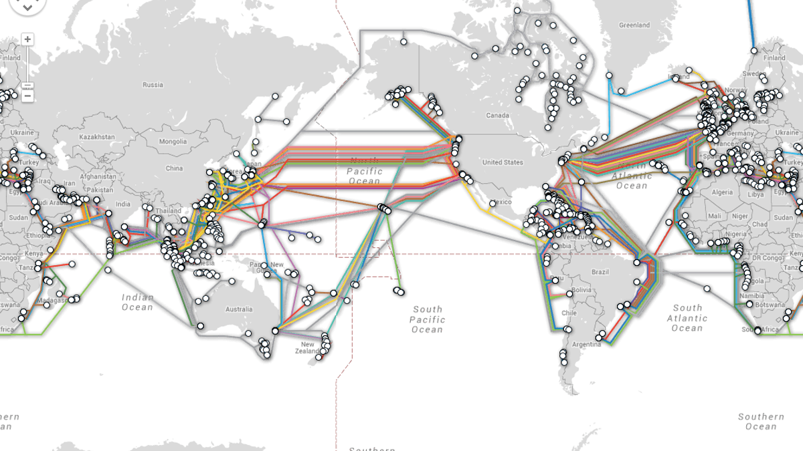

# 2.7: What is the Internet



## The internet is:

A series of interconnected computers.

A set of physical infrastructure that connects these computers together.

A set of hardware and software that allows communication across this physical infrastructure by programs that are run on the connected computers.

For the purposes of this course we'll be talking about the ways that we can listen for and send things across this network by the Node.js programs we create.


One of the main difficulties when speaking about this subject is that the mechanism of where this data interchange happens is all one level below in the computer system. \(Specifically at the operating system level, which is the part of the computer that takes these networking signals and passes them up to programs like the browser\).


We will begin by demonstrating some principals of the mechanics of the network before we write any JavaScript.

## The internet is: Software Protocols

At the birth of the internet, or specifically, computer networking, the task was to create software that defined the way that computers could talk to each other.

What kinds of signals would they send? How could those signals account for things like slow or unreliable connections, or the fact that someone may have simply switched off the machine at the other end?

These behaviors are defined in software networking protocols, which is simply a set of conceptual standards for how computers talk to each other, specifically to be implemented by the operating system so that any random program on a computer can interface with the network- much in the same way HDMI standardizes how a monitor might be plugged into a computer.

## TCP/IP

There are a couple layers of protocols that are running on the computer that make things like Chrome browser possible.

The lowest level protocol we'll describe is **TCP/IP**. The Internet Protocol. This is the software that takes a given message, splits it up, sends it across the network, and reconstructs it at the destination computer.  
  
During this course we won't be writing any applications that interface with this lower-level protocol directly.

TCP/IP defines the concept that computers on the network have a specifiable location, and that one location on a network can be reached from any other location.

The locations are defined by addresses, called IP addresses.

We'll mostly be dealing with IP addresses that look like this: 126.234.123.5 - four sets of numbers from 0-255 separated by a period.

There is a new version of IP addresses [called IPv6](https://en.wikipedia.org/wiki/IPv6) where the numbers are much larger. These are less common right now but will soon become the standard. \(This is because an older IP address number does not contain enough IP addresses for all the computers that are on the internet\). IPv6 addresses look like this: 2001:db8:0:0:0:ff00:42:8329

## Ports

On a computer that has TCP/IP networking capability, many different programs can use this functionality of the operating system. Many different programs can be sending and receiving things through the network.

There are probably several different programs sending and receiving network traffic on your computer besides the browser, such as: Spotify, Dropbox, Windows Updates, Mac Updates, etc.

Ports are the designated TCP/IP scheme to differentiate these different applications on the computer to use networking but identify themselves uniquely. Here is [a comprehensive list.](https://en.wikipedia.org/wiki/List_of_TCP_and_UDP_port_numbers)

## DNS

[DNS](https://en.wikipedia.org/wiki/Domain_Name_System) is a TCP/IP protocol that defines a way to identify the location of a computer on the network, but do it with words and not numbers. DNS is the system that translates domain names to IP addresses. DNS uses port 53.

## HTTP


As you can tell by the name, HTTP \(Hyper Text Transfer Protocol\) was invented to transport HTML \(Hyper Text\) across the internet. Today the HTTP protocol is used for many other things besides HTML. HTTP uses port 80.

### Request / Response

For the purposes of this course one of the most important properties of the HTTP protocol is that it describes how data gets from one place to another.

The original concept of HTTP was that a person would want to view an HTML page on their browser, and so would request it by asking for a given HTML file at a certain IP address. The computer on the other end would receive the request and send back the HTML file as a response.

Today HTTP is used for many more things besides HTML pages, but the underlying request/response mechanic is still the same.

## Other Protocols

There are still a bunch of surviving protocols built on top of TCP/IP like HTTP is. The most popular ones are:

**DHCP**: Used to configure your computer when it connects to a router. It uses port 67.

**SMTP**: This is the way most email is sent. It uses port 25.

Not used so much anymore:

**QOTD**: [Used to get a quote of the day.](https://en.wikipedia.org/wiki/QOTD) It uses port 17.

```text
telnet djxmmx.net 17
```

## Ping

[Ping](https://linux.die.net/man/8/ping) is a networking utility used to test if a computer is reachable on the network. It does not use a port because it is not trying to reach an application inside the computer, only that computer's networking software.

## Traceroute

[Traceroute](https://en.wikipedia.org/wiki/Traceroute) is a utility that diagnoses the computers your TCP/IP packets have travelled through.

## What's My IP

[https://whatismyipaddress.com/](https://whatismyipaddress.com/)

## Make Requests

Send some things back and forth.

Install [ngrok](https://ngrok.com/).

Start it:

```text
./ngrok http 3004
```

Open a new terminal and start a file server:

```text
node index.js
```

Make a request to the ngrok address.

