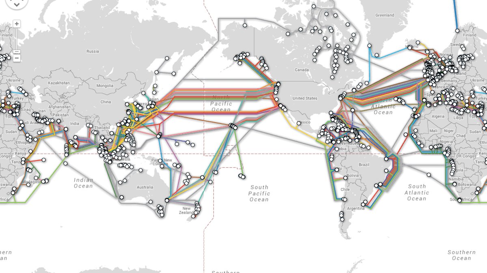
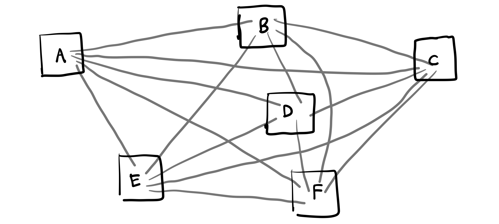
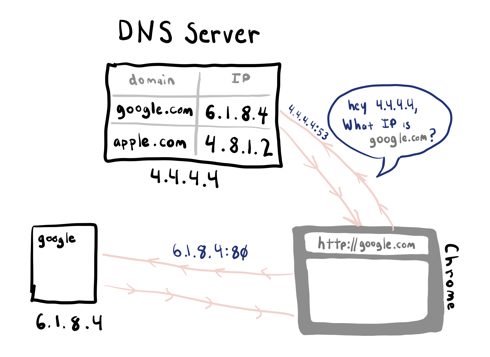
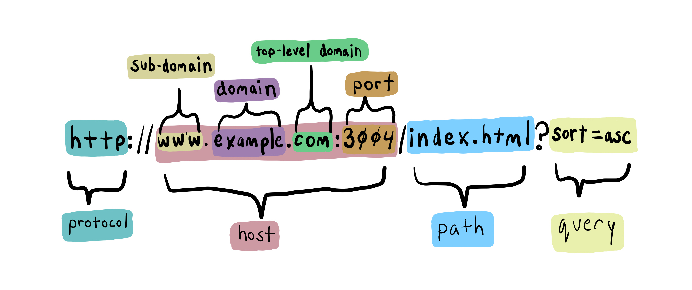
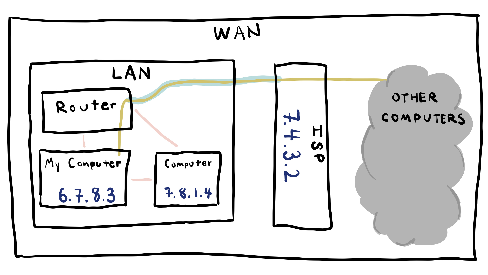
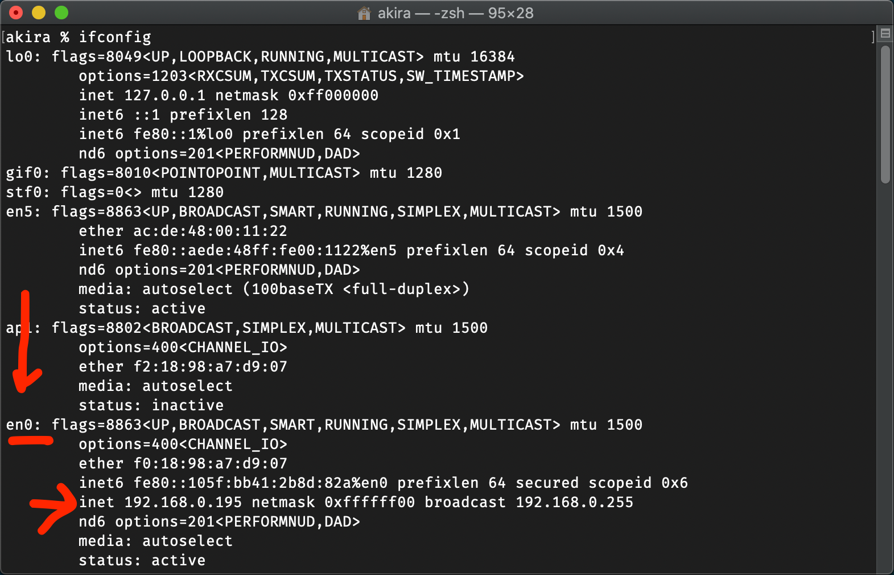

# 2.7: What is the Internet



## The Internet is:

* A series of interconnected computers.
* A set of physical infrastructure that connects these computers together.
* A set of hardware and software that allows communication across this physical infrastructure by programs that are run on the connected computers.

For the purposes of this course we'll be talking about the ways that we can listen for and send things across this network by the Node.js programs we create.


One of the main difficulties when speaking about this subject is that the mechanism of where this data interchange happens is all one level below in the computer system. \(Specifically at the operating system level, which is the part of the computer that takes these networking signals and passes them up to programs like the browser\).


We will begin by demonstrating some principles of the mechanics of the network before we write any JavaScript.

## The Internet is: Software Protocols

At the birth of the Internet, or specifically, computer networking, the task was to create software that defined the way that computers could talk to each other.

What kinds of signals would they send? How could those signals account for things like slow or unreliable connections, or the fact that someone may have simply switched off the machine at the other end?

These behaviors are defined in software networking protocols, which is simply a set of conceptual standards for how computers talk to each other, specifically to be implemented by the operating system so that any random program on a computer can interface with the network, much in the same way "files" are a conceptual standard for storing data on a drive.

## TCP/IP

There are a couple layers of protocols that are running on the computer that make things like Chrome browser possible.

The lowest level protocol we'll describe is **TCP/IP**. The Internet Protocol. This is the software that takes a given message, splits it up, sends it across the network, and reconstructs it at the destination computer.

During this course we won't be writing any applications that interface with this lower-level protocol directly.

## Addresses



TCP/IP defines the concept that computers on the network have a specifiable location, and that one location on a network can be reached from any other location.

The locations are defined by addresses, called IP addresses.

We'll mostly be dealing with IP addresses that look like this: 126.234.123.5 - four sets of numbers from 0-255 separated by a period.

There is a new version of IP addresses [called IPv6](https://en.wikipedia.org/wiki/IPv6) where the numbers are much larger. These are less common right now but will eventually become the standard. \(This is because an older IP address number does not contain enough IP addresses for all the computers that are on the internet\). IPv6 addresses look like this: 2001:db8:0:0:0:ff00:42:8329

## Ports

On a computer that has TCP/IP networking capability, many different programs can use this functionality of the operating system. Many different programs can be sending and receiving things through the network.

There are probably several different programs sending and receiving network traffic on your computer besides the browser, such as: Spotify, Dropbox, Windows Updates, Mac Updates, etc.

Ports are the designated TCP/IP scheme to differentiate these different applications _**per protocol**_ on the computer. Here is [a comprehensive list.](https://en.wikipedia.org/wiki/List_of_TCP_and_UDP_port_numbers)

TCP/IP ports were originally intended to designate an entirely separate protocol per port, but today many different applications use HTTP, but on different ports.

An application \*using\* and taking up a port on a computer is one that is listening for requests / connections on that port. In that sense, a single port is associated to a single process on a computer.

We can run more than one listening application \(regardless of the actual protocol\) on a single computer.

Get a list of all processes listening on your computer:

```text
lsof -i -P -n | grep LISTEN
```


## DNS

[DNS](https://en.wikipedia.org/wiki/Domain_Name_System) is a TCP/IP protocol that defines a way to identify the location of a computer on the network, but do it with words and not numbers. DNS is the system that translates domain names to IP addresses. DNS uses port 53.

The DNS system keeps a database of every domain name's IP address. When you enter in google.com into the browser, the browser has to look up the associated IP address so it can make the request to the correct computer.

Buy your own domain name [here](https://www.namecheap.com/promos/99-cent-domain-names).



Note that many times the browser will save, or "cache" these IP addresses so it doesn't have to look them up every time.

Use the command line to make this DNS request:

```text
host google.com
```

Notice that the result gives more than one answer. This is so that google can have many computers ready to respond to requests. If one fails, the browser will try another.

## HTTP

As you can tell by the name, HTTP \(Hyper Text Transfer Protocol\) was invented to transport HTML \(Hyper Text\) across the internet. Today the HTTP protocol is used for many other things besides HTML. HTTP uses port 80.

### Request / Response

For the purposes of this course one of the most important properties of the HTTP protocol is that it describes how data gets from one place to another.

The original concept of HTTP was that a person would want to view an HTML page on their browser, and so would request it by asking for a given HTML file at a certain IP address. The computer on the other end would receive the request and send back the HTML file as a response.

Today HTTP is used for many more things besides HTML pages, but the underlying request/response mechanic is still the same.

## Other Protocols

There are still a bunch of surviving protocols built on top of TCP/IP like HTTP is. The most popular ones are:

**DHCP**: Used to configure your computer when it connects to a router. It uses port 67.

**SMTP**: This is the way most email is sent. It uses port 25.

_**Not used so much anymore:**_

**QOTD**: [Used to get a quote of the day.](https://en.wikipedia.org/wiki/QOTD) It uses port 17.

Try making a request to a quote of the day server from the terminal:

```text
telnet djxmmx.net 17
```

## URLs

URLs are the way to specify a particular resource on the internet.

```text
http://www.example.com/index.html?fruit=banana
```



### Protocol

http

### Host

www.example.com

#### Subdomain

www

#### Domain

example

#### Top Level Domain

com

### Path

index.html

### Query

fruit=banana

## WAN vs. LAN

When you are using the internet it may seem like your computer is on the internet. If that was true then it would have an IP address as described above. However, if that were true, your current IP address would be accessible by anyone on the internet.



### LAN

The architecture of the network you're currently connected to is almost certainly a LAN. or Local Area Network. This simply means that there is a smaller network that your computer is connected to that you can access the internet through.

Running this command on your terminal will show the IP address currently assigned to your computer:

```text
ifconfig
```

There will be many different "interfaces" listed, but the relevant one is usually called `en0`. This shows your current IP address on the LAN.



## WAN

We can also check to see what a computer on the internet thinks your IP address is. After all, when making a request to a server through the internet, that server will know things like where that request came from.

[https://whatismyipaddress.com/](https://whatismyipaddress.com/)

Notice that the two IP addresses are different. This is because the one printed out on your terminal is the one from the LAN. The one that is detected from your public internet request is the IP of some computer that belongs to your ISP, through which all of your traffic to the wider internet has been forwarded.

## Ping

[Ping](https://linux.die.net/man/8/ping) is a networking utility used to test if a computer is reachable on the network. It does not use a port because it is not trying to reach an application inside the computer, only that computer's networking software.

```text
ping google.com
```

Note that if you try ping different domains they take a different amount of time to respond, based on how far away the server is.

* ntu.edu.sg
* genting.com
* tigerbeer.com.sg
* stanford.edu
* nus.edu.sg
* in-n-out.com
* musee-orsay.fr
* rwandatel.rw

## Traceroute

[Traceroute](https://en.wikipedia.org/wiki/Traceroute) is a utility that diagnoses the computers your TCP/IP packets have travelled through.

```text
traceroute google.com
```

A visual traceroute can show you the various directions packets can take to get from point A to point B.

Try them with websites that are not global \(companies like google or apple will have servers located all around the world\).

Also note that these requests originate where the traceroute service is located- these are in Europe.

* ntu.edu.sg
* genting.com
* tigerbeer.com.sg
* stanford.edu
* nus.edu.sg
* in-n-out.com
* musee-orsay.fr
* rwandatel.rw






