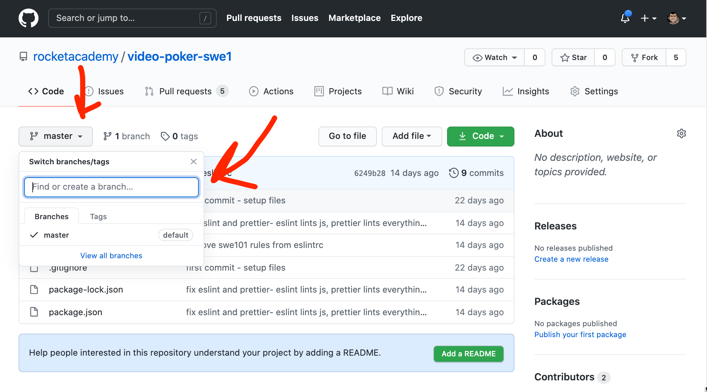

# 2.ICE.7: Git Branches

For this exercise we'll be creating a GitHub repo from scratch and creating branches for the repo.

## GitHub Repo Creation

Begin by creating a repo on GitHub.

When you create the repo also choose to create a README.md file as well, so that the repo does not start empty.

Clone the repo:

```text
git clone <REPO_URL>
```

cd into the repo and add this JavaScript file.

### index.js

```javascript
let name = process.argv[2];
console.log(`hello ${name.toUpperCase()}! How are you?`);
```

Add, commit and push this file to GitHub.

## Branch

Create a repo branch. Note that branch names are typically in kebab-case.

```bash
git checkout -b add-json
```

Add a `data.json` file and change the `index.js`

### data.json

```javascript
{
  "names": []
}
```

### index.js

```javascript
import { writeFile } from 'fs';

let name = process.argv[2];

writeFile('data.json', name, (error) => console.log('err ->', error));
```

## Push your changes to GitHub:

`origin` is the default [Git Remote](https://git-scm.com/docs/git-remote.html). A Git Remote is a a remote repository that this local repository is linked to. `git push` has 2 optional parameters. 1st is the remote to push to, and 2nd is the branch to push to at that remote.

```javascript
git push origin add-json
```

Go to the GitHub website to see your changes. Use the branch dropdown:



## Main

Checkout the main branch again and make a change to `index.js` on line `2`:

```javascript
console.log(`good day ${name}, are you well?`);
```

Add, commit and push this change to GitHub.

## Pull Request

When you push to a branch you'll get a GitHub message asking you if you want to make a pull request.

You can click the green button to see a comparison against your main branch \(or any other branch\), and whether or not there will be any merge conflicts. \(Clicking won't actually create a pull request\).


## 2nd User Branch

Add your partner as a contributor to the repo:

1. Go to the settings tab of the repo.
2. Click **Manage Access** on the left side column menu.
3. Click the green **Invite teams or people** button.


Type to autocomplete their GitHub username.


They will receive an email with an invite to collaborate. \(This notification doesn't show up on the GitHub website\).

## Change Partner Repo

Once you are a collaborator, checkout the repo:

```text
git clone <REPO_URL>
```

Create a new branch and make a change to line `2` of the `index.js` file.

```javascript
console.log(`yo ${name}, what's up dude.`);
```

Add, commit and push this change.

## Team Work

When we begin to collaborate on code, a pull request is the main way we'll be able to control what is happening within a project.

Each team mate will create a branch for the feature they are working on and create a pull request when they are done with that feature.

Create a pull request with the changes you made on the branch.

## Git Pull

To get the current set of changes on a branch that exists on GitHub but doesn't exist on your own branch, use `git pull`.

```text
git checkout main
git pull origin main
```

Note that for now, you have to be on the same branch as the one you are pulling from. Otherwise you are basically doing a merge.

When you do the pull you'll see the code change to the version that is the same as GitHub.

