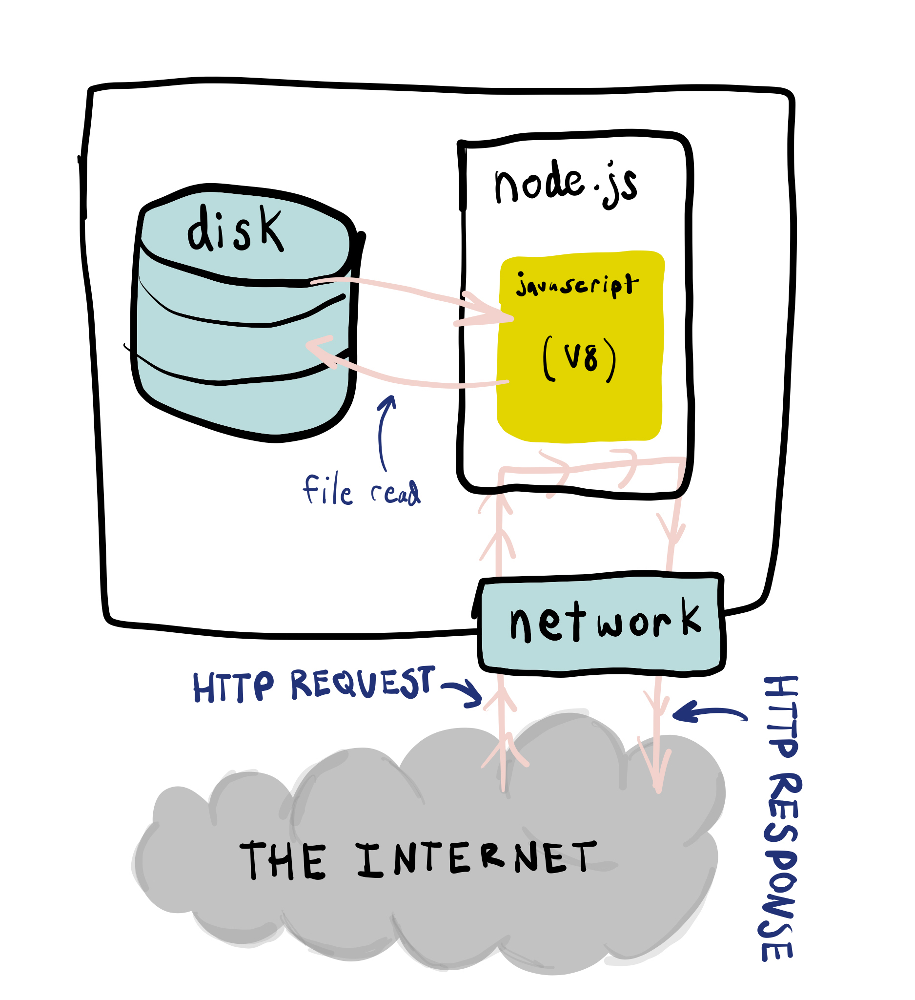

# 2.10: HTTP File Server

## Introduction

We can create a Node.js application that listens for requests for files we have on our computer. We call this a "file server".



### index.js

```javascript
// http is a built-in global Node.js module.
import { createServer } from 'http';
import { readFile } from 'fs';

// Use port 3004 by convention.
const PORT = 3004;

const whenIncomingRequest = (request, response) => {
  // request.url contains the portion of the URL after the domain.
  // E.g. for https://ra.co/index.html, request.url would return "/index.html".
  console.log('request url', request.url);

  // "." refers to the Unix filesystem ".", which represents the current directory.
  const filePath = '.' + request.url;

  readFile(filePath, (error, content) => {
    if (error) {
      console.log('error reading file', error);
      return;
    }

    response.writeHead(200, {});
    response.end(content, 'utf-8');
  });
};

createServer(whenIncomingRequest).listen(PORT);
```

## Create Text File

### hello.txt

```javascript
Hello My Text File.
```

## Run Server

When this runs, the server does not run through the code and then end. It's waiting for incoming requests until you press `Ctrl+C`. Look for this running process in the Activity Monitor / Task Manager.

```javascript
node index.js
```

## Make Request to Server from Browser

Visit [http://localhost:3004/hello.txt](http://localhost:3004/hello.txt) from browser. We are using the path portion of the URL to tell the `readFile` `fs` function where to look on the computer. We'll continue to use this equivalence of the file path and the URL path to specify "resources" later.


## Exercise

1. Clone [the base Node repo.](https://github.com/rocketacademy/base-node-bootcamp)
2. Repeat the above code.
3. Request for a file that does not exist.
4. Create an HTML file in the directory and make a request for it.
5. Look at the request for the server in the Chrome DevTools networking tab.
6. Copy all of the files for your Video Poker project into the directory and request for the HTML file from your browser.

