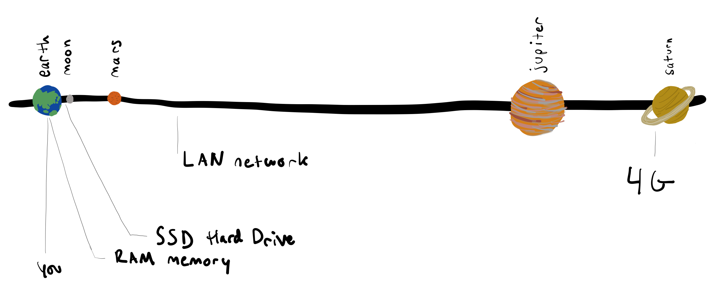

# 2.4: Disk Reading

## Introduction

Node.js enables us to read files on our hard drive.


## Basic Example

**mystuff.txt**

```javascript
hello world
```

**index.js**

```javascript
import { readFile } from 'fs';

console.log('done importing from fs');

// Define callback function to run after retrieving file contents in readFile
const whenFileIsRead = (error, content) => {
  console.log('running inside of whenFileIsRead');

  // Handle errors if any
  if (error) {
    console.log('read error', error);
    return;
  }

  console.log('content', content);
};

// Declare filename as a variable for modularity and clarity
const filename = 'mystuff.txt';

console.log('about to call readFile');

// 2nd param 'utf8' specifies the file encoding.
// Read more about UTF8 here: https://en.wikipedia.org/wiki/UTF-8
readFile(filename, 'utf8', whenFileIsRead);

console.log('done calling readFile');
```

This is a program that reads the contents of the file called `mystuff.txt`, as specified by the `filename` variable on line 19.

The most important aspect of this code is that it is asynchronous, just like click events, `setTimeout`, or `setInterval`.

What do you think the order of the `console.log`s will be?

## `fs` Module

`fs` is the built-in Node.js library that interacts with the computer's file system, i.e. the operating system abstraction of the hard drive. See the official `fs` documentation [here](https://nodejs.org/api/fs.html).

`readFile` is one of the functions that `fs` exports. See the specific documentation for `readFile` [here](https://nodejs.org/api/fs.html#fs_fs_readfile_path_options_callback).

## Error

`readFile` passes the `error` parameter to its callback function so that we know when something went wrong during file read. We should always have conditional checking for `error` when file reading.

## Node.js Asynchronous Actions

We will do all interfacing with the computer in Node.js asynchronously. This is because accessing resources external to our program can take an unknown amount of time depending on how "far away" that resources is.



<table>
  <thead>
    <tr>
      <th style="text-align:left">Hardware Component</th>
      <th style="text-align:left">What we use it for</th>
      <th style="text-align:left">Time</th>
      <th style="text-align:left">Relative Kilometers</th>
      <th style="text-align:left">Relative Distance</th>
      <th style="text-align:left">x Times Slower Than RAM</th>
    </tr>
  </thead>
  <tbody>
    <tr>
      <td style="text-align:left">RAM Memory</td>
      <td style="text-align:left">
        <p>var x = 0;</p>
        <p>console.log(x);</p>
      </td>
      <td style="text-align:left">0.0000001 seconds</td>
      <td style="text-align:left">1 km</td>
      <td style="text-align:left">Your office.</td>
      <td style="text-align:left">~</td>
    </tr>
    <tr>
      <td style="text-align:left">SSD Hard Drive</td>
      <td style="text-align:left">Databases, files on the computer.</td>
      <td style="text-align:left">0.00015 seconds</td>
      <td style="text-align:left">150,000km</td>
      <td style="text-align:left">Halfway to the moon.</td>
      <td style="text-align:left">10&#xB3;</td>
    </tr>
    <tr>
      <td style="text-align:left">LAN Network</td>
      <td style="text-align:left">Networked Database access from a computer nearby.</td>
      <td style="text-align:left">0.15 seconds</td>
      <td style="text-align:left">150,000,000km</td>
      <td style="text-align:left">Twice the distance to Mars.</td>
      <td style="text-align:left">10&#x2078;</td>
    </tr>
    <tr>
      <td style="text-align:left">4G Mobile Network</td>
      <td style="text-align:left">Downloading something on a mobile device. (30 mbps)</td>
      <td style="text-align:left">1 second</td>
      <td style="text-align:left">1,000,000,000km</td>
      <td style="text-align:left">Not quite to Saturn.</td>
      <td style="text-align:left">10&#x2079;</td>
    </tr>
  </tbody>
</table>

When we get something from the hard drive of the computer, as in the example above, we are writing a callback function that runs when the operating system is done with the drive reading action.

The reason why we want to go to the trouble of using an asynchronous callback \(which is more difficult to understand and more complicated to write than a synchronous action\) is because we will not be sure how long such an action will take, and we know that it will take a relatively large amount to time to run.

Many different factors could affect the speed of this action, such as, the size of the file, the specific hardware of the drive, \(SSD versus spinning platter\), if another application is accessing the file as well, etc. The operating system is managing all of this "traffic".

In the syntax above, our program can continue to run and do other things while it waits for the file contents to be ready.

This chart above shows that in the best case it takes 1000 times longer to get something from the disk than a variable from RAM memory \(where all program variables are stored\).

We will also see that when we get to the internet we need to solve for similar \(but much worse\) time scales.

## Example: Splitting Multi-Line Files

`\n` is the hidden character that creates a new line in text files. We can detect that character and create an array of lines in our program.

**mystuff.txt**

```javascript
hello world
bananas
apples
oranges
```

**index.js**

```javascript
import { readFile } from 'fs';

const whenFileIsRead = (error, content) => {
  const lines = content.split('\n');

  for (let i = 0; i < lines.length; i += 1) {
    console.log(`line ${i + 1}:${lines[i]}`);
  }
};

const filename = 'mystuff.txt';

readFile(filename, 'utf8', whenFileIsRead);
```


Newline characters are actually a relatively complicated topic. For our purposes `\n` will work for everything we want to do. It will not work in 100% of situations. Read more about newlines [here](https://en.wikipedia.org/wiki/Newline).


## Exercise

1. Clone [the base node repo.](https://github.com/rocketacademy/base-node-bootcamp)
2. Repeat the above code.
3. Set the file with an absolute path.
4. Set the file with a relative path using `~`.
5. What happens when we try to read a file that doesn't exist?
6. What happens when the name is a folder and not a file?
7. Get the file name from a command line command like the following.

```javascript
node index.js mystuff.txt
```

