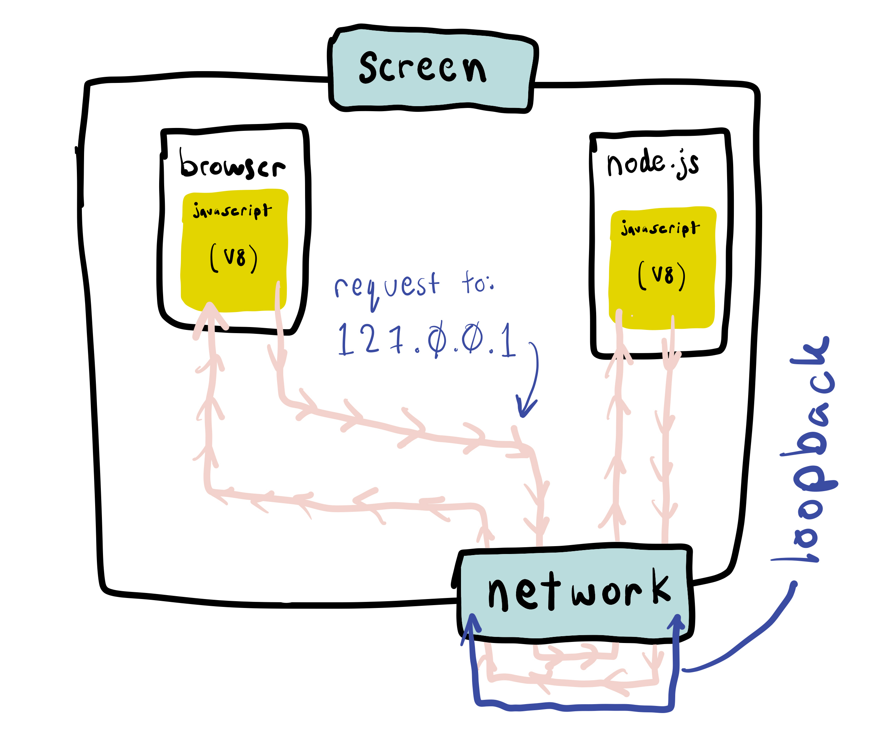

# 2.9: HTTP

## Introduction

HTTP stands for [Hypertext Transfer Protocol](https://developer.mozilla.org/en-US/docs/Web/HTTP#:~:text=Hypertext%20Transfer%20Protocol%20%28HTTP%29%20is,be%20used%20for%20other%20purposes.), a protocol that determines how data is sent across the internet through HTTP Requests and Responses. HTTP is an "application-level" protocol, meaning it packages data to be sent before lower-level protocols such as TCP/IP translate and transmit that data in the form of "packets".

## What is a Server

According to [Wikipedia](https://en.wikipedia.org/wiki/Server_%28computing%29), a server is "a piece of computer software that provides functionality for other programs called 'clients'". In an Internet context, this means software that listens for requests from "clients" \(e.g. browsers or mobile apps\) over the Internet, and sends back relevant responses. Servers are typically running 24/7 waiting for requests, such that clients can access their functionality 24/7.


## Server That Responds With 'yay'

#### index.js

```javascript
import { createServer } from 'http';

const PORT = 3004;

const handleIncomingRequest = (request, response) => {
  console.log('request came in');

  // response.end tells the server to send the completed response and mark
  // this request-response interaction complete.
  // https://nodejs.org/api/http.html#http_response_end_data_encoding_callback
  response.end('yay', 'utf-8');
};

createServer(handleIncomingRequest).listen(PORT);
```

#### Sample Command

```javascript
node index.js
```

This server is available at: [http://localhost:3004](http://localhost:3004). `localhost` is the default domain name for all servers that are running on our local machines, e.g. in our terminal programs. The port is specified from within the local server application. We do not use port 80 to prevent port conflicts between this server application and other applications potentially also running on `localhost`.

Note that when this runs, the server does not run through the code and then end. It's waiting for incoming requests until you press `Ctrl+C`. Look for this running process in the Activity Monitor / Task Manager.

## Node.js Asynchronous Network Actions

Node.js always interfaces with our computer asynchronously. This is because of the relative "distance" or "speed" of parts of our computer such as RAM or hard drive. We do not necessarily want our programs to wait for data to return from parts of our computer that are "far away" or "slower". We elaborate on this in the Internet Latency section below.

## Node.js Server Callbacks

Callbacks behave similarly regardless of frontend or backend: perform logic when a specific action happens. The `handleIncomingRequest` callback in our backend server has the same conceptual functionality as an `addEventListener` callback function in our frontend. For `handleIncomingRequest`, the action is a request from the client \(browser\), and for `addEventListener` the event is typically a UI action such as a mouse click.

## Internet Latency

When you interact with the internet:

1. It's slow.
2. You don't know how long it will take.

Getting something from the internet could take a literal million times \(10⁶\) times longer than getting something from the hard drive. Because most internet software expects to be accessed in many different contexts and from many different devices, you also have no control over the consistency of the speed. It will sometimes be fast, and sometimes be slow, and your application has to account for all of these situations.


<table>
  <thead>
    <tr>
      <th style="text-align:left">Hardware Component</th>
      <th style="text-align:left">What we use it for</th>
      <th style="text-align:left">Time</th>
      <th style="text-align:left">Relative Kilometers</th>
      <th style="text-align:left">Relative Distance</th>
      <th style="text-align:left">x Times Slower Than RAM</th>
    </tr>
  </thead>
  <tbody>
    <tr>
      <td style="text-align:left">RAM Memory</td>
      <td style="text-align:left">
        <p>var x = 0;</p>
        <p>console.log(x);</p>
      </td>
      <td style="text-align:left">0.0000001 seconds</td>
      <td style="text-align:left">1 km</td>
      <td style="text-align:left">Your office.</td>
      <td style="text-align:left">~</td>
    </tr>
    <tr>
      <td style="text-align:left">SSD Hard Drive</td>
      <td style="text-align:left">Databases, files on the computer.</td>
      <td style="text-align:left">0.00015 seconds</td>
      <td style="text-align:left">150,000km</td>
      <td style="text-align:left">Halfway to the moon.</td>
      <td style="text-align:left">10&#xB3;</td>
    </tr>
    <tr>
      <td style="text-align:left">LAN Network</td>
      <td style="text-align:left">Networked Database access from a computer nearby.</td>
      <td style="text-align:left">0.15 seconds</td>
      <td style="text-align:left">150,000,000km</td>
      <td style="text-align:left">Twice the distance to Mars.</td>
      <td style="text-align:left">10&#x2078;</td>
    </tr>
    <tr>
      <td style="text-align:left">4G Mobile Network</td>
      <td style="text-align:left">Downloading something on a mobile device. (30 mbps)</td>
      <td style="text-align:left">1 second</td>
      <td style="text-align:left">1,000,000,000km</td>
      <td style="text-align:left">Not quite to Saturn.</td>
      <td style="text-align:left">10&#x2079;</td>
    </tr>
  </tbody>
</table>

## Network Request to Yourself

### 127.0.0.1

There is a special IP address that doesn't access the network outside of the computer. It simply sends the request back around to the computer as if a request had come in from outside.

### localhost

localhost is the hostname that is resolved directly on your computer to 127.0.0.1



\(Note that localhost isn't specific to HTTP\).

## Headers

Headers are meta information about a given request. There are many different kinds of standard header values, we'll be looking them as we need them.

We make a logical distinction between the request being made and meta information about the request.

## HTTP Request Headers

### HTTP Method Header

The method indicates what kind of action the user is requesting the server do. The method is one of nine words that describes what kind of request is being made. The request method _is part of the JavaScript server application input_. It is up to you as the application programmer to decide which method most accurately describes the kind of request you are sending and accepting.

GET is the default method when you type into the browser bar. This method specification is sent in the header of the request.

GET means that you are _requesting to get something_. \(This language may seem redundant, but we'll see for the other methods, POST, PUT, DELETE, etc., that you can, for example, request to delete something\).

## HTTP Response Headers

### Status Code

The status code is the number that indicates what the server application says about the response. A status code _is part of the JavaScript application output_. It is up to you as the application programmer to decide which status code most accurately describes a given situation.

200 is the status code number that means everything was OK. See [this page](https://www.restapitutorial.com/httpstatuscodes.html) for an overview of different HTTP status codes.

Use the method `writeHead` to set the status code of the response.

```javascript
response.writeHead(200, {});
```

Look up[ in the docs](https://nodejs.org/api/http.html#http_response_writehead_statuscode_statusmessage_headers) for more on `writeHead`.

## Send Requests Out

The main modality of making requests that we'll be using is the Chrome browser. But it's very important to understand that HTTP requests are not specifically related to the browser. An HTTP request can be made from many different kinds of applications, for many different reasons.

### Send Requests with Chrome

Type in google.com to the address bar.

### Send HTTP Requests with the Command Line

`curl` is a command line program that can make requests.

```text
curl google.com
```

See some more [curl examples here.](https://cheatsheet.dennyzhang.com/cheatsheet-curl-a4)

### Send Requests with Node.js

```javascript
import { get } from 'http';

const whenResponseReceived = (resp) => {
  let data = '';

  // A chunk of data has been received.
  resp.on('data', (chunk) => {
    data += chunk;
  });

  // The whole response has been received. Print out the result.
  resp.on('end', () => {
    console.log('Response Data ===>', data);
  });
};

// Send an HTTP GET request using the HTTP module's `get` function.
get('http://info.cern.ch/', whenResponseReceived).on('error', (err) => {
  console.log('Error: ' + err.message);
});
```

## Exercise

1. Clone [the base Node repo.](https://github.com/rocketacademy/base-node-bootcamp)
2. Set up your server that listens for requests to come in.
3. Make a request to your server with each of the methods above.
4. Make a request to google.com with each of the methods above.
5. Make a request to: [http://info.cern.ch/](http://info.cern.ch/) with each of the methods above.
6. Use the Chrome networking tools and click into the request detail. Look for the header details of the HTTP method and status code.
7. Set your own header of `rocket-academy-wow` with value `true`.
8. Set other status codes in the header such as [206](https://developer.mozilla.org/en-US/docs/Web/HTTP/Status/206), [418](https://developer.mozilla.org/en-US/docs/Web/HTTP/Status/418) and [507](https://developer.mozilla.org/en-US/docs/Web/HTTP/Status/507). What do they do?
9. Set the special status code 300 like the following. What does it do? What does the network tab look like?

```javascript
response.writeHead(301, { Location: 'http://info.cern.ch/' });
```

