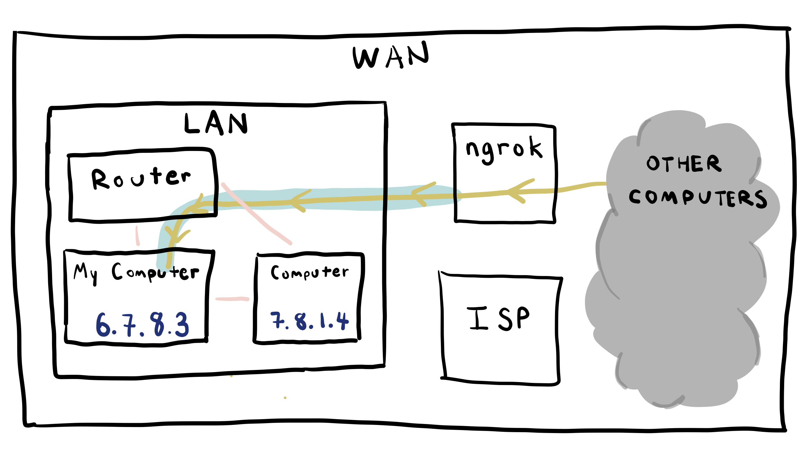

# 2.ICE.4: Servers and Requests

## Setup

Start with the [base Node repo](https://github.com/rocketacademy/base-node-bootcamp).

## Simple Server

#### index.js

```javascript
import { createServer } from 'http';

const handleIncomingRequest = (request, response) => {
  console.log('Received request!');
  response.end('Yay!', 'utf-8');
};

createServer(handleIncomingRequest).listen(3004);
```

Open a new terminal and start your server.

```text
node index.js
```

## `ngrok`



`ngrok` is a service that exposes our computers to the Internet by bypassing our LAN. Typically our computers would not be able to receive requests directly from the Internet.

We'll use `ngrok` to accept requests from others' computers. When we start `ngrok` it gives us a unique address. `ngrok` forwards any requests to that address to our computer at the port we specify.

### Installation

Install [ngrok](https://ngrok.com/). No signup or payment required.

#### Mac

```javascript
brew cask install ngrok
```

#### Windows

```text
sudo apt-get install ngrok-client
```

### Run `ngrok`

Start `ngrok` with the following command to send HTTP traffic to port 3004.

```text
ngrok http 3004
```

We should see the following output.


1. `ngrok` output will show us the public URL that now forwards to our local URL.
2. Open a new terminal window while keeping the `ngrok` window open. When we close the `ngrok` window, `ngrok` will stop forwarding from the public address to our local address.
3. Alter the code to the [base HTTP server](../2.9-http.md#server-that-responds-with-yay) to give a special message to anyone who requests it.

Put the URL to your server in Slack.

## File Server

Use the [base file server code](../2.10-http-file-server.md) and serve your [poker game project](../../projects/project-1-video-poker.md) instead of a message.

Use the file server to serve the [Bootstrap HTML files you created in the previous exercise.](2.ice.3-disk-altering.md#html-processor)

Use the file server to serve any other files you want.

## Multiple Servers

Change the code of the original \(non-file\) server from port 3004 to port 3008.

Open a new terminal window and run it.

Open another, fourth terminal window and run another `ngrok`.

Post this server in Slack.

## Make requests

Just like the previous exercise, make a request to the servers others have posted in Slack.

Use:

* `curl`
* the browser
* Node.js' `http.get`

Verify that you are able to access others' servers exposed via `ngrok`. Do you notice any differences between responses from others' servers and your own?

