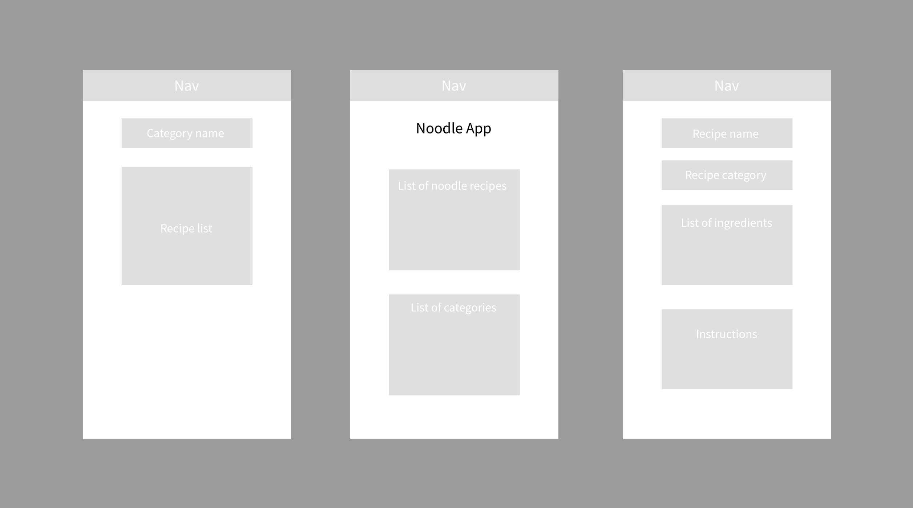
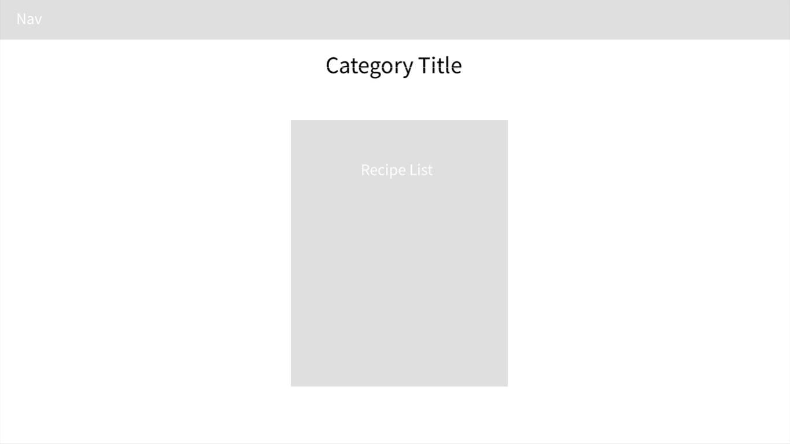

# 2.POCE.5: Responsive Noodle Site

## Introduction

We will upgrade the Noodle site we built in [1.POCE.1: Noodle Recipe Website](../../1-frontend-basics/1.poce-post-class-exercises/1.poce.1-noodles.md) with responsive layouts.

## Setup

Fork and clone the [Noodle App CSS repo](https://github.com/rocketacademy/noodle-app-css).

## Responsive Noodle Recipe Layouts

In [1.POCE.1: Noodle Recipe Website](../../1-frontend-basics/1.poce-post-class-exercises/1.poce.1-noodles.md) we created 3 types of pages.

1. Category page with list of all recipes in that category \(e.g. onion, chicken\)
2. Home page with list of all recipes and categories
3. Single recipe page with details about single recipe

### Instructions

1. Create responsive versions of the above pages according to the wireframes below.
2. Use Bootstrap for layout and choose a colour scheme of 2-3 colours.
3. Develop for mobile first because it is easier to add elements to a page to create desktop layouts than remove elements from a page to create mobile layouts. Starting with mobile will help our mobile views be simpler.

### Mobile Mockups

### Desktop Mockups

#### Category Page

#### Home Page

#### Recipe Page

## Deploy to EC2

1. Use the [file server example application](https://github.com/rocketacademy/file-server-example-bootcamp) we used in [2.11: Deploy Server to Cloud](../2.11-deploy-server-to-cloud.md) to serve files.
2. Inside the file server repo, clone your Noodle Site repo.
   1. This is an exception to the rule of not having Git repositories inside repositories.
   2. Your file server will then have access to the HTML and CSS noodle site files inside of the folder.
3. You should be able to access your noodle site at something like [http://18.234.213.11/noodle-app-css/index.html](http://18.234.213.11/noode-app-css/index.html), where we replace the IP address with the public IP address of your EC2 machine.
   1. Note that the URL path should match the path to the noodle files from the file server repo folder.


#### How can I update my code on EC2 after I've cloned it?

Git allows us to pull changes from an existing repo with the `git pull` command. If you need to do this here, read ahead to [0.6: Git Pull](../../0-language-and-tooling/0.6-git-pull.md).


## Bonus: Video Poker

Try deploying your Video Poker game on the same EC2 instance by following the deployment instructions above with your Video Poker repo.

