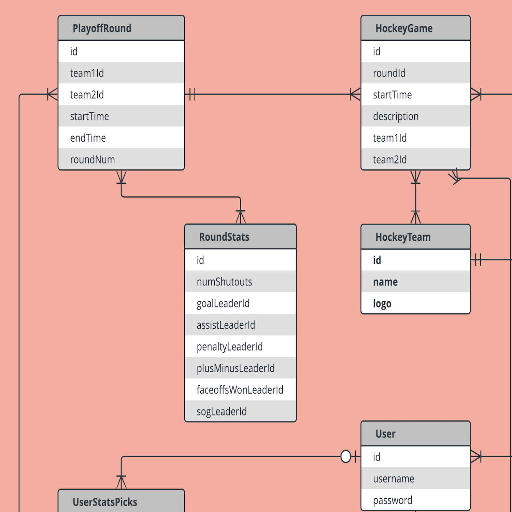

# 3.4.6: SQL Schema Design

Using foreign keys we can actually relate any table to any other table.

In our Express.js apps, when we model real life data, each piece of data is usually related to a couple of other pieces of data.

The exercise of defining those relationships and creating data that can be stored and retrieved in an east to code and efficient way is the practice of designing a SQL database.

There are a few hard rules to designing a SQL database:

1. Tables are related to each other through Primary Key - Foreign Key columns. Never reference a row in another table as a foreign key with a column other than the primary key.
2. Never store more than one piece of data in a cell.
3. Never reuse ids.
4. Always try to identify / pass the primary key id of the data in the JavaScript.

Of course there will always be well-considered exceptions to these rules, but they are relatively rare. The most common is when dealing with data that is not relational to the rest of the system. Something like a user dice roll may not be relational enough to warrant sticking to the rules above.

## 

## ERD

An ERD \(Entity Relationship Diagram\) is a drawing that lists the relationships and types of relationships between data. The purpose of an ERD is to visually represent how data relates to itself.

There are many different flavors of ERD, used at various stages of planning, analyzing and implementing a system, we will mostly be using it as a sketching tool before writing any SQL.

We will **not** be using an ERD to specify any tables or column data types. Our ERD will be a kind of pseudocode for our CREATE TABLE SQL statements.

Our ERD sits one conceptual level above the database. It talks about the kinds of data our app deals with.

### Drawing an ERD

There are online tools that can be used to draw an ERD but pencil and paper also work just as well.

