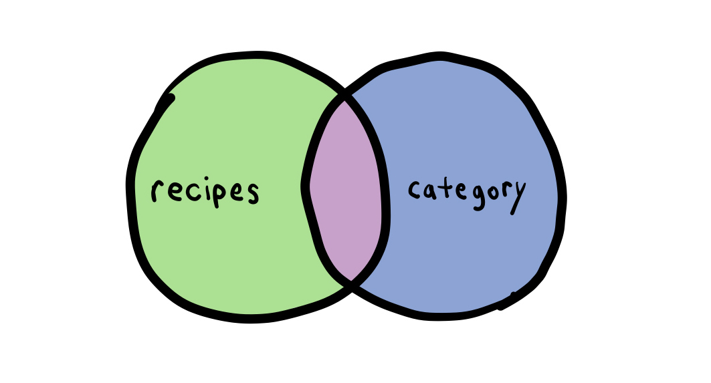
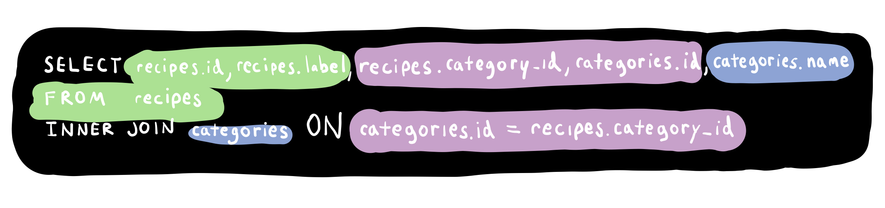
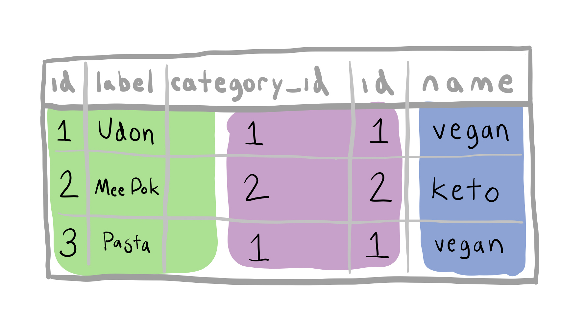

# 3.4.4: INNER JOIN

## Setup

```text
CREATE TABLE recipes ( id SERIAL PRIMARY KEY,
                 label TEXT,
                 category_id INTEGER);

CREATE TABLE categories ( id SERIAL PRIMARY KEY,
                   name TEXT);
```

Create some records:

```text
INSERT INTO categories ( name ) VALUES ('vegan');
INSERT INTO categories ( name ) VALUES ('keto');
INSERT INTO categories ( name ) VALUES ('nut free');
```

Check which ids have been assigned:

```text
SELECT * FROM categories;
```

Associate and create some recipes:

```text
INSERT INTO recipes ( label, category_id ) VALUES ('Udon',1);
INSERT INTO recipes ( label, category_id ) VALUES ('Mee Pok',2);
INSERT INTO recipes ( label, category_id ) VALUES ('Pasta',1);
```

## INNER JOIN

Query that JOINs the two tables:

```text
 SELECT recipes.id, recipes.label, recipes.category_id, categories.id, categories.name
 FROM recipes                                                                                     
 INNER JOIN categories
 ON categories.id = recipes.category_id;
```



An inner join is a query to find the overlapping values between two tables. This query is getting result rows when the category `id` is the same as the `category_id`.



The result of the query is to output a new table that has one row when two rows from the joined tables matched. \(`categories.id` is equal to r`ecipes.category_id`\).



Notice how the result of the query in psql is another table:

```text
 id |  label  | category_id | id | name
----+---------+-------------+----+-------
  1 | Udon    |           1 |  1 | vegan
  2 | Mee Pok |           2 |  2 | keto
  3 | Pasta   |           1 |  1 | vegan
```

### AS

We can change the column names of this result by using `AS`:

```text
SELECT recipes.id, recipes.label, recipes.category_id AS recipe_category_id, categories.id AS category_id, categories.name
FROM recipes                           
INNER JOIN categories
ON categories.id = recipes.category_id;
```

```text
 id |  label  | recipe_category_id | category_id | name
----+---------+--------------------+-------------+-------
  1 | Udon    |                  1 |           1 | vegan
  2 | Mee Pok |                  2 |           2 | keto
  3 | Pasta   |                  1 |           1 | vegan
```

