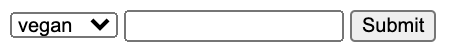

# 3.5.5: Rendering One-to-Many Forms

When we have a one-to-many relationship that encodes an official list of things, such as a category, we need to have the user input the selected category when they create a recipe.

The naive way to do this is simply create another text input for them to input the id, mirroring the value that's in the database.

```javascript
<form action="/recipe" method="POST">
    <input type="text" name="label">
    <input type="text" name="category_id">
    <input type="submit" value="Submit">
</form>
```

But this obviously no good, because the user has to already know what the categories are and what their ids are.

We want to give the user the ability to select from all the possible categories and for the user not to have to deal with the ids.

A recipe can only have one category, and the user has to choose a category out of the selection of categories, so we'll do this with a dropdown- which is a UI design element that represents choosing from one thing out of many things \(i.e., with a dropdown you can't select multiple things\).

We need to populate this dropdown with all of the categories in the database, so before we render the form we'll do a SQL query to get them.

#### index.js

```javascript
app.get('/recipes/new', (request, response) => {

  pool.query('SELECT * from categories', (error, result)=>{

    const data = {
      categories : result.rows
    };

    response.render('recipe', data);
  });
});
```

#### form.ejs



We can set the id of the category in the option of the form. The user never has to deal with what category name maps to what id.

```javascript
<form action="/recipe" method="POST">
    <select name="category_id">
        <% categories.forEach((category) => { %>
            <option value="<%= category.id %>">
                <%= category.name %>
            </option>
        <% }); %>
    </select>
    <input type="text" name="label">
    <input type="submit" value="Submit">
</form>
```

