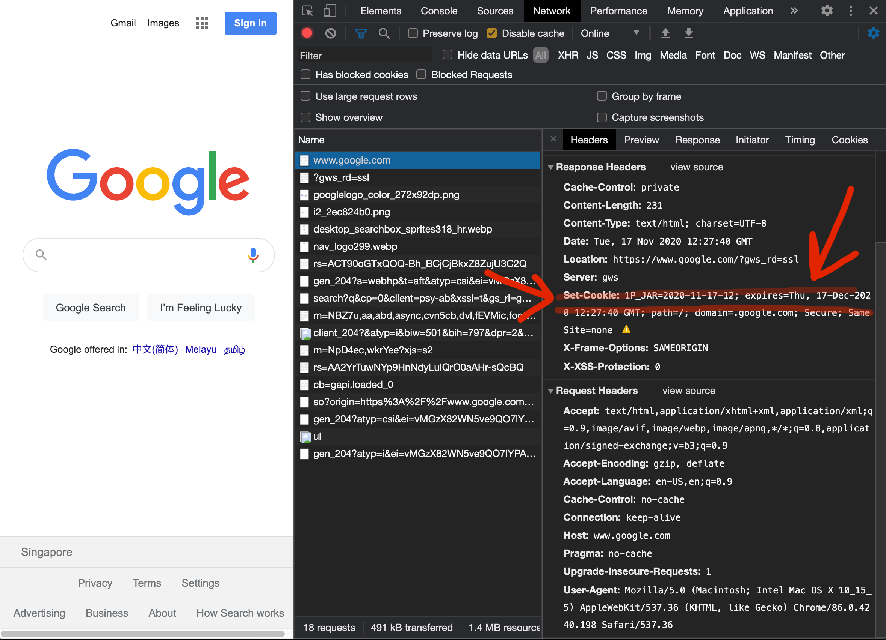
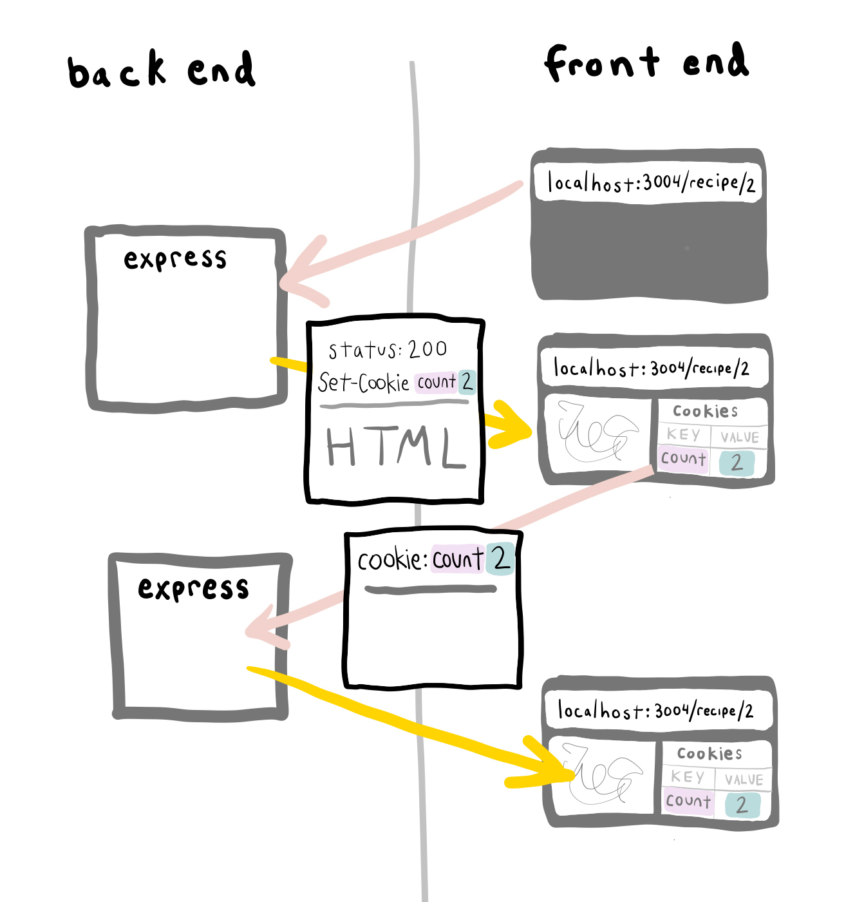

# 3.6.1: Cookies



Cookies are a browser-side feature that will hold onto data and send it in subsequent requests.

Cookies are one of the main technologies that enables basic functionalities like user login, and is one of the main ways that you are tracked across the internet for the purpose of ads, although that is currently changing, with laws and technical developments. See more about that below:

[https://www.theverge.com/2020/3/24/21192830/apple-safari-intelligent-tracking-privacy-full-third-party-cookie-blocking](https://www.theverge.com/2020/3/24/21192830/apple-safari-intelligent-tracking-privacy-full-third-party-cookie-blocking)  
[https://www.cookiebot.com/en/gdpr-cookies/](https://www.cookiebot.com/en/gdpr-cookies/)

## Headers

Specifically cookies are keyed to specific response headers and request headers.

If the browser receives a properly formatted **response** header, it will store a given set of cookie data.

On every new subsequent **request** on the same domain,. it will send that data back in the header of the request.

#### Cookie Setting and Sending Order:

1. The browser receives a response back from the server. This response header has the `Set-Cookie` key in it. The `Set-Cookie` key's value is a set of keys and values that contain cookie data and metadata.
2. The browser stores that set of keys and values.
3. The browser makes another request to that domain. Inside the request headers are the cookie keys and values.


The most important part of this mechanic to understand is that the instruction to set the cookie is in the **response** header to a request.


## Incognito Mode

The defining characteristic of Incognito Mode is that its cookie environment is separate from the non-Incognito cookie environment \(i.e., cookies are not mixed between the two\).

Open Incognito mode and open the Dev Tools. Go to [https://www.google.com/](https://www.google.com/?gws_rd=ssl) and look in the Network tab.

Look for the `Set-Cookie` header in the response. Look in the **request** header. It doesn't say anything about cookies.



Go to another Google domain address: [https://www.google.com/doodles/](https://www.google.com/doodles/)

Look in the **request** headers to see the cookies that the browser was previously instructed to hold, being sent back.


Look in the Application tab to see the set of all cookies for this domain. Click around the www.google.com domain to see that these cookies are being sent on every subsequent request.


## Curl

Send a cookie with `curl`.

```text
curl -v --cookie "TOKEN1=Yes;TOKEN2=no" http://localhost:3000/recipe/1
```

## Express

### Response: Set a cookie

[http://expressjs.com/en/4x/api.html\#res.cookie](http://expressjs.com/en/4x/api.html#res.cookie)

```text
response.cookie('name', 'tobi');
```

### Response: Delete a cookie

```text
response.clearCookie('name')
```

### Request: Receive a cookie

[http://expressjs.com/en/4x/api.html\#req.cookies](http://expressjs.com/en/4x/api.html#req.cookies)

```text
console.log(request.cookies.name)
```




