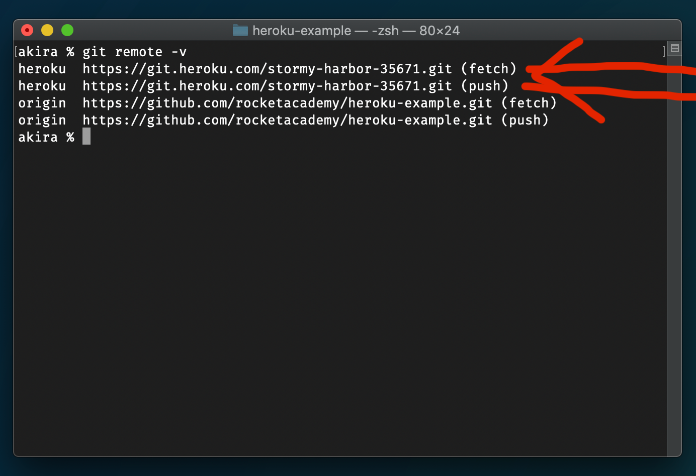

# 3.8.1: Heroku Deploy

Heroku works by tying your repo to it's deployment system. You git push your repo to the Heroku remote and Heroku runs a set of predetermined scripts so that your app is up and running.

You can see their [detailed docs here.](https://devcenter.heroku.com/articles/getting-started-with-nodejs?singlepage=true)

Install the Heroku commmand line tools:

MacOS

```text
brew install heroku/brew/heroku
```

Windows

```text
sudo snap install heroku --classic
```

Login to the service through the command line:

```text
heroku login
```

We're going to create a special example app to demonstrate Heroku.

## Repo Setup

Clone a copy of the express starter code:

```text
git clone https://github.com/rocketacademy/heroku-example.git
```

cd inside:

```text
cd heroku-example
```

Create this as a new repo for yourself on GitHub.

Remove the Rocket Academy origin URL:

```text
git remote remove origin
```

Set the new origin to your GitHub repo:

```text
git remote add origin <YOUR_GITHUB_URL>
```

push the code up to your new repo:

```text
git push origin main
```

## Express

We need to make a few changes to this repo to make sure it can be used on Heroku.

Start by proving that the app works properly on your local system:

```text
npm install
npx nodemon index.js
```

[http://localhost:3004/bananas](http://localhost:3004/bananas)

### Port

We need to add the ability of Heroku to configure the port that Express.js is listening on. \(We can't set it ourselves, and it's not 80 - our Express.js app will not be directly listening for incoming internet traffic. There is an internal Heroku server that is listening on port 80 and forwarding traffic to our Express.js server instance.

### index.js

```javascript
const PORT = process.env.PORT || 3004;
```

### package.json

Heroku needs a way to know what command to run to start the system. Add `start` to the `scripts` section of `package.json`.

```javascript
 "scripts": {
    "start": "node index.js",
    "test": "node test.js"
  },
```

Commit these changes to your repo. Test them to make sure your app still runs locally.

## Heroku

Now we'll associate the repo with Heroku \(note this happens on your laptop, not at GitHub\):

```bash
heroku create
```


Check to see the new remote Heroku has created for you:

```text
git remote -v
```

\`\`



`push` the repo code to Heroku:

```text
git push heroku main
```

This command will set off the Heroku scripts that activate and run your app. You'll see them running in the terminal.

The terminal output will tell you what the URL of your new app is.


Check the [Heroku dashboard to see your app settings.](https://dashboard.heroku.com/)


