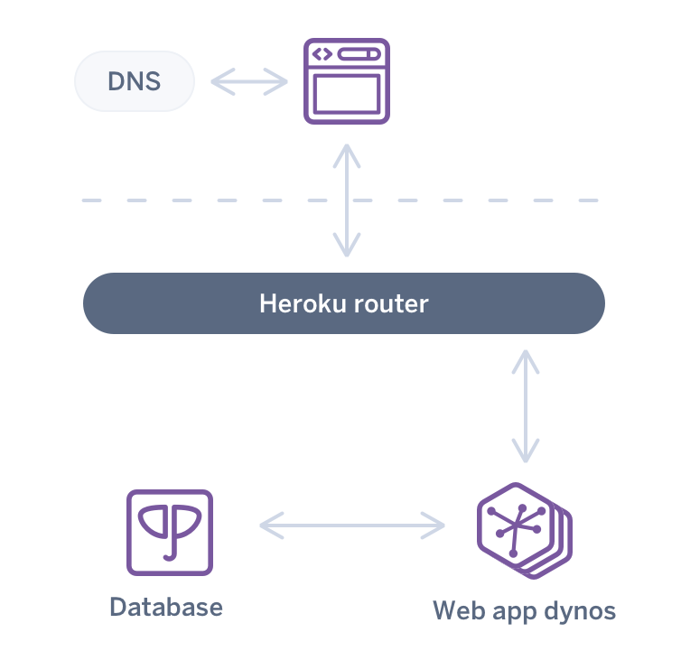

# 3.8.3: Heroku S3

On Heroku, unlike the AWS EC2 instances we were using before, the platform has been optimized for scalability to begin with.



Heroku will let you spin up hundreds of dynos, each running a copy of your app. This is for a single deploy of your app through Git. \(You don't have to run a terminal command for each of these dynos\).


Since this is the case we lose the idea of a location to upload files to. If a user uploads files to one dyno, that file is trapped on that dyno, because Heroku transparently routes traffic to one of the possible dynos you have running outside of your control.

In fact, the Heroku platform does not even really support uploads that you can send back to the user. If you keep a file inside a dyno long enough \(usually about a day\), it may simply disappear. See more [here ](https://help.heroku.com/K1PPS2WM/why-are-my-file-uploads-missing-deleted)and [here](https://devcenter.heroku.com/articles/dynos#ephemeral-filesystem).

## S3

S3 is AWS' file service. You can give them a file to store for later use. S3 is one of the main file services recommended by Heroku.

### Secrets

Get the secret keys we'll need to authenticate the server when uploading a file.

Go to the new user creation page to create a user for this app: [https://console.aws.amazon.com/iam/home\#/users](https://console.aws.amazon.com/iam/home#/users)

Add a user: [https://console.aws.amazon.com/iam/home\#/users$new?step=details](https://console.aws.amazon.com/iam/home#/users$new?step=details)

Name the user whatever you want.


Choose "Attach existing policies directly". Filter for S3 policies. Select the `AmazonS3FullAccess` policy. \(Note that in a real production app these permissions would be created from scratch\).

Copy the keys to use them in the app.

Set environment variables in order to get a hold of the values in the app:

```text
export ACCESSKEYID=<AWS_KEY>
export SECRETACCESSKEY=<AWS_SECRET>
```


Never make any commit in your code with these keys.

Never, ever push that commit to a GitHub repo.

Never, ever, ever push the code to a public repo.

You would be responsible for any charges to your AWS account if these keys were used by anyone else.

If you committed and pushed your keys by mistake, delete them from AWS right away.


### Buckets

A bucket is the S3 equivalent of a directory. Depending on the application you can have one or many buckets per app. The maximum bucket size is 5TB.

To begin with we'll create a single bucket for this app. Multiple bucket apps are out of the scope of this exercise.

Create a bucket [here. ](https://s3.console.aws.amazon.com/s3/bucket/create)Make sure to save the name of the bucket.

Allow public access on the bucket.


## S3 + Multer

We'll be using a few NPM libraries to tie together Multer, and S3. This assumes you already have Multer installed and configured from the [previous upload exercise.](../3.5-sql-applications/3.5.11-file-uploads.md)

```text
npm install aws-sdk multer-s3
```

Import the libraries:

```text
import aws from 'aws-sdk';
import multerS3 from 'multer-s3';
```

Configure the libraries:

```javascript
const s3 = new aws.S3({
  accessKeyId: process.env.ACCESSKEYID,
  secretAccessKey: process.env.SECRETACCESSKEY,
});
```

Configure the Multer upload:

```javascript
const multerUpload = multer({
  storage: multerS3({
    s3,
    bucket: '<MY_BUCKET_NAME>',
    acl: 'public-read',
    metadata: (request, file, callback) => {
      callback(null, { fieldName: file.fieldname });
    },
    key: (request, file, callback) => {
      callback(null, Date.now().toString());
    },
  }),
});
```

Assuming this form:

```markup
<form action="/recipe" method="post" enctype="multipart/form-data">
  <label for="label">recipe label:</label><br />
  <input type="text" id="label" name="label" /><br />
  <label for="photo">recipe photo:</label><br />
  <input type="file" name="photo" />
  <input type="submit" value="Submit" />
</form>
```

Add it to the express route:

```javascript
app.post('/recipe', multerUpload.single('photo'), (request, response) => {
  console.log(request.file);
  response.send(request.file);
});
```

The file you just uploaded will be available by copy-pasting the `location` key of `request.file`. Record this key in your database to use it later when displaying the file on an HTML page.

You should be able to see the file in the AWS bucket page as well.

## Heroku S3

Set the AWS values as environment variables.

Go to the settings tab of the heroku app dashboard and paste in the Amazon credential keys and values. 


Copy the values from your computer into the Heroku dashboard.

