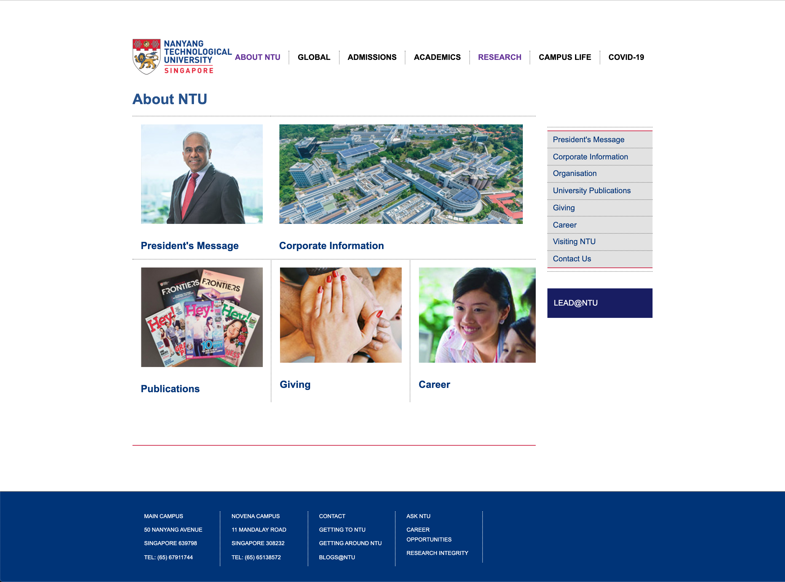

# 3.ICE.15: CSS Practice 3

## Instructions

Recreate the NTU website's [About page](https://www.ntu.edu.sg/AboutNTU/Pages/home.aspx).

1. Clone the [base Bootstrap repo](https://github.com/rocketacademy/basic-bootstrap-swe1).
2. Use Bootstrap to recreate the NTU About page based on the following screenshots. The screenshots may look slightly different from NTU's actual website because we fixed UI bugs and removed certain elements for simplicity. Remember to make the site responsive and work on the mobile version of the site first.

## Images

Link to the images or download them from [NTU's page](https://www.ntu.edu.sg/AboutNTU/Pages/home.aspx).

