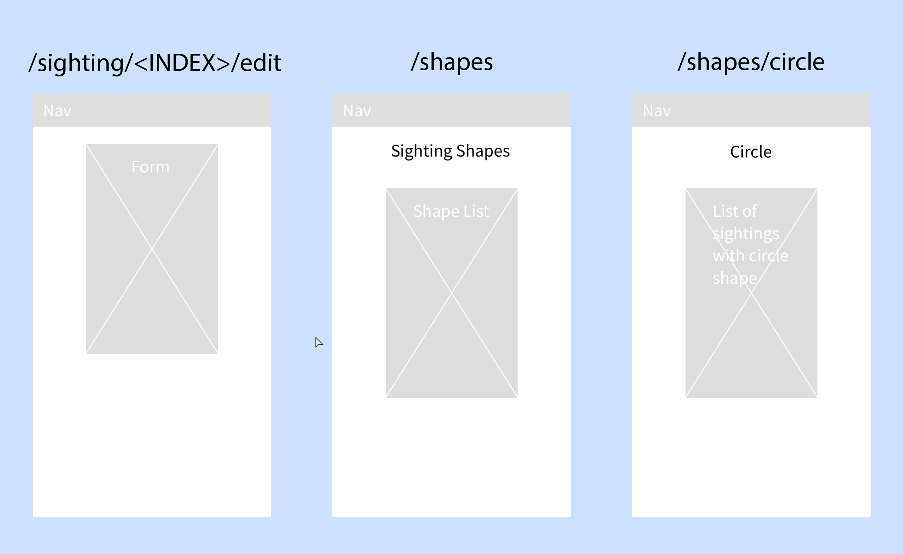

# 3.PCE.3: Express - UFOs

Create an app that tracks UFO sightings.

Begin by forking and cloning [this repo.](https://github.com/rocketacademy/ufo-express-swe1)

## Base

This app will render EJS files on the browser. Use Bootstrap to style the pages. Make the pages responsive so that they also don't look bad on a desktop width as well.

Here is a complete list of all the routes that are spec'd out for this app.

Work on them in the order listed below.

### Routes

| URL Path | Method | Purpose |
| :--- | :--- | :--- |
| /sighting | GET | Render a form that will create a new sighting. |
| /sighting | POST | Accept a POST request to create a new sighting. |
| /sighting/:index | GET | Render a single sighting. |
| / | GET | Render a list of sightings. |
| /sighting/:index/edit | GET | Render a form to edit a sighting. |
| /sighting/:index/edit | PUT | Accept a request to edit a single sighting |
| /sighting/:index/delete | DELETE | Accept a request to delete a sighting. |
| /shapes | GET | Render a list of sighting shapes. |
| /shapes/:shape | GET | Render a list of sightings that has one shape. |

_Note: notice that there is no GET route involving DELETE. The delete form is integrated into the root_ `/` _route. At each row of the list of sightings is a form with a single button that deletes that sighting._

## Comfortable

### Date Created

Use the [JavaScript Date object](https://developer.mozilla.org/en-US/docs/Web/JavaScript/Reference/Global_Objects/Date) to add a standardized time and date for when the sighting was submitted \(note that this is different from the reported time of the sighting\).

### Validation

For the creation and editing of sightings, implement functions that check the input from the user. Write them so that they can be reused for creation and editing.


The validation we are performing in Module 3 is all server-side validation, meaning the validation happens within the server. In Module 4 we will learn about client-side validation, where we can validate form values client-side before they are sent to the server.


## More Comfortable

### Bootstrap Validation

If an input validation fails, use the [Bootstrap form validation styles](https://getbootstrap.com/docs/4.5/components/forms/#validation) to let the user know what they did wrong. \(Note- DO NOT use the JavaScript validation- just use the CSS class validation\).

### jsonFileStorage

Abstract away each HTTP method action into the JSON file storage module. \(GET and POST are already done\).

**GET** read

**POST** add

**PUT** edit

**DELETE** delete

### Date Validation

Make sure the user can't submit a sighting on a date in the future.

### Date Format

Install the [moment npm](https://www.npmjs.com/package/moment) package and use it to format the date the sighting was submitted in the format "_x_ days ago".

[https://momentjs.com/docs/\#/displaying/fromnow/](https://momentjs.com/docs/#/displaying/fromnow/)

Use the library to nicely format the sighting date, e.g., "Monday, September 12th, 1997".

### Visit Counter

Add a visit counter for the home page of the site.

This is a count of all the people that have visited the site. \(You can test this by opening and closing an incognito window - when all incognito windows close, the cookies get erased\).

Display the counter on the home page.

### Visit Counter 2

A visit counts for a given user only once a day and for any page on the site \(i.e., a visit is when they go to any page on the site\). Visits on the same day do not increment the visit counter.

### Deployment

Spin up a new AWS instance and deploy the app.

### Favorites

Allow the user to submit "favorite" sightings. Save this information of the list of sightings for them in a cookie. Display the information in the cookie back out to them when viewing the home page. This should be a list of links to the sightings.

