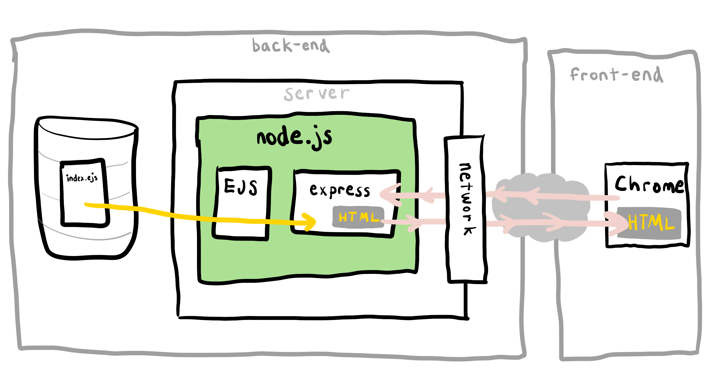
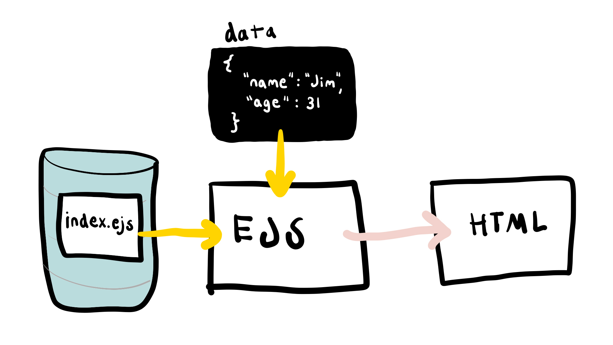

# 3.2: EJS

## What is EJS?



EJS stands for Embedded JavaScript. It is the npm library that works together with Express.js so that our responses can be full HTML documents.

It uses EJS HTML template files so that the main part of the HTML document does not have to be rewritten for every kind of response.

Express.js' `render` function runs the EJS part of the system and produces an HTML string that is sent back to the browser.

We are beginning to split our app up into separate files by putting the response HTML templates in their own directory.

## Views

EJS takes data passed to it from the `render` function and uses that to produce the HTML that gets sent back. These files will all live in a directory called `views`. The term "view" comes from the [Model-View-Controller or MVC framework](https://en.wikipedia.org/wiki/Model%E2%80%93view%E2%80%93controller) that defines views as the looks of the application, i.e. what the user is able to "view".




EJS HTML templates in the backend are not to be confused with DOM manipulation that happens in the frontend. Both happen independently. While DOM manipulation can be used to generate HTML content dynamically once a page has loaded, EJS is used to generate static HTML pages dynamically from the backend, such that different URL paths can yield different HTML pages, each of which can be generated from the same EJS template. 

An example of EJS and DOM working together in the same application can be our Noodle App. EJS templates can be used to dynamically generate recipe pages for URL paths `recipe/0` and `recipe/1`. Once loaded in the client, those recipe pages can then be manipulated by DOM JS code, where clicking on elements on the pages further updates the UI.


## Using EJS

### Configuration

Install the EJS library.

```bash
npm install ejs
```

Install the EJS syntax highlighter for VSCode. This is to enable JS syntax highlighting and formatting within EJS files.

[https://marketplace.visualstudio.com/items?itemName=DigitalBrainstem.javascript-ejs-support](https://marketplace.visualstudio.com/items?itemName=DigitalBrainstem.javascript-ejs-support)

### File Structure

```text
└── banana-app
    ├── index.js
    └── views
       └── index.ejs
```

### index.js

Set the view engine to generate HTML responses in `index.js`. This line goes below where you define `app`, but above any routes.

```javascript
app.set('view engine', 'ejs');
```

Within a route, when ready to return an HTML page as a response, call `response.render`. `response.render` takes two arguments.

1. The path/name of a file \(without extension\) in the `views` directory.
2. Data that will be used to render the HTML. This is an object.

```javascript
import express from 'express';

const app = express();

app.set('view engine', 'ejs');

app.get('/banana', (request, response) => {
  const data = {
    user: {
      name: 'kai',
    },
  };

  response.render('index', data);
});
```

### index.ejs

EJS files look similar to HTML files, except with "templating syntax" to inject JavaScript variables into the HTML. In this example, the properties of the `data` object in `index.js` are exposed in `index.ejs`.

These templating concepts and syntax are similar across most web application frameworks, including Ruby on Rails, Python Django, and Java Spring.

```markup
<html>
  <body>
    <h2><%= user.name %></h2>
  </body>
</html>
```


**Naming Conventions**

EJS files are named after the routes that render them.  
  
A route like this:

```javascript
app.get('/recipe/0', ...

```

should render an EJS file called `recipe.ejs`. There are very few exceptions to this convention.


## Add .prettierignore File for Prettier to Ignore EJS

VSCode interprets EJS files as HTML, and sometimes we do not want Prettier to format EJS as HTML. We will add a `.prettierignore` file at the root of the folder open in VSCode to ignore files with a `.ejs` file extension. 

Please add a `.prettierignore` file at the root of the folder open in VSCode with the following contents. For example, if my `rocket` folder is open in VSCode with many subfolders such as `ice`, `prce`, `poce`, `projects`, I will add `.prettierignore` to the `rocket` folder and not any of its subfolders. More info on Prettier Ignore [here](https://prettier.io/docs/en/ignore.html).

```text
# Ignore all EJS files
*.ejs
```

## Exercise

Run the above code.

Write an `h1` element and fill it with another key in the `data` object.

Create a request param: `/fruits/:name`. In the route callback get a hold of the value and output that request value in the HTML by adding it to the data object, then referencing it in the HTML.

