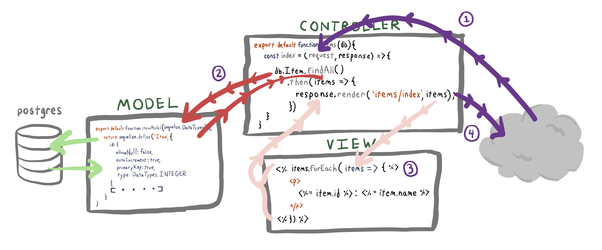

# 4.2: MVC

## Introduction

MVC stands for "Model View Controller" and refers to 3 logical components of web applications. We will use the MVC mental model to refactor our code into multiple files and folders. The MVC concept helps us separate concerns in our web apps, but does not strictly define what logic goes in which files, because different web frameworks have slightly different conventions.

### Model

The Model logical component in MVC refers to the structure of data in our applications, and is the component responsible for manipulating data in the database. In Coding Bootcamp we will use the Sequelize library to power our model architecture, but "model" in MVC refers to structure of data in general and is not dependent on Sequelize, any library, or even a SQL database.

Depending on the opinion of the architect, more or less logic can be placed in models. Read more about that [here](https://stackoverflow.com/questions/14044681/fat-models-and-skinny-controllers-sounds-like-creating-god-models). In Coding Bootcamp we will use models that only contain our Sequelize model definitions, and relegate business logic to our Controllers.

### View

View refers to application UI. We've already defined views in the `views` folder with EJS files. MVC distinguishes between "view logic" and "application logic". View logic determines how data should be rendered and formatted, e.g. transforming data format without changing underlying value. Application logic determines how data should be calculated and stored. Views typically contain view logic, and controllers typically contain application logic.

The following are examples of view logic.

1. Uppercasing a post title
2. Shortening post content to fit in a table
3. Transforming a boolean value in the DB to a contextual visual element, for example a heart icon for whether a user has liked a post.

### Controller

Controller refers to business logic. Controllers are the glue between model and views, and handle HTTP requests and responses. For example, a controIler would determine if, when, and how an app would respond with a 404. In Coding Bootcamp, controllers will contain the majority of our applications' business logic, and generally everything not a model or view will go in a controller. Other web frameworks such as Ruby on Rails advocate for "fat models and skinny controllers", where business logic can be abstracted to models to keep controller logic clean. This is a matter of preference.

### Routes

Other than models, views, and controllers, we will also have a route file or files that only connect requests to controllers via the requests' HTTP method and URL path. This is what we have been doing with methods such as `app.get` and `app.post`. We can imagine route files as a directory of our server's response logic.

## Grocery App Example

We'll create an example grocery app with a single model.



1. A request comes into the controller.
2. The controller calls the model in the callback.
3. The result of the model call is passed to the view. The view uses the data to render.
4. `response.render` sends the rendered view back in the response.

## Setup Packages and Folders, Configure DB

Set up Sequelize with a new Node application and configure the DB in the same way we did in [Module 4.1.1: Intro to Sequelize](../4.1-orm-sequelize/4.1.1-intro-to-sequelize.md#setup-packages-and-folders). Update `config.js` to use a new DB name, `grocerymvc_development` instead of `grocery_development` to distinguish the DB from modules 4.2.1's. Stop after creating the DB and follow the steps below to create an app with MVC architecture.

## Migrations: Create Items Table

### Generate Migration

```text
npx sequelize migration:generate --name create-items-table
```

Delete the entire contents of the file and write the table creation code:

#### &lt;GENERATED\_DATE&gt;-create-items-table.js

```javascript
module.exports = {
  up: async (queryInterface, Sequelize) => {
    await queryInterface.createTable('items', {
      id: {
        allowNull: false,
        autoIncrement: true,
        primaryKey: true,
        type: Sequelize.INTEGER,
      },
      name: {
        type: Sequelize.STRING,
      },
      created_at: {
        allowNull: false,
        type: Sequelize.DATE,
      },
      updated_at: {
        allowNull: false,
        type: Sequelize.DATE,
      },
    });
  },

  down: async (queryInterface, Sequelize) => {
    await queryInterface.dropTable('items');
  },
};
```

### Run Migration

```text
npx sequelize db:migrate
```

### Verify Migration

```text
psql -d grocerymvc_development
```

## Models: Create and Initialise Item Model

### models/item.mjs

```javascript
export default function initItemModel(sequelize, DataTypes) {
  return sequelize.define(
    'item',
    {
      id: {
        allowNull: false,
        autoIncrement: true,
        primaryKey: true,
        type: DataTypes.INTEGER,
      },
      name: {
        type: DataTypes.STRING,
      },
      createdAt: {
        allowNull: false,
        type: DataTypes.DATE,
      },
      updatedAt: {
        allowNull: false,
        type: DataTypes.DATE,
      },
    },
    {
      // The underscored option makes Sequelize reference snake_case names in the DB.
      underscored: true,
    }
  );
}
```

### models/index.mjs

```javascript
import { Sequelize } from 'sequelize';
import allConfig from '../config/config.js';

import initItemModel from './item.mjs';

const env = process.env.NODE_ENV || 'development';

const config = allConfig[env];

const db = {};

let sequelize = new Sequelize(
  config.database,
  config.username,
  config.password,
  config
);

db.Item = initItemModel(sequelize, Sequelize.DataTypes);

db.sequelize = sequelize;
db.Sequelize = Sequelize;

export default db;
```

## Seeders: Create Sample Items

```text
npx sequelize seed:generate --name seed-data
```

### &lt;GENERATED\_DATE&gt;-seed-data.js

```javascript
module.exports = {
  up: async (queryInterface) => {
    const itemsList = [
      {
        name: 'doritos',
        created_at: new Date(),
        updated_at: new Date(),
      },
      {
        name: 'mangoes',
        created_at: new Date(),
        updated_at: new Date(),
      },
      {
        name: 'pork shoulder',
        created_at: new Date(),
        updated_at: new Date(),
      },
    ];
    await queryInterface.bulkInsert('items', itemsList);
  },

  down: async (queryInterface) => {
    await queryInterface.bulkDelete('items', null, {});
  },
};
```

### Run Seed Migration

```javascript
npx sequelize db:seed:all
```

## Express: Incorporate Sequelize in Express

### Install Packages and Create Folders

Install Express.js and all the standard libraries:

```text
npm install express ejs method-override cookie-parser
```

Create standard Express.js app directories `views` and `public`.

```text
mkdir views public
```

### index.mjs

The following is a standard Express.js root file setup.

```javascript
import express from 'express';
import cookieParser from 'cookie-parser';
import methodOverride from 'method-override';

import bindRoutes from './routes.mjs';

// Initialise Express instance
const app = express();
// Set the Express view engine to expect EJS templates
app.set('view engine', 'ejs');
// Bind cookie parser middleware to parse cookies in requests
app.use(cookieParser());
// Bind Express middleware to parse request bodies for POST requests
app.use(express.urlencoded({ extended: false }));
// Bind method override middleware to parse PUT and DELETE requests sent as POST requests
app.use(methodOverride('_method'));
// Expose the files stored in the public folder
app.use(express.static('public'));

// Bind route definitions to the Express application
bindRoutes(app);

// Set Express to listen on the given port
const PORT = process.env.PORT || 3004;
app.listen(PORT);
```

Note that most of the app is now run from line 21. We'll define the routes in the following section. We try to keep the Express root file as small as possible, only adding library configuration middleware. This is so that multiple developers can work on the application with minimal interference with one other. If we need to add custom middleware like user auth middleware we can define it in a controller, import and bind it to `app` here.

## Routes

Create a routes file only for HTTP method and URL path matching. As our apps get more complex we can split our routes into multiple files, but for now let's keep them all in 1 file for simplicity.

Since this is the file in which we invoke controller methods, we will link our controllers to our models in this file. The `db` instance, containing the connection pool, will be passed around so that every controller has access to the database.

Note the `index` key of `itemsController`. We will define this in the controller file below.

### routes.mjs

```javascript
import db from './models/index.mjs';

// import the controller
import initItemsController from './controllers/items.mjs';

export default function bindRoutes(app) {
  // pass in the db for all items callbacks
  const itemsController = initItemsController(db);

  app.get('/items', itemsController.index);
}
```

## Controllers

We have written the routes matching requests to controllers in our routes file. Let's write the controller methods that handle the requests. Create a `controllers` folder to store controllers.

Each feature can have its own controller. In Coding Bootcamp we will export a function \(`initItemsController` in this case\) from each controller, such that the parameter to the function `db` can be used by all methods within this controller without explicitly passing `db` every time we invoke a controller method.

### controllers/items.mjs

```javascript
// db is an argument to this function so
// that we can make db queries inside
export default function initItemsController(db) {
  const index = (request, response) => {
    db.Item.findAll()
      .then((items) => {
        response.render('items/index', { items });
      })
      .catch((error) => console.log(error));
  };

  // return all methods we define in an object
  // refer to the routes file above to see this used
  return {
    index,
  };
}
```

### Controller Template

This example assumes you need to display a list of data. For convenience and consistency we can give standard names to the CRUD methods of our controllers. For example, an `index` method might retrieve all instances of a model. See the [names table below](./#names) for a complete listing.

#### controllers/&lt;NAME\_LOWER\_CAMEL\_CASE\_PLURAL&gt;.mjs

```javascript
export default function init<NAME_LOWER_CAMEL_CASE_PLURAL>Controller(db) {

  // route to render a list of all the <NAME>
  const index = (request, response) => {
    db.<MODEL_NAME_UPPER_CAMEL_CASE>.findAll()
    .then((<NAME_LOWER_CAMEL_CASE_PLURAL>) => {
      response.render('<NAME_LOWER_CAMEL_CASE_PLURAL>/all', {
        <NAME_LOWER_CAMEL_CASE_PLURAL>
      });
    })
    .catch((error) => console.log(error));
  };

  return {
    index
  };
}
```

## Views

Create one view folder for each controller and name it after the controller. In this case we name our view folder `items`.

```text
mkdir views/items
```

### views/items/index.ejs

```javascript
<% items.forEach(item => { %>
  <p>
    <%= item.id %>: <%= item.name %>
  </p>
<% }) %>
```

## Run Full Application

Run the server we just created with the following command.

```javascript
node index.mjs
```

Then access the route we defined on our server in the browser via `localhost:3004/items`.

## Naming Conventions: URL Path, Controller Method, View, and Model

Please use the following naming conventions for CRUD MVC components in Coding Bootcamp applications.

| URL Path | Method | Purpose | Controller Method Name | View File Name | Sequelize Model Method Name |
| :--- | :--- | :--- | :--- | :--- | :--- |
| /items/new | GET | Render a form that will create a new item. | newForm | newForm | N/A |
| /items | POST | Accept a POST request to create a new item. | create | N/A | create |
| /items/:id | GET | Render a single item. | show | show | findOne |
| /items | GET | Render a list of items. | index | index | findAll |
| /items/:id/edit | GET | Render a form to edit a item. | editForm | editForm | N/A |
| /items/:id | PUT | Accept a request to edit a single item | update | update | update |
| /items/:id | DELETE | Accept a request to delete an item. | delete | delete | destroy |

## Exercise

Replicate the above code and verify results.

