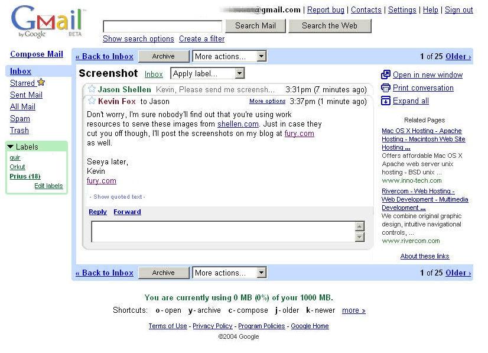

# 5.0: Module 5 Overview

## **Full Stack App - Front-End Logic**

We'll enhance the functionality of our app by adding front-end JS back into our stack.

Bringing logic onto the browser means that we can build more interactive versions of our server-side apps. We can build UIs that are more "modern" and aren't just limited to the functionality provided to us by HTML elements. (Remember that the only actions the user can take to affect our app data is to make a browser request- one that must be created by some HTML element- a form or link tag).

This means that by adding front-end JavaScript we are making a trade-off by increasing the complexity of our app code, yet also increasing usability. These are some of the design and engineering considerations when thinking about which features of a system to implement on the server or on the browser.

.jpg>)

## Historical Context

Module 5 marks another historical point in the evolution of the layers of architecture we're building upon in our web applications.

In module 2-4 we built a modular server side application with a SQL database. This brings us up to the state of the art in web development circa 2002, when the majority of web application architecture still relied on creating HTML documents that were displayed in the browser. Some more dynamic content architectures were brewing in the form of Java Applets and (then Macromedia) Flash.

### Web 2.0

The next generation of software and software companies relied on a new paradigm of web applications that were more dynamic and interactive than the last. In 2004 Google released what is considered the first widely-known, full-stack, dynamic, browser-side web application- Gmail. It was followed quickly a year later by Google Maps. What these applications have in common is a client-side architecture that displays and manipulates server-side data inside the browser using DOM manipulation. One of the key innovations is that _**in order for anything to be displayed, a new HTML page does not have to be rendered.**_ Facebook, Twitter and other companies followed suit, redeploying their apps to use this new model of user interaction.

### Full Stack, Web 2.5

Looking ahead past Module 5 we'll be looking at the knock-on effects of this new architecture. The main historical transition between Web 1.0 and Web 2.0 was the ability to provide a smoother more pleasant user experience by adding DOM manipulation to server-side data (ala Gmail.) The choice to enhance the user experience of normal browser apps into something more advanced had engineering trade-offs: firstly speed, which led to the development of V8, Google's powerful JavaScript runtime engine, and eventually led to the creation of Node.js, and secondly the ballooning of volume and scope of code running inside the browser. We will solve some of the challenges that arose from this in Module 6 and 7.

## Further Reading

#### A history of JavaScript across the stack

[https://dri.es/a-history-of-javascript-across-the-stack](https://dri.es/a-history-of-javascript-across-the-stack)

#### How Gmail Happened: The Inside Story of Its Launch 10 Years Ago

[https://time.com/43263/gmail-10th-anniversary/](https://time.com/43263/gmail-10th-anniversary/)

#### A unified 20-year history of the radically changing way we relate to the Web

[https://archive.is/A2puc](https://archive.is/A2puc)
