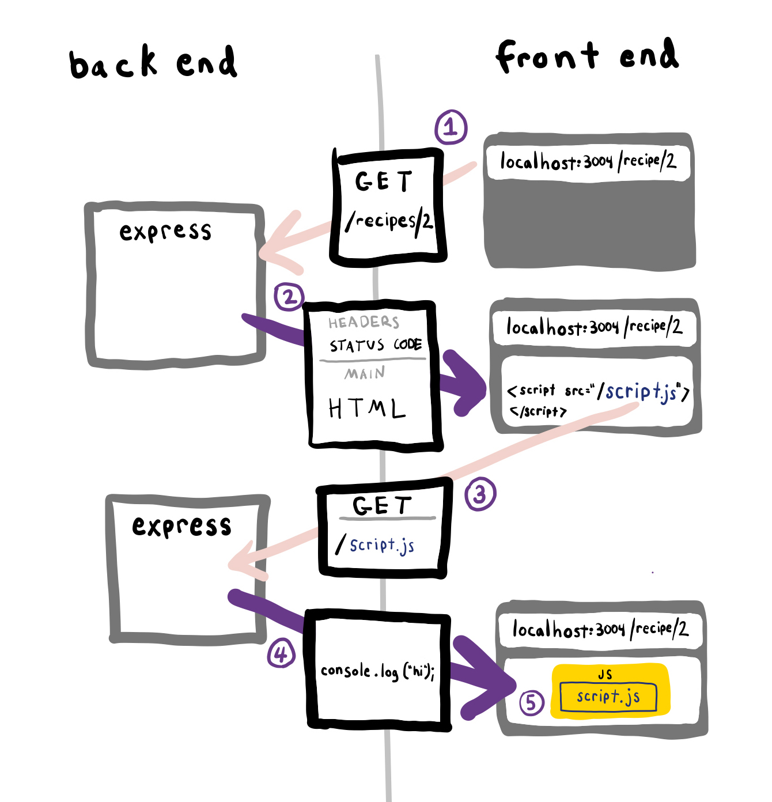

# 5.1: DOM Manipulation with Express App

## Introduction

We are adding back in the JavaScript from the first module.

We have now completed a journey to understand how an HTML page arrives at the browser, through a TCP/IP request built into an HTTP request- A request that results in HTML being sent back, HTML that is generated by an application with data from a SQL database.

Now that we are back in the browser we will investigate this request/response behaviour that happens before the JS file runs.



1. The browser makes a request to the server.
2. The Express server sends back HTML.
3. The browser reads a script tag in the HTML response. The script tag src attribute triggers the browser to make a get request for the JavaScript automatically.
4. The Express server, based on the request path, looks in the hard drive for a file that matches the request and sends the file contents back in the response.
5. Because the request was kicked off from a script tag, the file contents response is digested by the JavaScript interpreter of the browser.
6. JavaScript in the browser runs.

## Exercise

Clone the [base Express repo](https://github.com/rocketacademy/base-mvc-bootcamp).

### Routes

1. Create a route for `/items`
2. Create a controller for this route called `items`
   1. Since we don't care about the database for this exercise, we won't create a model for this controller. We'll use some fake data that looks like it could have come from the database.
   2. The controller callback will call `render` and pass in the following data.

      ```text
      const items = [
          {
              name:'banana',
              price:'$2',
              category:'fruits'
          },
          {
              name:'apple',
              price:'$1',
              category:'fruits'
          },
          {
              name:'salmon',
              price:'$22',
              category:'fish'
          },
          {
              name:'trout',
              price:'$12',
              category:'fish'
          },
          {
              name:'guava',
              price:'$3',
              category:'fruits'
          }
      ];
      ```
3. Create a view for this controller, `items/index.ejs`, and use a loop to render the list of items above.

### Add CSS

1. Add a CSS file called `styles.css` to the `public` folder. Set the background color of `body` to pink
2. Use a `link` tag to import this CSS into our view

### Add JS

1. Add a `script.js` file to the `public` folder. Put a console.log in the `script.js` file
2. Use a `script` tag to import this JS into our view

### Verify Behaviour

1. Open DevTools. Confirm that the console.log appears when we load the page
2. Look in the Elements tab. Confirm the existence of the `link` and `script` tags.
3. Look in the Network tab. Confirm the request for the CSS and JS files.

### Logic

Add the following logic to `script.js`.

1. When a user clicks on any item, apply a class to that item to turn the background colour grey.
2. When the user clicks the item again, the background reverts to the original colour.

