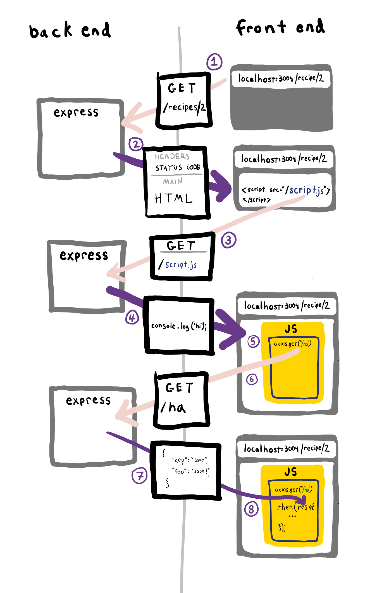

# 5.2: AJAX




1. The browser makes a request to the server.
2. The Express.js server sends back HTML.
3. The browser reads a script tag in the HTML response. The script tag `src` source triggers a get request.
4. The Express.js server, based on the request path, looks in the hard drive for a file that matches the request and sends the file contents back in the response.
5. Because the request was kicked off from a script tag, the file contents response is digested by the JavaScript interpreter of the browser.
6. The JavaScript file contains code that executes a JavaScript HTTP request using axios. A request is sent to the server for path `/ha`.
7. The Express.js server receives a request at the path `/ha`. The server sends back a JSON response.
8. The axios library receives and parses the JSON response, turning it into a JavaScript object.

## Example

```text
<script src="https://cdn.jsdelivr.net/npm/axios/dist/axios.min.js"></script>
```

```text
const axios = require('axios');

// Make a request for a user with a given ID
axios.get('/user?ID=12345')
  .then(function (response) {
    // handle success
    console.log(response);
  })
  .catch(function (error) {
    // handle error
    console.log(error);
  })
  .then(function () {
    // always executed
  });
```

