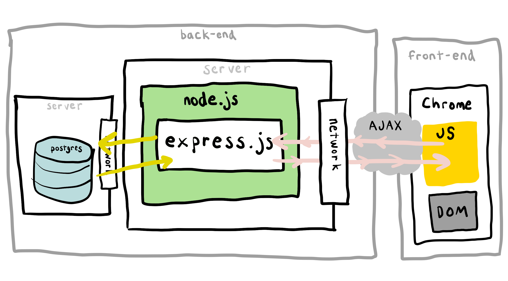

# 5.2: AJAX

AJAX is the browser functionality that can make requests from within JavaScript. It means that within a single page \(and page request\) we can build logic that deals with the world outside the browser page.

Eventually we will be able to move more of the view logic that renders and interacts with the user into the browser-side JavaScript.

As we go along we'll see more specific examples of this.



## AJAX Order of Actions

1. The browser makes a request to the server.
2. The Express.js server sends back HTML.
3. The browser reads a script tag in the HTML response. The script tag `src` source triggers a get request.
4. The Express.js server, based on the request path, looks in the hard drive for a file that matches the request and sends the file contents back in the response.
5. Because the request was kicked off from a script tag, the file contents response is digested by the JavaScript interpreter of the browser.
6. The JavaScript file contains code that executes a JavaScript HTTP request using axios. A request is sent to the server for path `/ha`.
7. The Express.js server receives a request at the path `/ha`. The server sends back a JSON response.
8. The axios library receives and parses the JSON response, turning it into a JavaScript object.

## Exercise

### Setup

[Clone the example repo](https://github.com/rocketacademy/ajax-swe1).

Set the app up. There is already a migration and a seed file in the repo. Run them.

When you are done, try out the items route in the browser: http://localhost:3004/items

### AJAX

Add a new route for a page.

Add a view for this page.

Add a script tag to the view page for a JavaScript file.

Add a JavaScript file to the public folder called `script.js`.

Add the Axios script tag to the view:

```markup
<script src="https://cdn.jsdelivr.net/npm/axios/dist/axios.min.js"></script>
```

Add this Axios example to `script.js`.

```javascript
// Make a request for all the items
axios.get('/items')
  .then(function (response) {
    // handle success
    console.log(response);
  })
  .catch(function (error) {
    // handle error
    console.log(error);
  });
```

### DOM Manipulation

When you receive the response, manipulate the DOM to show all the items on the screen.

### DOM Listening

Refactor the code so that when you click a button, the AJAX code runs.


