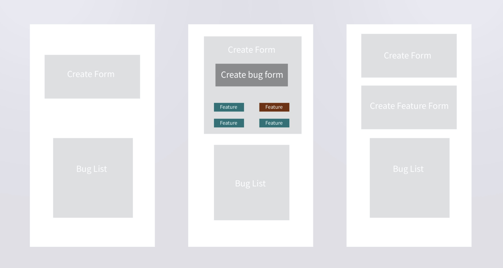

# 5.PCE.1: Bug Reports AJAX

Create an app that tracks bugs.

Begin with [the starter repo.](https://github.com/rocketacademy/ajax-bugs-swe1)

### Database Schema

#### Bug Table \(`Bugs`\)

| column name | data type | description | example |
| :--- | :--- | :--- | :--- |
| id | SERIAL PRIMARY KEY | ID | 1 |
| problem | TEXT | Description of the problem. | Crashes on POST request. |
| errorText | TEXT | Error output text, if any. | Cannot set property "fill" of null. |
| commit | TEXT | Git commit hash of solution. | 961f1c |
| FeatureId | Foreign Key | Foreign Feature Key | 1 |

**Feature Table \(`Features`\)**

| column name | data type | description | example |
| :--- | :--- | :--- | :--- |
| id | SERIAL PRIMARY KEY | ID | 1 |
| name | TEXT | Name of the feature | Navbar |

## Base

Create a seed file for features.

When a form renders to create a bug, make a request to the database to get the list of all features.

Each feature is represented by a button. Only one feature can be selected at a time. When one feature is selected, it turns red. All other feature selection buttons remain blue.

When the user fills out the form and clicks submit, send the currently selected feature as `FeatureId` in the POST request.

If you need to, split your functionality up into another file, and add a script tag for it in the ejs file.

## Comfortable

#### Refresh

When the page loads, get the list of bugs and render them onto the page.

#### Form Validation

Make sure that the user can't submit a new bug until the bug problem has been filled out and a feature has been selected.

#### Add Features

Add another section into the page that adds features into the database.

## More Comfortable

#### Group By

Create a button that groups the bugs by feature. This is a toggle button. When the user clicks it a second time, the bugs go back to the default sorting, by date created.

#### Git

Add a feature where the bug tracker integrates with a project. Choose your bird watching project. Add a folder to the root of the repo called `bug-tracker`. Add a line in `.gitignore` for the folder. Clone _a new copy_ of your bug tracking repo into the folder. In order for the app to work, delete the `.git` folder in the bug tracking repo.

#### Latest

Add a button that, when clicked, gets the last commit and commit message of the project. When your server receives the request, run the `git log` command on the server for your project repo.

#### Commit List

When creating a bug, let the user select from a list of commits to associate with the bug.

