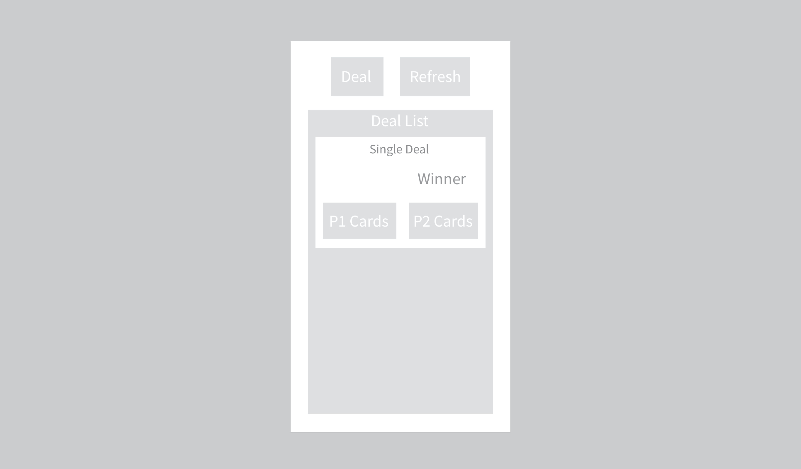

# 5.POCE.3: AJAX Cards

## Introduction

1. Create a 2-player high-card game.
2. Seed the database with 2 users.
3. Copy user login functionality from [5.POCE.2: Bug Reports AJAX Users](5.poce.2-bug-reports-ajax-users.md).

## Base

### Game Play

1. When a user clicks the Start Game button, the app creates a Game record in the DB and adds a random 2nd player into the game. This 2nd player 
2. When either player clicks the Deal button, the app deals cards to the players and evaluates who has won that hand. The app records the result in the DB and sends the result in a response to the user.
3. At any time, any user can click the Refresh button to see the current game status. Note that the Refresh button does not refresh the page- it sends an AJAX request to retrieve updated data from the DB and re-render part of the page using JavaScript.

### Database Schema

#### `Users` Table

| column name | data type | description | example |
| :--- | :--- | :--- | :--- |
| id | SERIAL PRIMARY KEY | ID | 1 |
| email | TEXT | User's email | kai@kai.com |
| password | TEXT | Hashed password | jdh3732gd |

#### `Games` Table

| column name | data type | description | example |
| :--- | :--- | :--- | :--- |
| id | SERIAL PRIMARY KEY | ID | 1 |
| cards | JSON | JSON object containing the game cards. |  |

#### `GamesUsers` Table

A join table. Game has many users. User has many games.

| column name | data type | description | example |
| :--- | :--- | :--- | :--- |
| id | SERIAL PRIMARY KEY | ID | 1 |
| GameId | Foreign Key | Game ID | 1 |
| UserId | Foreign Key | User ID | 1 |

## Comfortable

### Score

Keep a running score of which user is winning the game.

### Winner

The winner of the entire game is the player who gets 3 winning hands. Make a migration to the database to record the winner of the game. The game is over and can no longer be played.

## More Comfortable

### Discards

When the user deals, allow them to specify how many cards get discarded before their card. This applies to both users. Show the users their discarded cards.

### Winner records

Create an ejs page in express that displays the users winning and losing games.

### Find Friends

When the game is created, let the user choose from a drop down of users to play the game with.

