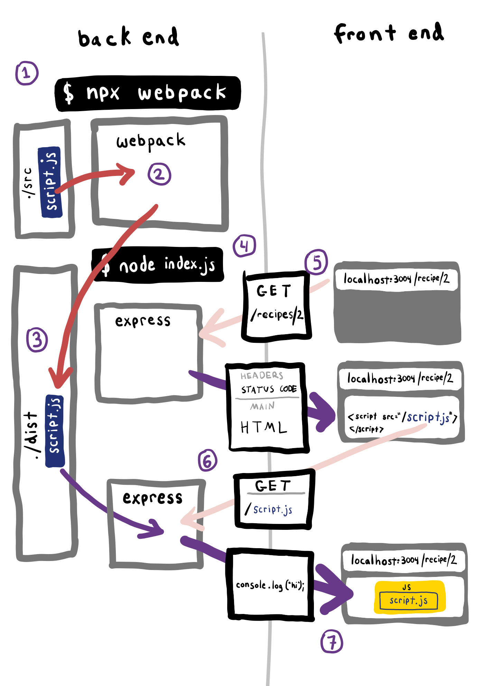

# 6.1: Webpack

Note: If you're here before looking at [6.0 Module 6 Overview](../6.0-module-6-overview.md), please go there to view the short video, so you have more context in this discussion. :)

## What is webpack?

At its core, **webpack** (a JavaScript library) is a static module bundler for modern JavaScript applications. When webpack processes your application, it combines all the modules your project needs into one or more bundles. These bundles are static assets which your content is served from.

## Why do we use webpack?

1. webpack compiles our code into vanilla languages that browsers can understand. This allows us to code in latest syntaxes such as ES6 and SASS that browsers may not support natively yet, but still have our code work.
2. webpack allows us to use JS modules, meaning our apps can load JS code as-needed for each page and not all upfront. We no longer need to worry about the order of our HTML `script` tags.
3. webpack minifies our files, resulting in our files taking up less space.

_Minification_ - the process of removing all unnecessary characters from JavaScript source code without altering its functionality. This includes the removal of whitespace, comments, and semicolons, along with the use of shorter variable names and functions.

## How does webpack work?



When webpack processes your application, it starts from a list of modules defined on the command line or in its configuration file. Starting from these _entry points_, webpack recursively builds a _dependency graph_ that includes every module your application needs, transforms them if necessary, then bundles all of those modules into a small number of bundles - often, only one - to be loaded by the browser. In other words, webpack pre-processes our files before they are loaded by the browser.

_Entry point_ - The point from which to start the application bundling process.

_Dependency graph_ - A dependency graph is a data structure formed by a directed graph (we will cover graphs later on in Algorithms), that describes the dependency of an entity in the system on the other entities of the same system, i.e, each node points to the node on which it depends.

## Webpack Order of Events

1. The `webpack` command is run.
2. Webpack transforms `src/script.js` and/or whichever other files or groups of files are specified in Webpack configuration. "src" stands for "source".
3. Webpack puts the resulting file in `./dist`, or whichever target folder is specified in Webpack configuration. "dist" stands for "distribution".
4. The Express.js server starts with `node index.js` on the command line. The server is ready to accept requests.
5. The browser makes a request to the server for a page.
6. The browser reads a script tag in the HTML response. The script tag's `src` attribute triggers a GET request to the URL in that attribute.
7. The Express server, based on the request path, looks in the filesystem for a file that matches the request. In our example, the script tag requests the transformed `script.js` file in `./dist`. Because the script tag initiated the request, the browser's JS interpreter processes the response's file contents.

## Further Reading

[https://webpack.js.org/concepts/why-webpack/](https://webpack.js.org/concepts/why-webpack/)
