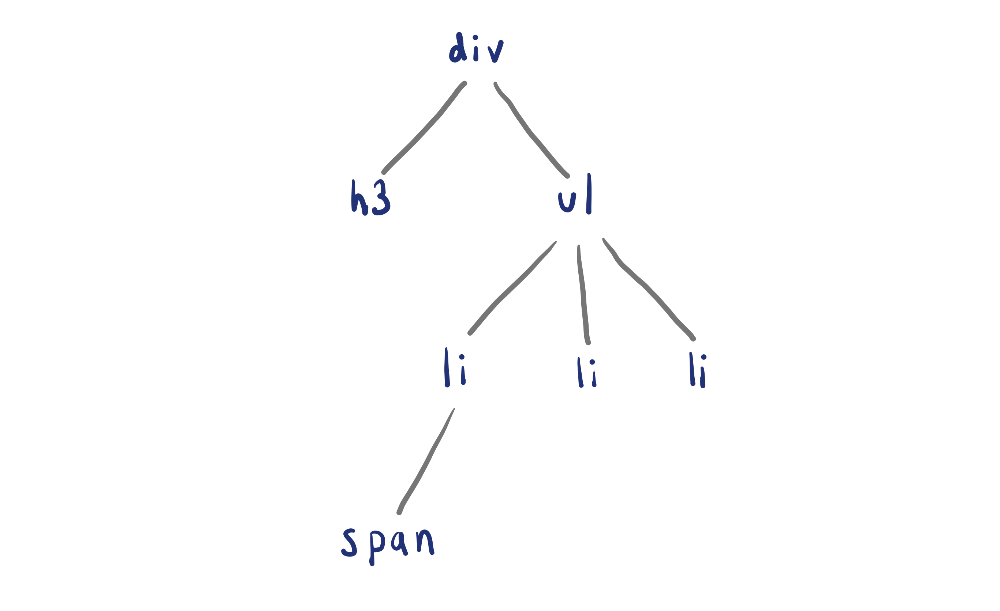
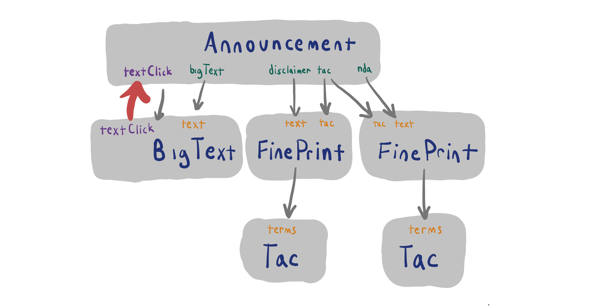

# 7.6: Prop Functions

## Introduction

Sometimes we may wish to have 1 component on the page \(e.g. an input\) update data in another component on the page \(e.g. a text element\). 

To move data from a component to a sibling component, the only way is to pass a function from the parent component as a prop \(i.e. "prop function"\) to its child that wants to update the data. When the child component calls the prop function, that function updates data in the parent \(usually stored as state in the parent\), which will then trigger an update of the sibling component.

## Element Hierarchy

In HTML we can define the parent and child relationship of a set of elements in another form called a tree.

```markup
<div>
  <h3>Fruits</h3>
  <ul>
    <li><span>dole</span> bananas</li>
    <li>apples</li>
    <li>tomatoes</li>
  </ul>
</div>
```



In React, when we talk about components we can talk about data props the same way.

```jsx
function Tac({ terms }) {
  return <p>{terms}</p>;
}

function BigText({ text }) {
  return <h1 className="hero-text">{text}</h1>;
}

function FinePrint({ text, tac }) {
  return (
    <p className="small">
      {text}
      <Tac terms={tac} />
    </p>
  );
}

function Announcement({ bigText, legalDisclaimer, nda, tac }) {
  return (
    <div>
      <BigText text={bigText} />
      <FinePrint text={disclaimer} tac={tac} />
      <FinePrint text={nda} tac={tac} />
    </div>
  );
}
```


## Lifting Functions

We can pass a function down into a component. This component can call the function. This is how we can get data back up through the hierarchy.

```jsx
function Tac({ terms }) {
  return <p>{terms}</p>;
}

function BigText({ text, textClick }) {
  return <h1 className="hero-text" onClick={textClick}>{text}</h1>;
}

function FinePrint({ text, tac }) {
  return (
    <p className="small">
      {text}
      <Tac terms={tac} />
    </p>
  );
}

function Announcement({ bigText, legalDisclaimer, nda, tac }) {

  const textClick = () => {
    console.log('clicked');
  };

  return (
    <div>
      <BigText text={bigText} textClick={textClick}/>
      <FinePrint text={disclaimer} tac={tac} />
      <FinePrint text={nda} tac={tac} />
    </div>
  );
}
```



## Putting it All Together

On line 14 in the `TempForm` component we call the `sendTemp` function from the `App` component and pass in a `TempForm` state variable.

```jsx
function TempForm({ sendTemp }) {
  const [temperature, setTemp] = useState("");

  const handleChange = (event) => {
    const temperature = event.target.value;

    console.log(temperature);

    // validate form only enter numbers
    if (temperature === "" || Number(temperature)) {
      setTemp(temperature);
      
      // set the teperature value in App component
      sendTemp(Number(temperature));
    }
  };

  return <input value={temperature} onChange={handleChange} />;
}

function Fahrenheit({ temperature }) {
  return (
    <p>
      {temperature} in fahrenheit is: {(temperature * 9) / 5 + 32}
    </p>
  );
}

export default function App() {
  // App (parent) level data and state function
  const [temperature, setTemp] = useState(0);
  return (
    <div>
      <TempForm sendTemp={(temp) => setTemp(temp)} />
      <Fahrenheit temperature={temperature} />
    </div>
  );
}
```

