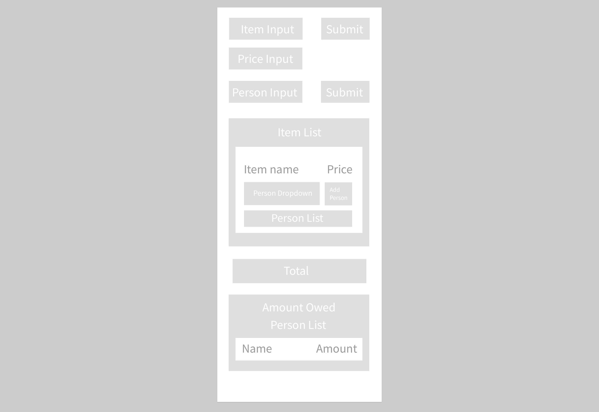
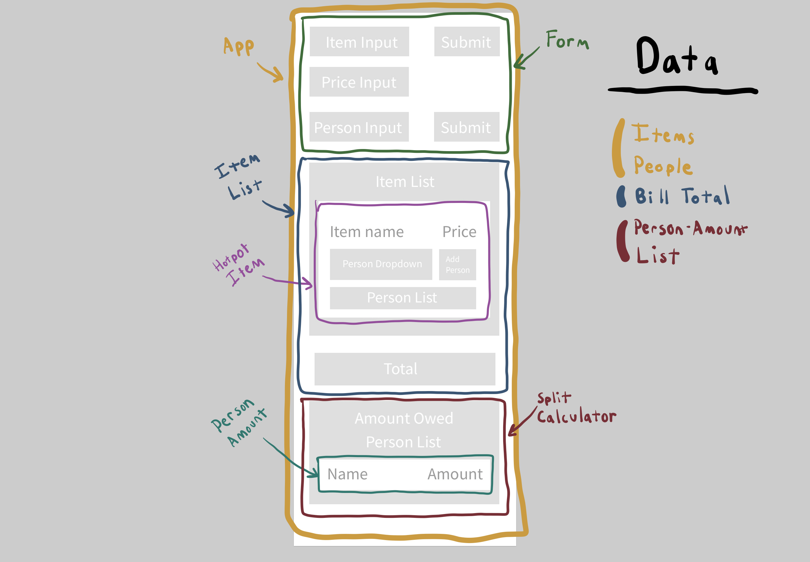

# 7.POCE.4: Hot Pot Bill Splitter

Create an app that will split the your hot pot bill between friends.

## Base

A person can be added into a list of people.

Items and their price can be added into a list of items.

When an item is added each person who wanted that item can be added onto the list of people for that item.

At the end the app calculates the number each person is responsible for paying.

Only the data about people and the amount they are responsible for is stored in the database. Add a save button to record this data at the end when the whole bill has been entered.

### Database Schema

#### `Bills` Table

| column name | data type | description | example |
| :--- | :--- | :--- | :--- |
| id | SERIAL PRIMARY KEY | ID | 1 |
| total | DECIMAL | Total amount of the bill. | 765.23 |
| name | TEXT | Name of bill | Hai di Lao December |

**`People` Table**

| column name | data type | description | example |
| :--- | :--- | :--- | :--- |
| id | SERIAL PRIMARY KEY | ID | 1 |
| name | TEXT | Name  | Kai |
| amount | DECIMAL | Amount this person owes | 324.65 |

**`PeopleBills` Table**

| column name | data type | description | example |
| :--- | :--- | :--- | :--- |
| id | SERIAL PRIMARY KEY | ID | 1 |
| bill\_id | FOREIGN\_KEY | bill id  | 1 |
| person\_id | FOREIGN\_KEY | person id | 1 |

## 

Create at least three components, `Form`, `ItemList` and `SplitCalculator`. The illustration above suggests some further components and also says where certain data in the app must be stored. The main data, the list of people and the list of items \(which will also contain the associated people\) must be state of the top-level `App` component.

