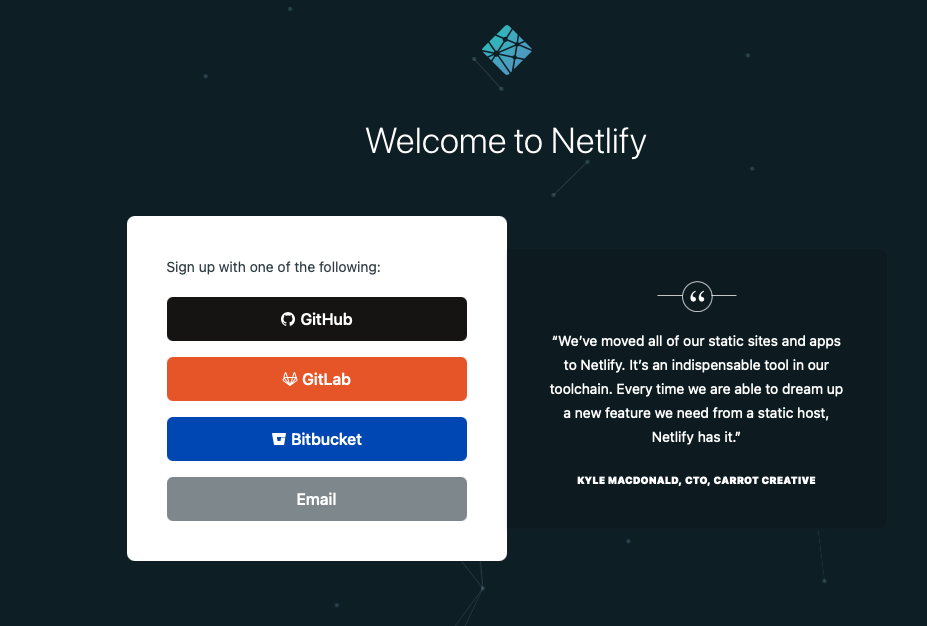
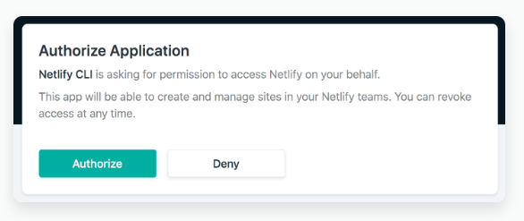
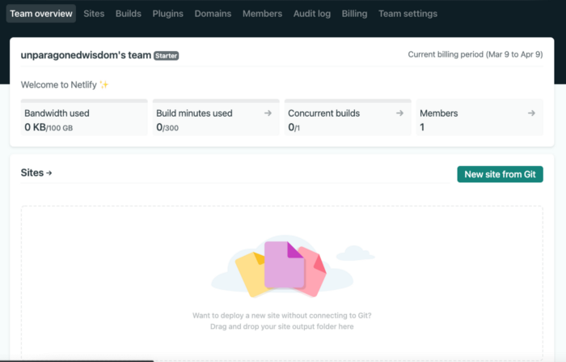
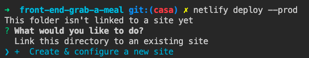
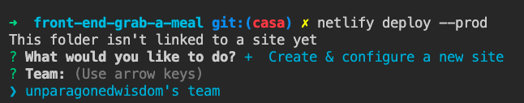
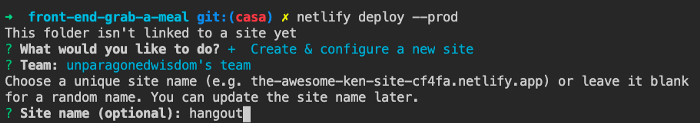
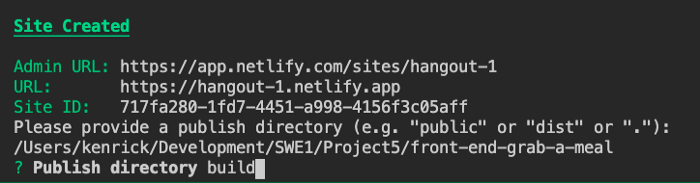
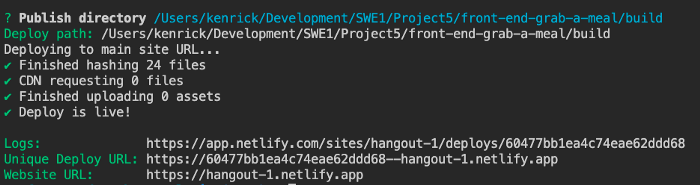
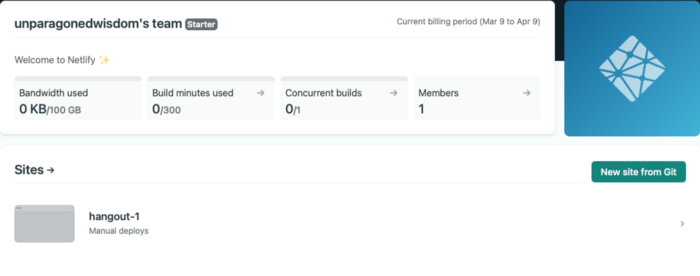

# 8.1.2: CRA Deployment

Deploying both the back and front end repos of a project requires some special workflows. This is for a few reasons:

1. We already have 2 repos, they can't be deployed in a single step.

2. Heroku apps without a custom domain \(herokuapps.com\) are on the Public Suffix List. This means we cannot make CORS requests between a front-end and back-end that are both deployed on Heroku. See more about the public suffix list here: [https://devcenter.heroku.com/articles/cookies-and-herokuapp-com](https://devcenter.heroku.com/articles/cookies-and-herokuapp-com)

These instructions are taken from here: [https://unparagonedwisdom.medium.com/deploying-react-front-end-on-netlify-and-express-postgres-and-node-js-98495958ed9](https://unparagonedwisdom.medium.com/deploying-react-front-end-on-netlify-and-express-postgres-and-node-js-98495958ed9)

Netlify

We'll be deploying the front-end on a different service, Netlify. Netlify is optimized for applications that are back-end light or that have a separately deployed back-end like our current app.

### Sign Up

Sign up for a Netlify account: [netlify.com](https://www.netlify.com/)



### CLI Setup

The very first thing you need to do is install netlify-cli tool. By doing so you can easily deploy from your command line and even in VS Code itself. To install netlify-cli, type the code below:

```text
npm install -g netlify-cli
```

There after authorize netlify by keying into your command line:

```text
netlify login
```

After this command, it will open the browser and click on Authorize



You should see the page below:



### React Router

This next step assumes you already have a react app in place and you are using react router, if not skip ahead to the next section which is the deployment section.

If you are using react alongside react router before creating your production build, create a new file in the public folder and call it \_redirects:

```text
cd public
touch _redirects
```

Open the file up in VSCode and add the line of code below into \_redirects

```text
/* /index.html 200
```

The reason we need to add the above line of code is because Netlify deploys as a static page and we need to tell the browser to accept redirects as react works as a single application for the most part and as such the url itself does not actually change but the components that are rendered changes.

Thereafter, create your production build.

### **Creating your build**

To create your production build, type into the command line:

```text
npm run build
```

### **Deployment**

After your build has been created, it’s time to deploy to netlify on a production build. Enter into the command line:

```text
netlify deploy --prod
```

After entering the command you will see:



Select Create & Configure to a new site and you will have to select your team after.



Thereafter, name your app if You want, if not Netlify will generate a random name for You. You can change the site name later. For me, I chose hangout-1



Next, you will have to choose the publish directory. If you are just deploying a static website, just hit enter. Otherwise, key in build\(This build is created from your previous npm run build\) and hit enter.



You will see a success message.



Now head over to the netlify webpage and you will see your site deployed.



## Heroku

This is the same as previous instructions.

