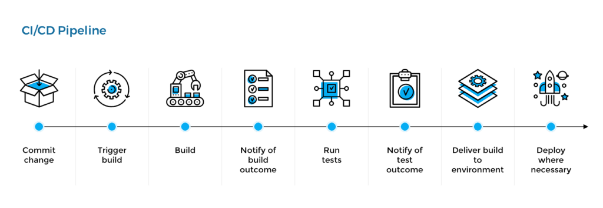

# 9.9: CI/CD

### Learning Objectives

* Understand CI/CD
* Know the benefits of CI/CD
* Understand the processes of the pipeline
* What tools are used

### What is CI/CD?

Continuous Integration (CI) refers to automated, continuous integration testing on code changes, and Continuous Delivery (CD) refers to automated, continuous deployment on code changes. These concepts are often implemented together, hence why they are often referred to as CI/CD instead of just CI or CD.

> Continuous Delivery is the ability to get changes of all types -- including new features, configuration changes, bug fixes, and experiments -- into production, or into the hands of users, safely and quickly in a sustainable way. -Jez Humble

The aim is to increase early defect discovery, increase productivity, and provide faster release cycles.

CI/CD services compile the incremental code changes made by developers, then link and package them into software deliverables. The process is automated once the developer pushes changes to the repo.

### Benefits of CI/CD

1. Fast Delivery
2. Fast Feedback Cycle
3. Low-risk Releases
4. Flexible Release Options

### CI/CD Pipeline Process

Developers main role in the process is committing the change to the repository. The commit triggers the build. If that fails, the developer will be notified. The developer will then have to fix the code so that the build doesn't fail. Developers also work on creating the tests to run. While the tests are automated, what to test and what type of tests to run are integral for developers.

### CI/CD Tools

* [Github](https://github.com)
* [Jenkins](https://www.jenkins.io/doc/pipeline/tour/hello-world/)
* [Docker](https://docs.docker.com/language/nodejs/configure-ci-cd/)
* [Ansible](https://docs.ansible.com/ansible/latest/user\_guide/playbooks\_intro.html)
