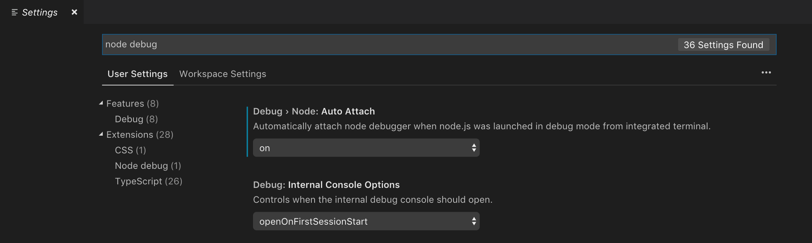

# 9.9: VSCode Node Debugger

## Setup

### VSCode

Change your setting so that Node.js debug "Auto Attach" is set to "always".



### Project Code

Create a debug script in package.json so you can easily run nodemon with debugging enabled.

#### package.json

```text
"scripts": {
    "debug": "nodemon --inspect index.js"
}
```

#### Further Reading:

[https://itnext.io/the-absolute-easiest-way-to-debug-node-js-with-vscode-2e02ef5b1bad](https://itnext.io/the-absolute-easiest-way-to-debug-node-js-with-vscode-2e02ef5b1bad)

[https://code.visualstudio.com/docs/nodejs/nodejs-debugging](https://code.visualstudio.com/docs/nodejs/nodejs-debugging)

[https://github.com/microsoft/vscode-recipes/tree/master/nodemon](https://github.com/microsoft/vscode-recipes/tree/master/nodemon)

## Run

1. Open the VSCode integrated terminal.
2. Run your server.
3. Open the debugger tools.
4. Set a breakpoint.


