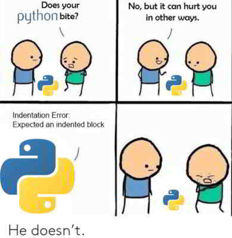

# A.2: Intro to Python

## Introduction



Rocket recommends doing DS\&A interviews in Python instead of JavaScript because the concise and English-like nature of Python syntax may enable more efficient use of time in a time-pressured interview setting. This is why Python is the most popular language for solving DS\&A problems. In addition, Python is the most popular language for data-related work, e.g. data analytics or data science, thus it will be in students' favour to learn Python in addition to JavaScript.

## Python Quirks

1. Python variables adhere to [function scope](https://www.w3schools.com/python/python\_scope.asp), which means all local variables are accessible within the function in which they are declared. This is different from the [block scope](https://dev.to/sandy8111112004/javascript-introduction-to-scope-function-scope-block-scope-d11#:\~:text=A%20block%20scope%20is%20the,only%20within%20the%20corresponding%20block.) that applies to `let` and `const` vars in JavaScript.
2. Python `==` works like JS `===`, in that both operators compare both value and data type.



## Exercises

The following are a collection of concise exercises from [learnpython.org](https://learnpython.org) (powered by [datacamp.com](https://datacamp.com)) that we believe will be helpful to you to do before starting DS\&A practice with Rocket.

1. [Hello, World!](https://www.learnpython.org/en/Hello%2C\_World!)
2. [Variables and Types](https://www.learnpython.org/en/Variables\_and\_Types)
3. [Lists](https://www.learnpython.org/en/Lists)
4. [Basic Operators](https://www.learnpython.org/en/Basic\_Operators)
5. [String Formatting](https://www.learnpython.org/en/String\_Formatting) (Here's a [nice article on String Interpolation](https://www.programiz.com/python-programming/string-interpolation))
6. [Basic String Operations](https://www.learnpython.org/en/Basic\_String\_Operations)
7. [Conditions](https://www.learnpython.org/en/Conditions)
8. [Loops](https://www.learnpython.org/en/Loops)
9. [Functions](https://www.learnpython.org/en/Functions)
10. [Classes and Objects](https://www.learnpython.org/en/Classes\_and\_Objects)
11. [Dictionaries](https://www.learnpython.org/en/Dictionaries)
