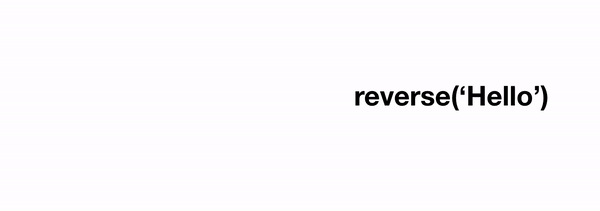

# A.9: Recursion

## Introduction

Recursion is one of the most powerful techniques in programming, albeit rarely used in business applications because business applications typically do not require it. Recursion is the concept of a function calling itself to achieve its result. A classic example is the [Fibonacci sequence](https://en.wikipedia.org/wiki/Fibonacci_number), where `Fib(n) = Fib(n-1) + Fib(n-2)`. The `Fib` function would repeatedly call itself until it reaches a so-called **"base case"**, after which the latest function calls would then `return` to the previous function calls.

Recursion is an alternative to iteration (i.e. loops), and every problem that can be solved recursively should also be solvable iteratively. However, some problems are far easier to solve recursively or iteratively than vice versa, so recursion is an indispensable tool in the DS\&A tool kit. 

There are 2 concepts to remember with recursion.

1. Recurrence relation
   1. When our function calls itself, what do we expect to be returned by that function?
2. Base case
   1. When does our function stop calling itself and return a value that does not depend on the function calling itself again?
   2. In our Fibonacci example, our base cases would be that `Fib(0) == 1` and `Fib(1) == 1`.
   3. Without base cases, our recursive function would recurse infinitely and result in an infinite loop.

## Required Reading

Please review the following resources to better understand recursion.



1. FreeCodeCamp's Intro to Recursion
   1. [https://www.freecodecamp.org/news/quick-intro-to-recursion/](https://www.freecodecamp.org/news/quick-intro-to-recursion/)
2. Stanford's Intro to Recursion
   1. [https://web.stanford.edu/class/archive/cs/cs106b/cs106b.1206/lectures/intro-to-recursion/](https://web.stanford.edu/class/archive/cs/cs106b/cs106b.1206/lectures/intro-to-recursion/)

## Exercises

### Instructions

We will be working through these exercises over multiple days. Please see your batch schedule for which exercises to do on which days.

We will complete the Learn Python Recursion Repl. Please start with [this empty starter repl](https://repl.it/@kaiyuanneo/Recursion#main.py). RA created this repl by copying the @Learnpython Recursion Repl and removing answers.

1. Pressing the Play button (`Ctrl+Enter` on Windows, `Cmd+Enter` on Mac) in Repl to run `main.py` will execute all problems against the provided test cases.
2. To limit the problems that Repl executes at any given time, see instructions in the Repl document to edit the `problems` array in the `main` function.
3. See [here](https://docs.repl.it/repls/editor) for useful keyboard shortcuts in Repl.

### Reference Solutions

Please attempt to solve each problem on your own before reviewing each problem's answer. If you find yourself stuck and unable to proceed, feel free to learn from sample answers for each problem in the [@Learnpython Recursion Repl](https://repl.it/@Learnpython/Recursion). Note there are multiple ways to solve each problem and the sample answers represent only 1 way.

### Part 1

1. Factorial
2. Bunny Ears
3. Fibonacci
4. Bunny Ears 2
5. Triangle
6. Sum Digits
7. Count 7
8. Count 8
9. Power N
10. Count X
11. Count Hi

### Part 2

1. Change XY
2. Change Pi
3. No X
4. Array 6
5. Array 11
6. Array 220
7. All Star
8. Pair Star
9. End X
10. Count Pairs

### Part 3

1. Count ABC
2. Count 11
3. String Clean
4. Count Hi 2
5. Paren Bit
6. Nest Paren
7. Str Count
8. Str Copies
9. Str Dist
   1. [RA Solution Code](https://pastebin.com/xVFqzPrj)
   2. [FTBC3 Solution Video](https://youtu.be/CnKOLqJ2THc?t=3092)

## Optional Reading

1. Fast Exponentiation. What would be the time complexity of an algorithm to calculate the value of `2^n`, where `n` is an input value? A naïve solution would be to write a for loop to multiply 2 by itself `n` times, which would run in `O(n)` time complexity. However, if we take the notion that `2^2^2 == 2^4` , and `2^4^2 == 2^8`, we can see that we can calculate `2^n` in many fewer operations than `n`, on the order of `log(n)`, with time complexity of `O(logn)`. Fast exponentiation can be implemented relatively easily with recursion. Programming languages typically implement exponent operators using fast exponentiation.
   1. [https://en.wikipedia.org/wiki/Exponentiation_by_squaring#Basic_method](https://en.wikipedia.org/wiki/Exponentiation_by_squaring#Basic_method)

## Introduction

For solving certain types of algorithm problems we'll want to repeat an action several times, as in a loop- the syntax keyword `for` in JavaScript and Python. There is another syntax to repeat some code a set number of times called recursion. Recursion is a function that calls itself. Specifically we we need to add some features inside the function so that it stops after _n_ times.

We'll see through some examples where a given concept or code is expressed more elegantly (not necessarily more simply) in the format of a function that calls itself. This may be preferable to writing the code using the `for` keyword to make a loop.

```
def say_something
    print("hello")
    say_something() # keep repeating this function forever
```

### New Vocabulary for Loops

When we introduce this new syntax for repeating some code with a function that calls itself, we'll still call that a loop, but make a new distinction between what kind of loop it is.

#### Iterative vs. Recursive

From now on we'll refer to writing "loops" (code that repeats a given number of times) either as _**iteratively**_, that is using something like the `for` keyword or any of the other ways we wrote repeating code before- `while`, `map`, etc. **or** we'll refer to the loop as _**recursive**_- using a function that calls itself.

## Background on Recursion

The history of recursion is deeply tied to the invention of Turing's theoretical computer. The word recursion is not just a topic in Computer Science but also a topic in mathematical logic. So the concept of recursion is deeper than simply a function that calls itself. It is any construct or system that is defined in terms of itself. Implementations of the concept of recursion include a [JavaScript interpreter written in JavaScript](./#part-2), or a [quine](https://en.wikipedia.org/wiki/Quine_\(computing\)), a program whose purpose is to print out it's own code. However, the purposes of Rocket's algorithms content we can assume the word recursion to mean a loop.

## Examples

### Infinite Recursive Loop

Given this infinite iterative loop:

```
count = 0
while True:
    print(f'count: {count}')
    count += 1
```

Let's implement the same loop in recursion.

```
def loop_count_times(count: int) -> None
    print(f'count: {count}')
    new_count = count + 1
    loop_count_times(new_count)

loop_count_times(0)   # start the loop at zero, will increase forever
```

### Base Case - How to End the Loop

Given this iterative loop:

```
count = 5
while count != 0:
    print(f'count: {count}')
    count -= 1
```

Let's implement the same loop in recursion.

```
def loop_count_times(count: int) -> None
    print(f'count: {count}')
    if count == 0:
        return
    new_count = count - 1
    loop_count_times(new_count)

loop_count_times(5)   
```

On line 3 we are writing what's called a Base Case. We need to be able to write code that, in contrast to the infinite example above, knows when to end the loop.

### Base Case with Parameters

How can we implement a recursive loop that counts up instead of down?

Given this iterative loop:

```
count = 0
while count < 5:
    print(f'count: {count}')
    count += 1
```

Let's implement the same loop in recursion.

```
def loop_count_times(max: int, count: int) -> None
    print(f'count: {count}')
    if count == max:
        return
    new_count = count + 1
    loop_count_times(max, new_count)

loop_count_times(5,0)   
```

Also note that it is a convention to have the base case at the top of the function. We actually call the function at the end once just to check the count value and return / end the loop, even though it isn't affecting the counter- it will just end after the check fails.

### Recursive Return

How do we write recursive functions that returns values?



Given this iterative loop:

```
def reverse_iter(word: str) -> str:
    result = ''
    for char in word:
        result = char + result
    return result
    
result = reverse_iter('hello') # olleh
```

Let's implement the same loop in recursion.

```
def reverse_recurse(word: str) -> str:
  
  if len(word) == 0:
    return ''
  
  last_letter = word[-1] # letter at the end of the word
  rest = word[:-1] # the rest of the string except the last letter
  
  # get the result of reversing every other letter before the current one
  recurse_result = reverse(rest)
  
  new_string = last_letter + recurse_result # arrange the last letter in front
  
  return new_string
  
result = reverse_recurse('hello') # olleh
```

#### Compact Refactor

```
def reverse_recurse_compact(word: str) -> str:
  if len(word) == 0:
    return ''
  else:
    return word[-1] + reverse_recurse_compact(word[:-1])
    
result = reverse_recurse_compact('hello')
```


