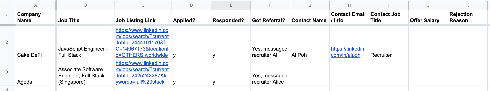
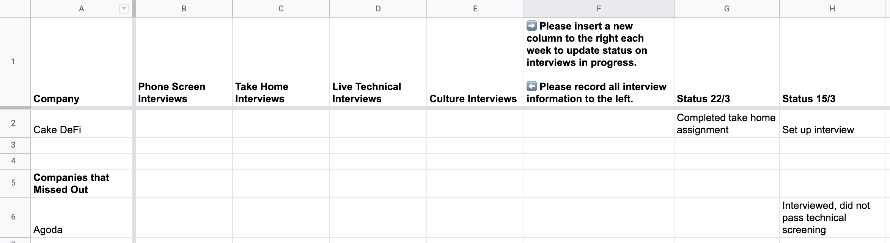

# CP.4: Job List

## Introduction

After compiling your resume and portfolio, it's time to compile a job lists and systematically track the jobs we have applied to and are interviewing at. This will help us maximise our chances and not waste time with companies that may be dragging their feet.

Please continually update your jobs list. The standard is 20 new job applications per week. Remember that this is a numbers game, and the more jobs we apply to, the higher our chances of success. Don't give up!

## Jobs List

We will use Google Sheets to help us track our jobs. Google Sheets is on the cloud, allowing Rocket Academy to see your latest job list at any time, helping with referrals. 

To start, find 20 jobs you are interested in using the methods described in [CP.1: Job Application Strategy](cp.1-job-application-strategy.md#how-will-you-find-the-jobs-youre-looking-for). Compile these jobs in a spreadsheet, with columns for Company Name, Job Title, Job Listing Link, Applied?, Responded?, Got Referral?, Contact Name, Contact Email/Info, Contact Job Title, Offer Salary, and Rejection Reason. Something simple like the following will suffice.

[Here](https://docs.google.com/spreadsheets/d/1Zt70gxE4Rafgh-xMC97dAoRcArg9sn0LZurDZQU_Gdw/edit?usp=sharing) is a starter template you can use by Rocket Academy.

## Interview List

Next we will create an Interview List of all companies that have responded and wish to interview you. This is to help us stay organised and avoid dropping leads.

Create a new sheet in the Jobs List spreadsheet called Interview List, and add columns for Company, Phone Screen Interviews, Take Home Interviews, Live Technical Interviews, Culture Interviews, and Status &lt;This Week's Date&gt;. Add a new status column each week to track progress. If we get rejected, move that company to a section called Companies that Missed Out. The following is Rocket Academy's template for reference.

[Here](https://docs.google.com/spreadsheets/d/1Zt70gxE4Rafgh-xMC97dAoRcArg9sn0LZurDZQU_Gdw/edit#gid=2074064392) is a starter template you can use by Rocket Academy \(same sheet as above but different tab\).

