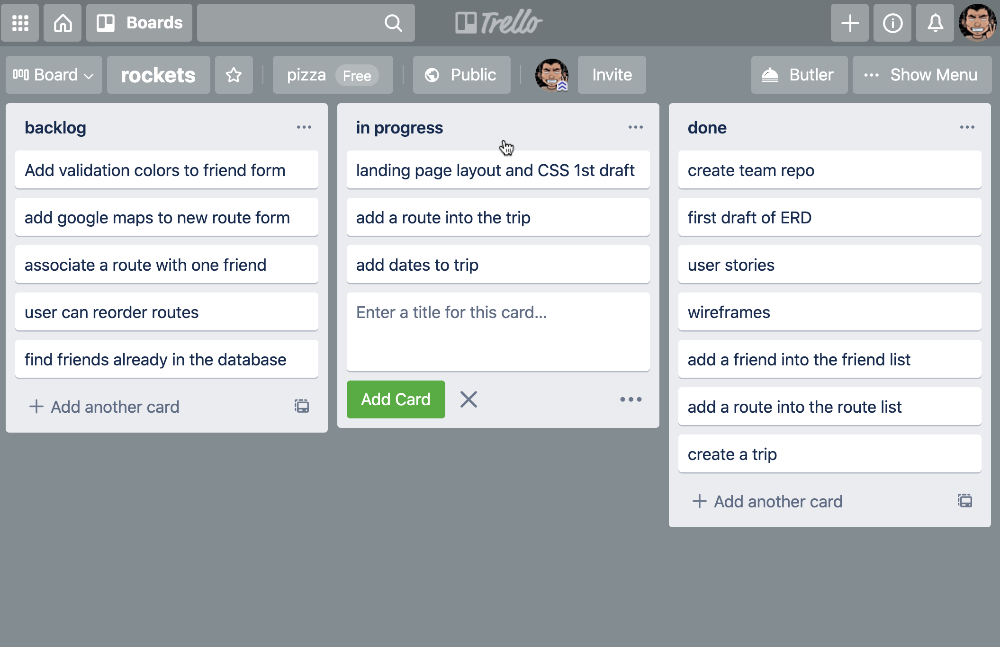

# Group Work

Workflow when coding a project collaboratively is very different from coding a project by yourself.

The following section will describe a set of tools and workflows that will make it as smooth as possible to create an entire project together.

## Principles

Working closely on a technical project in a group can be challenging. Not only as a coding challenge but as an exercise in communication. As teams get bigger, the communication necessary for coordination does not grow at the same linear rate.

If you've never coded in a team setting, understand that it will feel slow compared to the working alone, due to time spent on communication overhead.

In a real team setting this coordination and communication is the most important key to the success of a project \(not its technical merits\).

## Communication Processes

Usually, when discussing a team's successful collaboration, a big element is the processes put in place that make it clearer how all the relevant people are doing within the project.

We will outline these processes for dividing and completing tasks, which should make it easier to coordinate all the work.

All of these things are \(not strictly\) derived from "agile" workflow.

You can read more about agile [here](https://en.wikipedia.org/wiki/Agile_software_development).

### User Stories

The user stories are the first part of planning that state what the app should give the user the ability to accomplish, and why the user wants to accomplish that task.

* The user is going on a trip. They can create it within the app.
* The user wants to invite their friends. The app allows them to enter their friend's names.
* The user wants to keep track of all the places they want to go. The app allows them to record each place.

### Wireframes

Wireframes show visually how the user will accomplish the tasks described in the users stories. If a wireframe has a UX element that is not used for a task described in a user story, it should be removed.

### Kanban Board

A Kanban board is a team document that is used for planning, to show what each team member is working on, and to show what parts of the project are already done.

You'll be using Trello to hold your Kanban board. The board will have the following three sections:

#### Backlog

The backlog section is the set of tasks that have to be done. When planning, the team will break the larger features / user stories of the app into small pieces that can be completed by one person in a relatively small amount of time.

Each team member will assign themselves a task in the board and move it to "**in progress**".

When planning try to avoid adding every single task that could ever conceivably be done in the future. This should be for features that have already been planned out in the user stories and wireframes.

#### In Progress

For tasks in progress.

#### Done

For done tasks.

## Git Workflow

One member of the team will create a GitHub repo and invite the other collaborators. See [2.15 Git Branches](../2-backend-basics/2.15-git-branches.md) and [2.ICE.7.](../2-backend-basics/2.ice-in-class-exercises/2.ice.7-git-branches.md)

For each task in the Kanban board a new branch will be created from `main`, and named after the task to be completed. When a task is done create a pull request and merge the code into `main`.

#### Getting the Lastest Changes

When working in a team, changes will be happening to main branch that will need to be pulled down locally.

Whenever there is a big change to main follow these steps to get them locally:

1. Save & commit all changes on the current \(non-main\) feature branch. Checkout main: `git checkout main`
2. `git pull origin main` to get the latest changes from GitHub on the main branch made by others.
3. `git checkout` the feature branch again.
4. If there are changes on `main` that are needed in the feature branch, do a merge: `git merge main`
5. \(optional\) If work is not completed yet on the feature branch, it's possible to do a defensive merge of `main` into the feature branch, even if that code is not needed. This best practice prevents very large changes from being merged all at once.

#### Avoiding Merge Conflicts

In a React full-stack app, there are a few files that might generate merge conflicts, such as `App.js` or `routes.js` on the back-end. For the most part, to avoid merge conflicts it simply takes a lot of communication when two people are both changing these centralized files. Ideally each new change would just be done one after the other, where one person waits to get the code of the second person.

#### Dealing with Merge Conflicts

One hard rule is, _**never merge a pull request into `main` that has a conflict.**_ If there is a merge conflict it should be resolved inside the conflicting branch first, before it's merged into `main`. 

#### Merge `main` into the Branch

The main strategy for dealing with merge conflicts and keeping the main branch clean is to merge `main` into the conflicting branch and make all necessary code edits in the conflicting branch. \(this all happens on the local computer\). Then push that \(now clean\) branch to GitHub.

