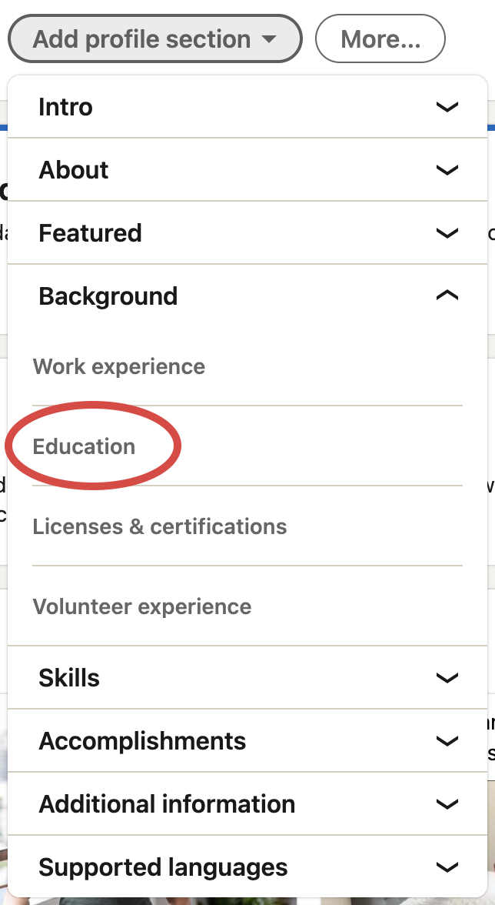
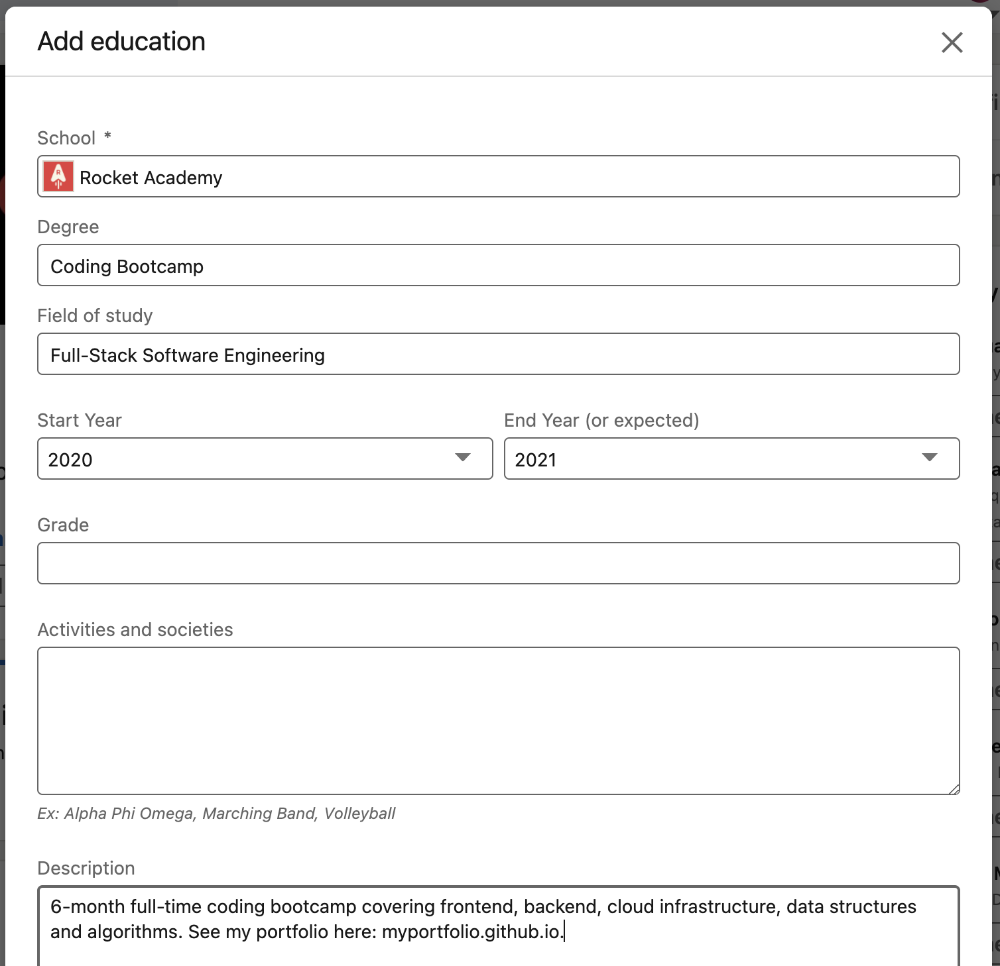

# LinkedIn Certificates

Coding Bootcamp students can add Rocket Academy to the Education sections of their LinkedIn profiles. Here are instructions.

## 1. Go to your LinkedIn profile page and click "**Add profile section"**

## 2. Click "Education" to add a new education badge

## 3. Fill in the course name, organisation, issue date, and your unique certificate link

1. School
   1. Rocket Academy
2. Degree
   1. Coding Bootcamp
3. Field of study
   1. Full-Stack Software Engineering
4. Start Year
   1. The year you enrolled in RA's Bootcamp
5. End Year
   1. The year you graduated from RA's Bootcamp
6. Description
   1. 6-month full-time coding bootcamp covering frontend, backend, cloud infrastructure, data structures and algorithms. See my portfolio here: &lt;INSERT-MY-PORTFOLIO-LINK&gt;
   2. Feel free to customise this as you wish :\)
7. Share with network
   1. On

## 4. Admire your hard-earned education badge 🚀

If needed, drag the new education badge to the top of your Education section by hovering over the batch and dragging the hamburger icon on the right of the badge.

