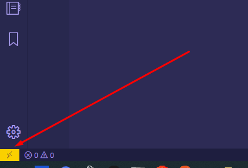

# Required Hardware and Software

## Introduction

1. If you haven't already, ensure you have [Required Hardware and Software](https://basics.rocketacademy.co/course-logistics/required-hardware-and-software) from Coding Basics.
2. Please install the latest version of Windows or MacOS that your computer supports. This is so that students have the same and latest operating system features as much as possible.

## Windows

### Windows Subsystem for Linux \(WSL\)

1. WSL allows us to run the Linux operating system on Windows machines. This is desirable because all web programming is done on Unix-based operating systems, of which MacOS is also a descendant.
2. Most SWEs using Windows machines at tech companies do their work in WSL to maximise compatibility between their work and that of Linux machines.
3. Before installing WSL, make sure you have updated your Windows version.

#### WSL

WSL is the virtual machine environment that allows us to run other operating systems inside Windows. Install WSL [here](https://docs.microsoft.com/en-us/windows/wsl/install-win10).

#### Ubuntu

We will use the Ubuntu Linux "distro" or distribution. Install the latest version of Ubuntu [here](https://www.microsoft.com/en-sg/p/ubuntu-2004-lts/9n6svws3rx71).

### WSL and VSCode

#### Sudo

`sudo` is the command that tells the computer to execute an instruction as an admin \(root\) user.

#### Apt

Apt is the package management system in Ubuntu. On a clean new Ubuntu install we need to make sure it has the latest package records and everything is updated.

```text
sudo apt update
sudo apt upgrade
```

#### Build Essential

Ubuntu needs some standard libraries in order to properly install common packages.

```text
sudo apt install build-essential
```

#### SSL

WSL Communicates with VSCode using the SSL protocol. We need the SSL verification certificates on Ubuntu for this to work correctly.

```text
sudo apt-get install ca-certificates
```

### Remote Development

VSCode will integrate into Ubuntu automatically. The VSCode terminal will show the Ubuntu terminal.


If you were using the Git Bash terminal before, after following these instructions you **must only use the Ubuntu terminal** from now on.


1. Install the [Remote Development extension](https://marketplace.visualstudio.com/items?itemName=ms-vscode-remote.vscode-remote-extensionpack) for VSCode.
2. Once you install the extension, you will see a Remote Development extension icon at the bottom left corner of the VS Code editor.



1. Click on the icon, you will get a pop up with a list of options. Click on the first option "**Remote-WSL: New Window**" for the default distro or select the "**Remote-WSL: New Window using Distro**" for a specific distro.


1. You will see a notification "Starting VS Code in WSL...". This means VS Code is setting up a server inside WSL for the first time. Once installed, the VS Code of your Windows machine/desktop will communicate with VS Code server on the Linux side.

[](https://res.cloudinary.com/practicaldev/image/fetch/s--hQNq4fVk--/c_limit%2Cf_auto%2Cfl_progressive%2Cq_auto%2Cw_880/https://dev-to-uploads.s3.amazonaws.com/i/3667py1lgpqwwl1ijafz.png)

#### Install Node.js

Open an Ubuntu terminal and follow [install instructions](https://github.com/nodesource/distributions/blob/master/README.md#installation-instructions), copied below. Read more about these install instructions [here](https://dev.to/ajeet/the-ultimate-guide-to-use-vs-code-with-windows-subsystem-for-linux-wsl-51hc).

```text
curl -sL https://deb.nodesource.com/setup_15.x | sudo -E bash -
sudo apt-get install -y nodejs
```

## Mac

### XCode Command Line Tools

XCode command line tools install relevant command line utilities such as Git for us to use our command line on Mac effectively.

```bash
 xcode-select --install
```

### Homebrew

Homebrew is a package manager for MacOS that allows developers to have a single source of truth for which packages are installed and what versions they are. This is typically only relevant to packages for the command line; GUI applications are typically not installed via Homebrew.

Homebrew typically manages OS-specific packages and not application-specific packages. Application-specific packages are typically managed by application-level package managers such as `npm` or `pip`. Application-specific packages are packages that are typically bundled and deployed together with an application, regardless of where those applications are running.

Follow the install instructions at: [https://brew.sh/](https://brew.sh/)

### VS Code - Open in Browser

Add [this extension](https://marketplace.visualstudio.com/items?itemName=techer.open-in-browser) to make opening the `index.html` file easier.

## Folder Organisation 

In Coding Bootcamp we will be cloning starter code many times for new projects. To keep things organised, we recommend the following folder structure.


All files and folders are in kebab-case \(lowercase and hyphenated\) for ease of use on the command line. It is generally a bad idea to name any files or folders with a space in them.


### Folder Organisation - Mac

1. Host all Coding Bootcamp code in a folder called `bootcamp`.
2. Within the `bootcamp` folder, for each week \(there are 24 total\) in Coding Bootcamp, create a new folder for that week. This means you will have 24 week-specific folders, such as `week1`, `week2`, ..., `week24`.
3. Within each `weekX` folder, create 1 folder for each day of the week, i.e. `day1`, `day2`, ..., `day5`.
4. Within each `dayX` folder, create `pre-class`, `in-class`, and `post-class` folders for the respective exercises.
5. Within each `X-class`folder, keep a separate folder for every exercise you do that requires a new Git repo.
6. Store projects within a `projects` directory directly within the `bootcamp` folder for easy accessibility.

### Folder Organisation - Windows

Because the Back-end portions of the course change the way we run our code, we will be changing the location of our code from that point forward as well.

1. For Weeks 1 & 2 and Project 1, host code in a folder called `bootcamp`.
2. Within the `bootcamp` folder, for each week 1 & 2 in Coding Bootcamp, create a new folder for that week. This means you will have 2 week-specific folders, such as `week1`, `week2`
3. Within each `weekX` folder, create 1 folder for each day of the week, i.e. `day1`, `day2`, ..., `day5`.
4. Within each `dayX` folder, create `pre-class`, `in-class`, and `post-class` folders for the respective exercises.
5. Within each `X-class`folder, keep a separate folder for every exercise you do that requires a new Git repo.
6. Store projects within a `projects` directory directly within the `bootcamp` folder for easy accessibility.
7. For Weeks 3 \(Module 2\) onwards we will store files inside the WSL part of the computer. Create a directory called `bootcamp` in the home \(`~`\) folder of the Ubuntu system.
8. Name the weeks and days similarly to the above.
9. Do not save any of the files from Week 3 \(Module 2\) onwards in the Windows side of the computer.

